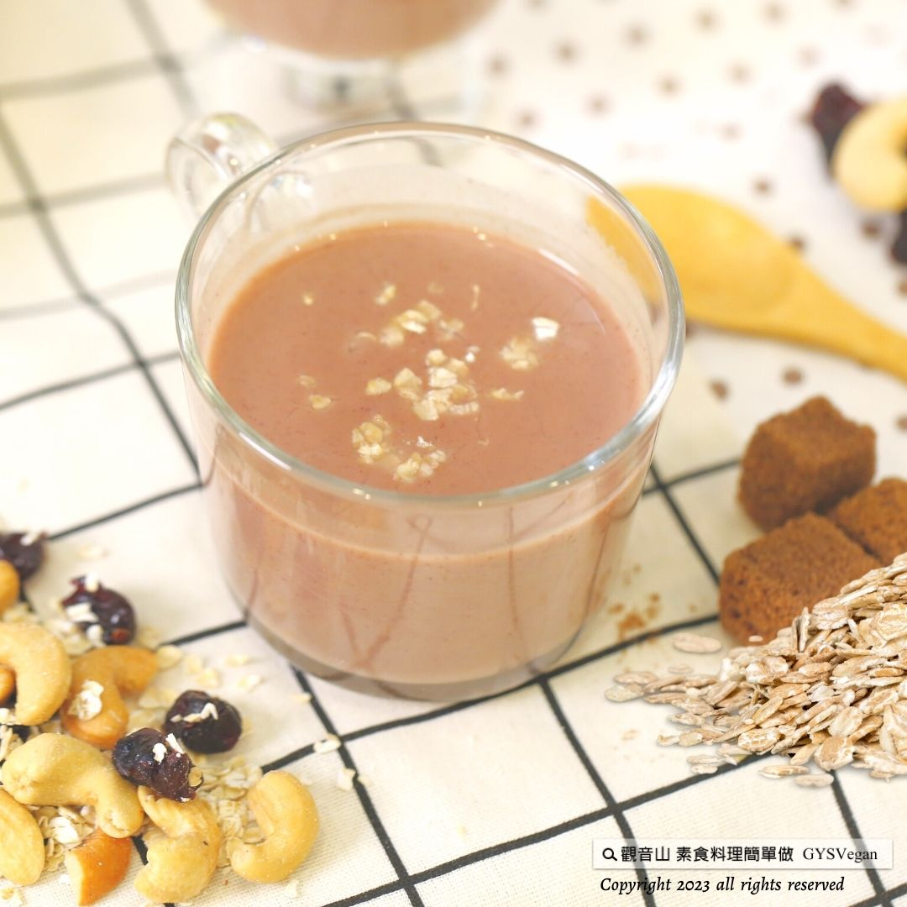

# 飲品料理 蔓越莓燕麥奶

## 📋 基本資訊 / Recipe Overview
- **料理名稱**：飲品料理 蔓越莓燕麥奶
- **原始標題**：飲品料理｜蔓越莓燕麥奶｜全素
- **素食流派 / Diet**：全素 Vegan
- **料理分類 / Category**：輕食點心
- **來源平台 / Source**：[觀音山 · 素食料理簡單做](https://vegan.gys.org.tw/cranberry-oat-milk20230623/)

## 📖 食譜圖文詳情 (中英雙語對照)

端午節假期，糯米吃太多覺得難消化嗎?蔓越莓的獨特酸甜和燕麥的香濃，營養清爽，簡單又美味，蔓越莓富含原花青素，炎夏悶熱，可減少女性私密困擾；燕麥奶富含纖維，高纖可以加速腸胃蠕動，幫助促進消化。 ​ 無論是午後小憩或是早晨的飲品，都是最佳的選擇，快跟著觀音山主廚，一起素食料理簡單做吧！
​ ​
◎食材及佐料〔Ingredients〕：(3人份)
▪️蔓越莓乾 ​ ​ ​ ​ ​ ​ 100克
▪️燕麥奶 ​ ​ ​ ​ ​ ​ ​ ​ ​ ​ 約600毫升
▪️熱水 ​ ​ ​ ​ ​ ​ ​ ​ ​ ​ ​ ​ ​ ​ 適量
▪️砂糖 ​ ​ ​ ​ ​ ​ ​ ​ ​ ​ ​ ​ ​ ​ 適量
▪️檸檬汁 ​ ​ ​ ​ ​ ​ ​ ​ ​ ​ 少許
​
​
◎烹飪步驟：
【前製作業】
1.蔓越莓乾加入少許熱水，浸泡靜置軟化。
​
【調理作法】
1.準備乾淨的果汁機，放入浸泡好的蔓越莓乾、燕麥奶、砂糖打勻，最後加入少許檸檬汁提味。
​
【特別說明】
冷熱飲皆可，將呈現不同風味。
​
​
本食譜提供：台中 觀音山蔬食館
​
​
▌慈悲的 #龍德上師 成立「觀音山蔬食館」提倡健康素食、慈悲護生，以”觀音山素食料理簡單做”的理念，提供多款素食食譜，讓您一學就會！
​
觀音山相關連結
➠
https://www.fazang.org/link/
​ ​
​
▌觀音山近期活動
7月19日 釋迦牟尼佛‧如珍寶加持總集薈供法會
✦ 登記「超薦蓮位、除障祿位」
https://bit.ly/3bH7Z46
✦ 護持「薈供供品」推廣素食愛心公益
https://bit.ly/3bHzJ8H
(登記至7月19日晚上7:00截止)
​ ​
​ ​
—
歡迎轉載，請註明出處： 觀音山素食料理簡單做 GYSVegan 素食環保愛地球，健康營養無負擔，慈悲護生一起來~

---
*食譜歸檔時間：2026-08-20 · 來源：觀音山素食料理簡單做 (vegan.gys.org.tw)*