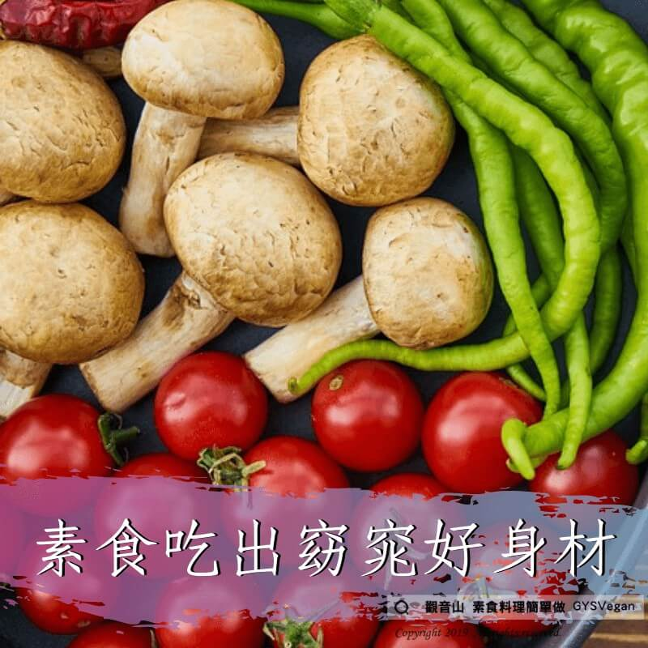

# 養生之道  吃出窈窕好身材 - 素食料理簡單做

## 📋 基本資訊 / Recipe Overview
- **料理名稱**：養生之道  吃出窈窕好身材 - 素食料理簡單做
- **原始標題**：【養生之道】｜吃出窈窕好身材 - 素食料理簡單做
- **素食流派 / Diet**：全素 Vegan
- **來源平台 / Source**：[觀音山 · 素食料理簡單做](https://vegan.gys.org.tw/%e3%80%90%e9%a4%8a%e7%94%9f%e4%b9%8b%e9%81%93%e3%80%91%ef%bd%9c%e5%90%83%e5%87%ba%e7%aa%88%e7%aa%95%e5%a5%bd%e8%ba%ab%e6%9d%90/)

## 📖 食譜圖文詳情 (中英雙語對照)

【#蔬食環保救地球】 吃出窈窕好身材，素食者通常比肉食者苗條。​
​
美國一項對200位素食者及非素食者進行的研究顯示，非素食者的體重平均超出正常體重55%，而素食者體重平均要比肉食者輕20磅(約9公斤)。​
素食者有助血液保持微鹼性，使身體的新陳代謝活躍起來，加速燃燒脂肪。​
​
同時，不少素食食物都能讓您吃出窈窕好身材✨。​
例如：​
▪大豆含亞油酸，即Omega6，亞油酸含量高達51.8%，能阻止膽固醇在體內積存。​
▪燕麥含豐富水溶性纖維，每天吃3/4杯燕麥，能令血液中的低密度脂蛋白膽固醇(LDL，壞膽固醇)排出體外，降低血膽固醇4-8%。​
​
吃東西一定要吃的健康，素食也有許多選擇，可以依自己的狀況去作適時調整、替代。​
每個人都適合吃素，只要能吃的對✅、吃的健康、吃出窈窕好身材。​
​
✨慈悲的 龍德上師成立「觀音山蔬食館」提倡健康素食、慈悲護生，以”觀音山素食料理簡單做”的理念，提供多款素食食譜，讓您一學就會！?​
​
​
?觀音山 素食料理簡單做 Follow us?
Facebook ｜好文按讚
http://www.facebook.com/GYSVegan​
Instagram ｜料理追蹤
http://www.instagram.com/gysvegan/​
Youtube ｜加入訂閱
https://reurl.cc/q8VEqy​
Telegram ｜頻道推薦
https://t.me/GYSVegan​
​
​
—​
? 歡迎轉載，請註明出處： 觀音山 素食料理簡單做 GYSVegan 素食環保愛地球，健康營養無負擔，慈悲護生一起來~?

---
*食譜歸檔時間：2026-08-20 · 來源：觀音山素食料理簡單做 (vegan.gys.org.tw)*