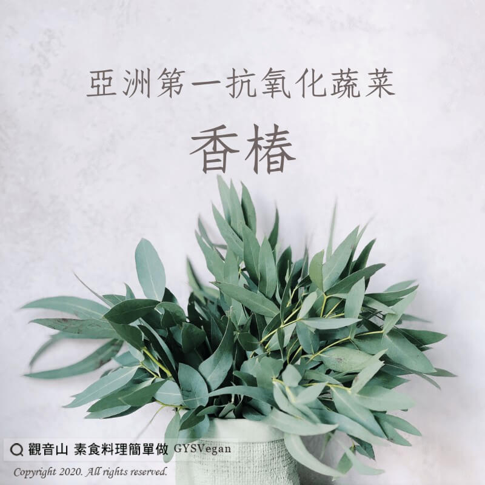

# 養生之道 亞洲第一抗氧化蔬菜-香椿

## 📋 基本資訊 / Recipe Overview
- **料理名稱**：養生之道 亞洲第一抗氧化蔬菜-香椿
- **原始標題**：【養生之道】亞洲第一抗氧化蔬菜-香椿
- **素食流派 / Diet**：全素 Vegan
- **來源平台 / Source**：[觀音山 · 素食料理簡單做](https://vegan.gys.org.tw/%e3%80%90%e9%a4%8a%e7%94%9f%e4%b9%8b%e9%81%93%e3%80%91%e4%ba%9e%e6%b4%b2%e7%ac%ac%e4%b8%80%e6%8a%97%e6%b0%a7%e5%8c%96%e8%94%ac%e8%8f%9c-%e9%a6%99%e6%a4%bf/)

## 📖 食譜圖文詳情 (中英雙語對照)

一、晨起喝溫水，到老不後悔 ;​
二、早上吃生薑，身體健又強 ;​
三、多喝一點醋，没空上藥舗 ;​
四、色欲有節制，勝過吃補藥 ;​
五、每天五蔬果，老人賽壯丁 ;​
六、天天一身汗，小病不用看 ;​
七、有空勤拍打，健康您我他 ;​
八、睡前泡泡腳，不用開藥方。​
​
✨慈悲的 龍德上師成立「觀音山蔬食館」提倡健康素食、慈悲護生，以”觀音山素食料理簡單做”的理念，提供多款素食食譜，讓您一學就會！?​
​
​
?觀音山 素食料理簡單做 Follow us?
Facebook ｜好文按讚
http://www.facebook.com/GYSVegan​
Instagram ｜料理追蹤
http://www.instagram.com/gysvegan/​
Youtube ｜加入訂閱
https://reurl.cc/q8VEqy
​
Telegram ｜頻道推薦
https://t.me/GYSVegan​
​
​
—​
?歡迎轉載，請註明出處： 觀音山 素食料理簡單做 GYSVegan 素食環保愛地球，健康營養無負擔，慈悲護生一起來~?

---
*食譜歸檔時間：2026-08-20 · 來源：觀音山素食料理簡單做 (vegan.gys.org.tw)*