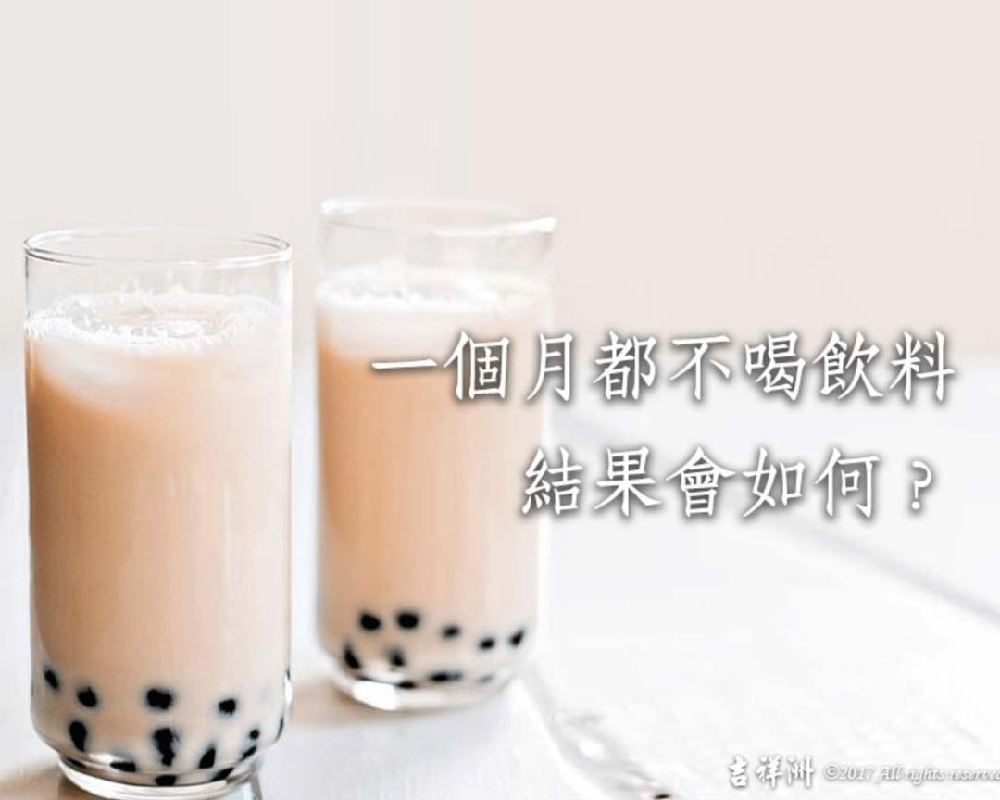

# 養生之道 健康減糖大作戰 一個月不喝飲料會如何_

## 📋 基本資訊 / Recipe Overview
- **料理名稱**：養生之道 健康減糖大作戰 一個月不喝飲料會如何_
- **原始標題**：【養生之道】健康減糖大作戰 一個月不喝飲料會如何?
- **素食流派 / Diet**：全素 Vegan
- **來源平台 / Source**：[觀音山 · 素食料理簡單做](https://vegan.gys.org.tw/healthy-sugar-reduction20201213/)

## 📖 食譜圖文詳情 (中英雙語對照)

【健康減糖大作戰】一個月不喝飲料會如何?
​
克里斯‧貝利（Chris Bailey）深入研究生產力，在自己身上進行數十種實驗，被TED封為「史上最有生產力的人」，親身進行了一項試驗：挑戰一整個月都不喝飲料?，只喝白開水。
​
?他的實驗心得結果：​
1. 減少熱量攝取 ▶​
一杯含糖的茶大約會讓你多吸收30卡；早上來杯摩卡，大約是250卡；​
一杯500毫升的可口可樂，則是210卡。​
水呢?零卡，而且它顯然更能幫你補充水份，因為它是水。​
2. 緩和食欲 ​▶
水會壓抑你的食欲，因為你可能根本不餓，只不過是口渴了。
3. 提升大腦運作 ​▶
大腦約有75-85%是水，保持水份充足，大腦的運作也會更棒，讓你更專注、更有活力。
如果等等要考數學，記得多喝水喔!​
4. 水比較便宜​ ▶
喝水不但有益身體健康，對皮夾也有直接的好處。​
5. 提高新陳代謝​ ▶
起床後立刻喝水，會提高你一整天的新陳代謝。
研究顯示：喝下500毫升的水，可以讓人的新陳代謝率上升30%；​
用一杯水來啟動你身體裡的引擎吧。​
6. 讓你皮膚更好​ ▶
停止喝甜飲、改喝水，會讓你的皮膚更好。​
它會讓你的皮膚更溼潤，也會讓你不會被缺水帶來的頭痛困擾。​
7. 上廁所時更順暢​ ▶
水可以讓你定期排便，再配上高纖飲食，你就能擁有最高品質的廁所之旅。排尿可能會變頻繁，但那也不是件壞事。​
8. 對心臟有益 ▶
如果你極度缺水，血液就會變濃，心臟也得更費力。​
研究顯示：與一天喝2杯水相較，一天喝5杯水，可以讓心臟病的機率下滑41%。​
9. 有助運動 ▶​
缺乏水份之時，你的體能無法完全發揮。​
想打破個人最佳紀錄，記得確保身體擁有充足的水份。​
​
?資料來源：英國獨立報、A Life of Productivity​
✅多喝水─好處多多，補充水分，也保持健康!!
✨歡迎轉載，請註明出處： 觀音山 素食料理簡單做 ! 素食環保愛地球，健康營養無負擔，慈悲護生一起來~?
​
? 觀音山 素食料理簡單做 ?​
Facebook ｜好文按讚
http://www.facebook.com/GYSVegan
Instagram ｜料理追蹤
http://www.instagram.com/gysvegan/
Youtube ｜加入訂閱
https://reurl.cc/q8VEqy
Telegram ｜頻道推薦
https://t.me/GYSVegan
–​
? 觀音山 素食料理簡單做 按讚、留言設定搶先看!​素食環保愛地球，健康營養無負擔，慈悲護生一起來~?​

---
*食譜歸檔時間：2026-08-20 · 來源：觀音山素食料理簡單做 (vegan.gys.org.tw)*