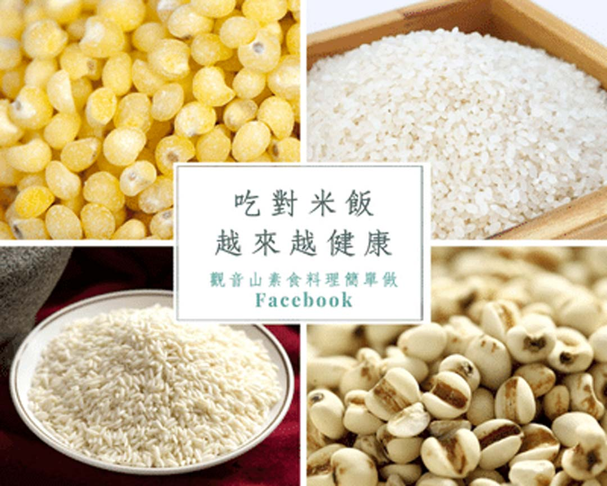

# 養生之道 吃對米飯，越來越健康

## 📋 基本資訊 / Recipe Overview
- **料理名稱**：養生之道 吃對米飯，越來越健康
- **原始標題**：【養生之道】吃對米飯，越來越健康
- **素食流派 / Diet**：全素 Vegan
- **來源平台 / Source**：[觀音山 · 素食料理簡單做](https://vegan.gys.org.tw/rice20201213/)

## 📖 食譜圖文詳情 (中英雙語對照)

【素食營養補給站】吃對米飯，越來越健康
​
飲食是我們每天都要注意的事，尤其是主食更是重要。​
臺灣的養身觀念已經漸漸發展起來了，而不同的米有不同的功效！​
讓我們從中醫學的角度來看，各種米有什麼不同的功效吧。
?【黑米最補腎】​
黑米為米中珍品，素有「貢米」、「藥米」、「長壽米」美譽，是一種具有諸多保健功效的珍貴稻米。✨​?中醫典籍《本草綱目》中記載：​
「黑米有滋陰補腎、健脾暖肝、明目?活血的功效。」​
?研究發現：​
黑米中含18種氨基酸及硒、鐵、鋅等微量元素B1、B2，營養價值極高，而其膳食纖維含量，是白米的「25」倍，熱量卻只有糙米的一半。
現代醫學認為：​
黑色食品不但營養豐富，且多有補腎，防衰老、保健益壽、防病治病以及黑髮美容等獨特功效。
​
?【糯米最排毒】​
秋冬季節排毒潤燥，溫和的食療是最好的選擇?，雜糧富含植物纖維，能清理腸管內的廢物，將毒素與廢物順利排出體外。​
糯米是屬偏熱雜糧，適合寒性體質。​
?中醫認為：​
糯米味甘、性溫，能夠補養人體正氣，吃了後會全身發熱，起到禦寒、滋補的作用。
糯米含有蛋白質、脂肪、糖類、鈣、磷、鐵、維生素B1、煙酸及澱粉等，​
糯米的主要功能是溫補脾胃，所以脾胃氣虛、常常腹瀉的人吃了，能起到很好的治療效果。
​
?【粳米最滋補】​
粳米又稱大米、蓬萊米，其味甘淡，其性平和，每日食用，是滋補之物。​
粳米含有人體必需的澱粉、蛋白質、維生素B1、煙酸、維生素C及鈣等營養成分，可以提供人體所需的營養和熱量。
?唐代醫藥學家孫思邈在《千金方•食治》說：粳米能養胃氣、長肌肉。​
?《食鑒本草》也認為：粳米有補脾胃、養五臟、壯氣力的良好功效。​
​
?【小米最養胃】​
小米富含蛋白質、脂肪、糖類、維生素B2、煙酸和鈣、磷、鐵等營養成分。​
由於小米非常易被人體消化吸收?，故被營養專家稱為「保健米」。​
?中醫認為：​
小米味甘鹹，有清熱解渴、健胃除濕、和胃安眠等功效。​
小米最主要的功效是補脾胃。​
?李時珍在《本草綱目》説：「治反胃熱痢，補虛損，開腸胃」。​
?《本草綱目》説：喝小米湯「可增強小腸功能，有養心安神之效」，對於那些因胃腸不好導致的失眠，其療效可勝過安眠藥。
鹼性體質可增加自體排毒功能，維持身體的健康。​
而小米是五穀雜糧中唯一的鹼性食物。​
​
?【薏仁最養顏】​
薏仁又稱薏仁米、苡米。​
薏仁的營養價值很高，被譽為「世界禾本植物之王」
?中醫認為：​
薏仁味甘、淡，性微寒、入脾、胃、肺經，對脾虛腹瀉、肌肉痠痛、​
關節疼痛等症有治療和預防作用。​
薏米是五穀類中纖維質最高的，低脂、低熱量，是減肥的最佳主食。​
豐富的蛋白質、碳水化合物和8種氨基酸，有美白、除斑功能，對下半身水腫的人尤具療效。​
​
✨慈悲的 龍德上師成立「觀音山蔬食館」提倡健康素食、慈悲護生，以”觀音山素食料理簡單做”的理念，提供多款素食食譜，讓您一學就會！?​
​
​
?觀音山 素食料理簡單做?
Facebook ｜好文按讚
http://www.facebook.com/GYSVegan​
Instagram ｜料理追蹤
http://www.instagram.com/gysvegan/​
Youtube ​ ​ ​ ｜加入訂閱
https://reurl.cc/q8VEqy​
Telegram ​ ｜頻道推薦
https://t.me/GYSVegan​
​
​
—​
? 歡迎轉載，請註明出處： ​ ​ 觀音山 素食料理簡單做GYSVegan按讚、留言設定搶先看! 素食環保愛地球，健康營養無負擔，慈悲護生一起來~?

---
*食譜歸檔時間：2026-08-20 · 來源：觀音山素食料理簡單做 (vegan.gys.org.tw)*