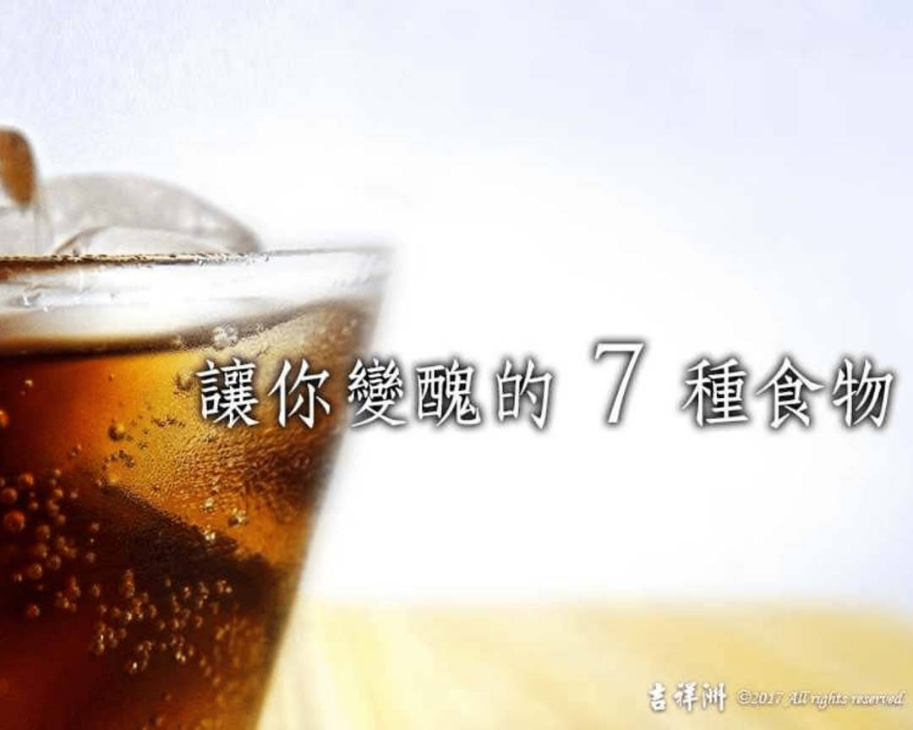

# 養生之道 謹慎飲食 讓你變醜的7種食物

## 📋 基本資訊 / Recipe Overview
- **料理名稱**：養生之道 謹慎飲食 讓你變醜的7種食物
- **原始標題**：【養生之道】謹慎飲食 讓你變醜的7種食物
- **素食流派 / Diet**：全素 Vegan
- **來源平台 / Source**：[觀音山 · 素食料理簡單做](https://vegan.gys.org.tw/%e3%80%90%e9%a4%8a%e7%94%9f%e4%b9%8b%e9%81%93%e3%80%91%e8%ac%b9%e6%85%8e%e9%a3%b2%e9%a3%9f-%e8%ae%93%e4%bd%a0%e8%ae%8a%e9%86%9c%e7%9a%847%e7%a8%ae%e9%a3%9f%e7%89%a9/)

## 📖 食譜圖文詳情 (中英雙語對照)

【謹慎飲食】讓你變醜的7種食物
​
英文有句俗諺 ”You are what you eat.”（人如其食），意思是你吃什麼，就會像什麼。飲食習慣會洩漏個性，也會反映在臉上。
一些食物看起來沒那麼糟，對皮膚來說卻不然，吃多可能會使臉色差，甚至導致發炎反應、細胞氧化、損害膠原蛋白和DNA。​
簡單來說，雖不至讓人毀容，卻有變醜、「操老(台語)」的風險。​
​
⬇️這7種食物，小心，別吃太多。 ​
1.胡蘿蔔、木瓜等紅色蔬果 ​
紅色蔬果不是富含類胡蘿蔔素與纖維，能抗癌、重整腸道環境嗎?​
沒錯，紅色蔬果營養價值高，但短時間內吃過量或長期吃太多恐怕會變黃臉婆。 ​
?‍⚕️臺北長庚皮膚科主治醫師黃毓惠指出，類胡蘿蔔素是一種脂溶性色素，是天然色素中最重要的族群。​
若過量食用胡蘿蔔、南瓜、木瓜這類含有大量類胡蘿蔔素?的蔬果，將導致血液中的類胡蘿蔔素濃度過高，色素沉澱在皮膚真皮層中，讓膚色黯沉變黃。
?醫師提醒，一天不要吃超過兩個飯碗份量的紅色蔬果，就不會有問題。? ​
​
2.洋芋片 ?​
雖然油脂是維持肌膚彈性的重要元素，卻不是所有油脂都對我們有益，好油才會提供健康皮膚所需的維生素E。 ​
愛吃薯片?、洋芋片、鹹酥雞的人要注意，不僅容易肥胖，小心惱人的粉刺、面皰揮之不去。​
為了降低成本?，炸物、洋芋片通常是用劣油、油炸過的油，飽和脂肪酸和反式脂肪酸過多，容易造成皮膚發炎、自由基增加，影響細胞的完整度和皮膚的保濕狀況，容易造成有一張比實際年齡老?的臉。​
​
3.速食 ?​
車子開進車道、點餐取餐，好快就解決一頓，正如其名「速食」。​
你的皮膚可能也在快速變醜。​
吃太多速食會長痘痘，?《美國皮膚病學》期刊進一步指出，長期習慣吃高GI值、低蛋白質、高飽和脂肪酸的食物如速食，與面皰病變有關聯，會對皮膚造成嚴重威脅。?​
​
4.甜點 ​
蛋糕?、馬卡龍、糖果等精緻點心?對女生來說簡直是夢幻逸品，姊妹時間少了這些點綴，想必會大為失色。可是這些食物充滿糖分或人造奶油的反式脂肪，享受的同時，體重不知不覺增加?，還讓人過了青春期，粉刺痘痘卻還冒不停。 ​
?‍⚕️黃毓惠醫師指出，想要有漂亮皮膚，就要少吃點糖，糖分會降低細胞活性、誘發肌膚發炎，吃太多糖會破壞膠原蛋白，讓皮膚失去彈性和柔軟度，並刺激粉刺生長。 ​
從中醫觀點，這些加工過的點心缺乏膳食纖維，容易讓腸道毒素孳生，導致便秘，反應在臉上使臉色黯淡?。總是打扮美美的去吃下午茶，卻愈吃氣色愈差。若真無糖不歡，不妨適量吃點黑糖 。​
​
5.含糖穀片、三合一沖泡包 ​ ​
不要被包裝上的美言騙了。?許多穀片、沖泡包標榜營養、低GI、低熱量，其實含大量糖分，且往往都是砂糖、精製糖。?​
身體需要維生素B群參與醣類代謝、皮膚角質代謝，攝取過量糖分，將造成維生素B群快速流失、血管發炎，氣色也跟著變差。​
若貪圖方便天天喝2～3包，可能就因小失大。☕️​
​
6.酒精 ?​
近來不少研究在還啤酒、紅酒清白，指出適量喝酒有益健康，到這裡竟又被列為黑名單?​
飲酒過量除了會上癮、傷肝，?‍⚕️黃毓惠醫師指出，喝完酒讓人看起來毛孔粗大、臉紅紅的，其實是酒精讓皮膚的血管擴張，長期飲酒輕則引起泛紅?、「酒糟臉」，重則長膿皰或損傷保持皮膚堅實的膠原蛋白。 ​
​
7.碳酸飲料 ?​
相信可樂、汽水對不少人來說難以抗拒，夏天尤其消暑，有些果汁汽水，更讓人以為喝到水果的營養。​
碳酸飲料通常含糖和磷酸鹽，果汁含量少之又少。糖會加速皮膚老化、皺紋生成，磷酸鹽則會造成鈣質流失。?喝太多碳酸飲料，不但會胖，小心臉看起來垮垮的，皺紋也跑出來了。 ​
記得別矯枉過正，營養均衡還是最重要。?​
?‍⚕️劉怡里營養師叮嚀，體內醣類代謝、皮膚角質代謝、保濕度維持、細胞的完整都需要維生素B群和維生素E參與，膠原蛋白的合成也需要維生素C。​
因此，不要亂節食，若營養不均、蔬果吃不夠，維生素流失又未獲得補充，老化就在所難免。​
​
✅謹慎飲食，就是最有用的微整形。?​
​
✨慈悲的 龍德上師成立「觀音山蔬食館」提倡健康素食、慈悲護生，以”觀音山素食料理簡單做”的理念，提供多款素食食譜，讓您一學就會！?
​
?觀音山 素食料理簡單做 ?​
Facebook ｜好文按讚
http://www.facebook.com/GYSVegan​
Instagram ｜料理追蹤
http://www.instagram.com/gysvegan/​
Youtube ​ ​ ​ ｜加入訂閱
https://reurl.cc/q8VEqy​
Telegram ​ ｜頻道推薦
https://t.me/GYSVegan​
​
​
? 歡迎轉載，請註明出處： ​ ​ 觀音山 素食料理簡單做GYSVegan按讚、留言設定搶先看! 素食環保愛地球，健康營養無負擔，慈悲護生一起來~?​

---
*食譜歸檔時間：2026-08-20 · 來源：觀音山素食料理簡單做 (vegan.gys.org.tw)*