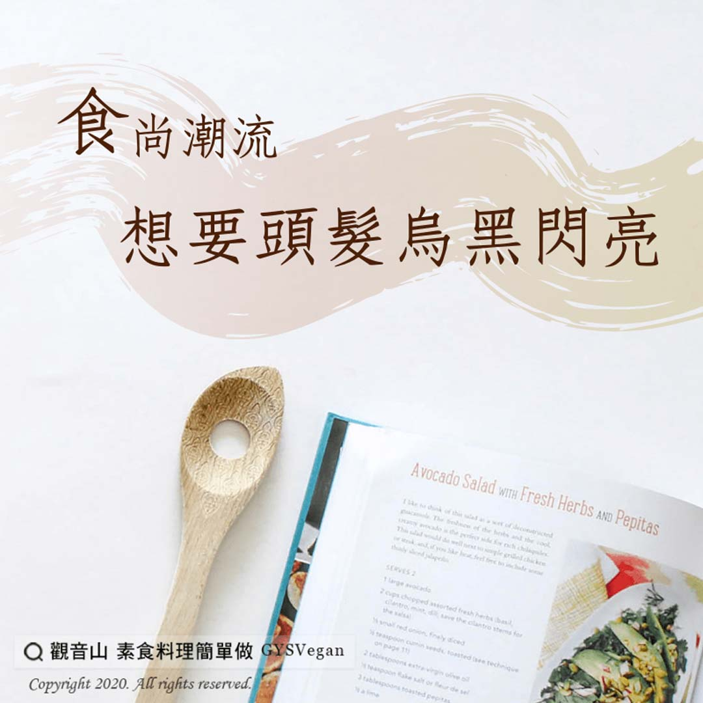

# 養生之道 食尚潮流 想要頭髮烏黑閃亮

## 📋 基本資訊 / Recipe Overview
- **料理名稱**：養生之道 食尚潮流 想要頭髮烏黑閃亮
- **原始標題**：【養生之道】食尚潮流 想要頭髮烏黑閃亮
- **素食流派 / Diet**：全素 Vegan
- **來源平台 / Source**：[觀音山 · 素食料理簡單做](https://vegan.gys.org.tw/%e3%80%90%e9%a4%8a%e7%94%9f%e4%b9%8b%e9%81%93%e3%80%91%e9%a3%9f%e5%b0%9a%e6%bd%ae%e6%b5%81-%e6%83%b3%e8%a6%81%e9%a0%ad%e9%ab%ae%e7%83%8f%e9%bb%91%e9%96%83%e4%ba%ae/)

## 📖 食譜圖文詳情 (中英雙語對照)

頭髪主要是由蛋白質組成，而頭髮上的毛乳頭會不斷吸收血液中的營養，供給我們的髪根、頭髪生長。以下有六種食物的營養成份，讓我們可以擁有一頭健康烏黑的頭髮！?​
​
(一)黑豆：​
黑豆的蛋白質豐富，還有多種礦物質和微量元素，是很好的蛋白質來源。​
​
(二)桑葚：​
富含鐵質和維生素C，是補血的好選擇，使頭皮血液供應充足，改善「貧血白髮」。​
​
(三)海帶：​
海藻類食物的鐵和維生素B12，有助預防貧血，可以讓頭髮吃進更多營養！​
​
(四)核桃：​
核桃當中的維生素E是天然抗氧化劑，可讓頭髮呈現美麗光澤。​
​
(五)黑芝麻：​
黑芝麻富含維生素B群，可以維護肌膚、頭皮、頭髪的健康，還能促進頭髪生長、保持自然光澤✨。​
​
(六)何首烏：​
何首烏能幫助補肝腎之血、烏髭髮、強筋骨等，十分滋補。建議可將黑豆粉、黑芝麻粉、何首烏粉加入豆漿?攪拌均勻，一起飲用；或者做成素食醬料加入乾麵?,拌成美味的蔬食麻醬麵,有助預防和改善白髮、掉髮的困擾。​
​
✨慈悲的 龍德上師成立「觀音山蔬食館」提倡健康素食、慈悲護生，以”觀音山素食料理簡單做”的理念，提供多款素食食譜，讓您一學就會！?​
​
​
?觀音山 素食料理簡單做 Follow us?
Facebook ｜好文按讚
http://www.facebook.com/GYSVegan​
Instagram ｜料理追蹤
http://www.instagram.com/gysvegan/​
Youtube ｜加入訂閱
https://reurl.cc/q8VEqy​
Telegram ｜頻道推薦
https://t.me/GYSVegan​
​
​
—​
? 歡迎轉載，請註明出處： 觀音山 素食料理簡單做 GYSVegan 素食環保愛地球，健康營養無負擔，慈悲護生一起來~?

---
*食譜歸檔時間：2026-08-20 · 來源：觀音山素食料理簡單做 (vegan.gys.org.tw)*