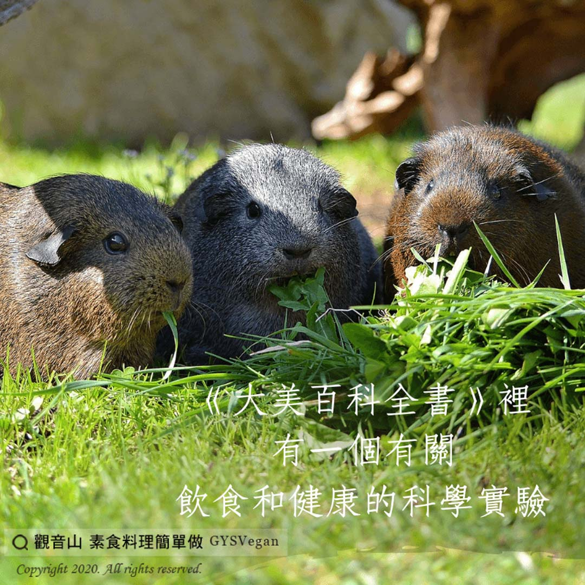

# 養生之道 飲食和健康

## 📋 基本資訊 / Recipe Overview
- **料理名稱**：養生之道 飲食和健康
- **原始標題**：【養生之道】飲食和健康
- **素食流派 / Diet**：全素 Vegan
- **來源平台 / Source**：[觀音山 · 素食料理簡單做](https://vegan.gys.org.tw/%e3%80%90%e9%a4%8a%e7%94%9f%e4%b9%8b%e9%81%93%e3%80%91%e9%a3%b2%e9%a3%9f%e5%92%8c%e5%81%a5%e5%ba%b7/)

## 📖 食譜圖文詳情 (中英雙語對照)

《大美百科全書》裡有一個有關飲食和健康的科學實驗⚗️。​
科學家把老鼠?分成兩組，甲組老鼠每天都給牠 #吃得飽飽的?，乙組的老鼠則給予 #少量的食物。​
​
結果發現：​
乙組的老鼠不但平均壽命比甲組的老鼠長，而且乙組老鼠身上的毛也較甲組的老鼠有光澤✨。​
​
心理學上也有類似的實驗，例如：把白老鼠分做兩組，甲組的白老鼠 #每天餵飽後，偶爾用「電擊」來刺激她們：乙組的白老鼠則 #盡量讓她們挨餓。​
​
結果發現：​
甲組的白老鼠犯胃潰瘍的比例，較乙組的白老鼠高出了許多。​
這也說明了：產生胃潰瘍的原因主要是精神緊張，而並非飢餓。​
​
在自然界中，我們很容易找到吃得少而長壽的證據，例如：​
一、烏龜?每天只吃很少的水草?而可活上數百年。​
二、獅子、老虎??每天吃下很多肉類，壽命卻反而短。​
​
在現實社會中也是如此，天下絕對没有暴飲暴食而活長命的人。​
許多住在鄉下山上的老太婆，她們每天都吃很簡單的蔬菜?，却能活到九十高齢！​
​
心平氣和，不動怒，​
生活有規律，調節飲食（不暴飲暴食），​
足夠的營養，不過度勞累等，是讓我們長壽的緣。​
​
仁愛心，慈悲心或救護所有動物，​
放生、宣揚戒殺護生的原理，​
施捨飲食（請人吃素或以小米餵鳥?），是長壽的因。​
​
✨慈悲的 龍德上師成立「觀音山蔬食館」提倡健康素食、慈悲護生，以”觀音山素食料理簡單做”的理念，提供多款素食食譜，讓您一學就會！?​
​
​
?觀音山 素食料理簡單做 Follow us?
Facebook ｜好文按讚
http://www.facebook.com/GYSVegan​
Instagram ｜料理追蹤
http://www.instagram.com/gysvegan/​
Youtube ｜加入訂閱
https://reurl.cc/q8VEqy​
Telegram ｜頻道推薦
https://t.me/GYSVegan​
​
​
—​
?歡迎轉載，請註明出處： 觀音山 素食料理簡單做 GYSVegan 素食環保愛地球，健康營養無負擔，慈悲護生一起來~?

---
*食譜歸檔時間：2026-08-20 · 來源：觀音山素食料理簡單做 (vegan.gys.org.tw)*