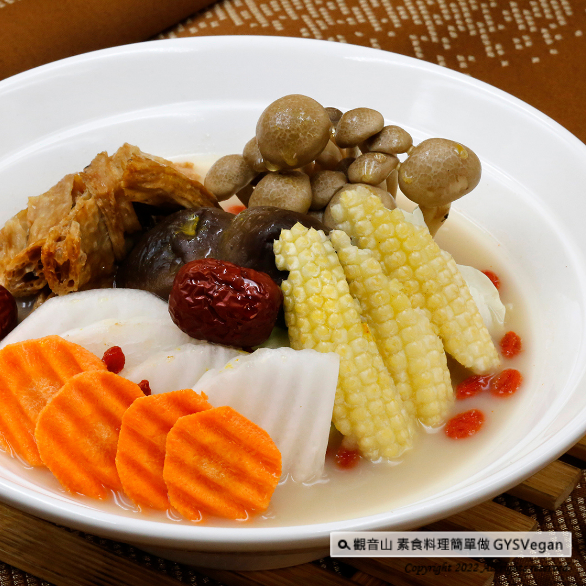

# 養生天香回味燕麥奶煲湯

## 📋 基本資訊 / Recipe Overview
- **料理名稱**：養生天香回味燕麥奶煲湯
- **原始標題**：燕麥奶系列 ｜養生天香回味燕麥奶煲湯｜全素
- **素食流派 / Diet**：全素 Vegan
- **料理分類 / Category**：湯品系列
- **來源平台 / Source**：[觀音山 · 素食料理簡單做](https://vegan.gys.org.tw/healthy-mongolian-oat-milk-broth20220415/)

## 📖 食譜圖文詳情 (中英雙語對照)

獨特的蒙古藥材香氣，將食補養生概念融入湯底燕麥奶中，清淡孜然芳香，與白蘿蔔、紫山藥、菇類的完美組合，不需沾醬就可以讓食材的鮮味完整呈現，不燥不熱四季皆合適，快跟著觀音山主廚，一起素食料理簡單做吧！​
​
◎食材及佐料〔Ingredients〕：(3人份)​
▪️蒙古藥材包 ​ 1包​
▪️燕麥奶、水 ​ 各600cc​
▪️皮絲(泡發的)、白蘿蔔 ​ 各150克​
▪️紫山藥、鴻喜菇 各100克​
▪️玉米筍 ​ 6條​
▪️鮮香菇 ​ 3朵​
▪️鹽、砂糖 ​ 適量​
​
◎烹飪步驟：​
1.紫山藥切1公分厚，片狀。​
2.皮絲切塊。​
3.鴻喜菇去蒂頭，稍微撥成小株的大小。​
4.白蘿蔔去皮，切滾刀塊。​
​
【調理作法】​
1.將蒙古藥材包、所有食材(紫山藥、皮絲、鴻喜菇、玉米筍、白蘿蔔、鮮香菇)放入湯鍋中，加入燕麥奶、水各600cc。​
2.放入電鍋，外鍋加2杯水燉煮。​
3.最後加入適當的調味料:鹽、砂糖即可享用。​
​
【特別說明】​
1.蒙古藥材包可以買市售，火鍋用的湯包，超市、素料行都可以購得。​
2.煲湯材料可依個人喜好做變化。​
3.此道湯品也可做為火鍋湯底享用。​
​
◎本食譜提供：台中觀音山蔬食館​
​
✨慈悲的龍德上師 成立「觀音山蔬食館」提倡健康素食、慈悲護生，以”觀音山素食料理簡單做”的理念，提供多款素食食譜，讓您一學就會！
​
​
「觀音山 社群樹」一鍵快速前往觀音山 官方相關連結！​
➠ ​
https://fazang.taplink.ws/​
​
​
★4月16日 無量光佛節日：善惡業增長1百萬x1000倍​
​
✨殊勝功德增長日✨​
觀音山邀請您於4月16日響應素食、廣修供養、戒殺護生、誦經修法、行持諸種善行，獲福無量。​
​
​
【recipe】​
​
📖With a concept of nourishing and health care, the unique aroma of Mongolian herbs cooks into the soup base of oat milk. A light cumin scent perfectly spreads out. Cooked along with white radish, purple yam and mushrooms, the umami of the ingredients can be fully presented without dipping sauce. In Chinese herbal perspective, it’s not too dry or hot for our body suitable for all seasons. let’s follow the chef of Guanyinshan and make vegetarian dishes together! ​ ​
​
◎Ingredients : （For 3 people）​
▪️A pack ofChinese herbal soup ​ ​
▪️Oat milk、Water ​ 600cc​
▪️Tofu skin、White radish ​ ​ 150g​
▪️Yam、Brown beech mushroom 100g​
▪️Six baby corn ​
▪️Three shiitake mushroom ​
▪️Salt、Sugar ​ , adequate amount​
​
◎ Instructions:​
【Cutting/ PREP-Ahead】​
1. Cut the purple yam into 1 cm thick, sliced. ​
2. Cut tofu skin into pieces. ​
3. For the brown beech mushrooms, cut off the base of the cluster and use your hands to separate the stems.​
4. Peel the white radish and roll cut. ​ ​
​
【Cooking Steps】​
1. Put the Mongolian herbal bag, all the ingredients (purple yam, shredded tofu skin, brown beech mushrooms, baby corns, white radish, fresh mushrooms) into the soup pot, and add 600cc of oat milk and 600cc of water. ​
2. Place it in a rice cooker, add 2 cups of water to the outer pot and simmer. ​
3. Finally, add appropriate seasonings: salt, sugar and enjoy. ​ ​
​
【Special notes】​
1. Mongolian herbal pack is store-bought from supermarkets or vegetarian shops. ​
2. The soup ingredients can be adopted to personal preference. ​
3. This recipe can also be used as a hot pot soup base. ​ ​
​
◎This recipe is provided by: Taichung Guanyinshan Green Restaurant​
​
​
🌱 觀音山 素食料理簡單做 🌱​
◎Facebook ｜好文按讚​
https://www.facebook.com/GYSVegan​
​
◎Instagram ｜料理追蹤​
https://www.instagram.com/gysvegan/​
​
◎Youtube ​ ​ ​ ｜加入訂閱​
https://reurl.cc/q8VEqy​
​
◎官方Blog ​ ​ ｜網站推薦​
https://vegan.gys.org.tw/​
​
​
—​
👑歡迎轉載，請註明出處： 觀音山 素食料理簡單做 GYSVegan 素食環保愛地球，健康營養無負擔，慈悲護生一起來~🥰

---
*食譜歸檔時間：2026-08-20 · 來源：觀音山素食料理簡單做 (vegan.gys.org.tw)*