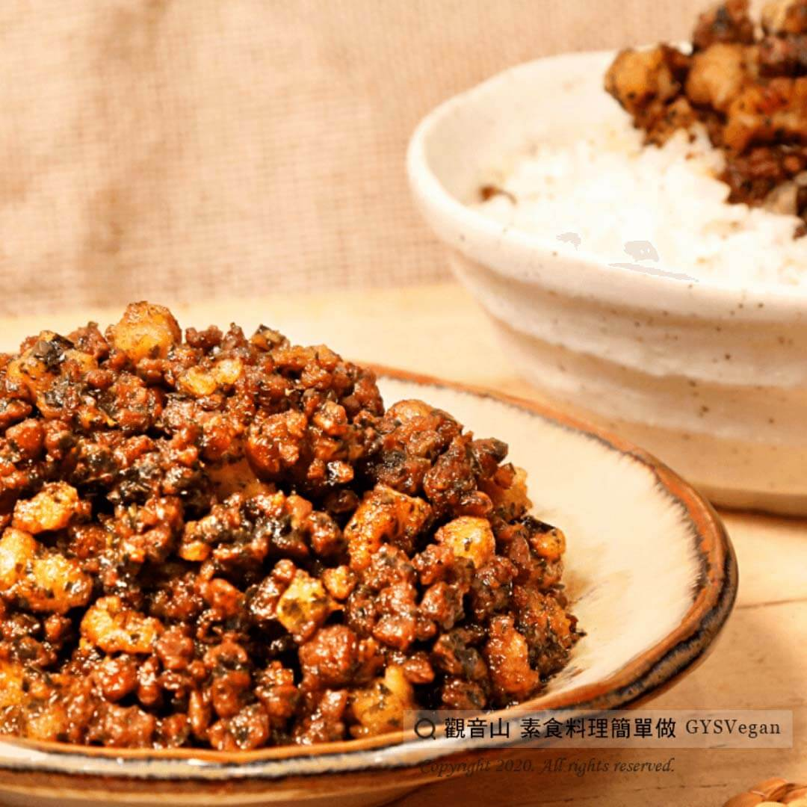

# 香椿素燥

## 📋 基本資訊 / Recipe Overview
- **料理名稱**：香椿素燥
- **原始標題**：香椿素燥｜全素
- **素食流派 / Diet**：全素 Vegan
- **來源平台 / Source**：[觀音山 · 素食料理簡單做](https://vegan.gys.org.tw/%e9%a6%99%e6%a4%bf%e7%b4%a0%e7%87%a5%ef%bd%9c%e5%85%a8%e7%b4%a0/)

## 📖 食譜圖文詳情 (中英雙語對照)

香椿是藥食兼用的食材，有著獨特的香氣，營養豐富且抗氧化第一！平常做好一罐放冰箱保存，拌飯隨時可配，非常方便！一個下飯的素燥，讓餐桌出菜不NG，餐餐都可以一碗飯配到底！​
​
?食材及佐料〔Ingredients〕：(可依人數需求做調整)​
▪素肉粒 300g​
▪香椿醬 1大匙​
▪胡椒粉 少許​
▪醬油 適量​
▪水 少許​
▪糖 適量​
▪鹽 適量​
​
?烹飪步驟：​
1. 素肉粒泡水至鬆軟，水分擠乾。​
2. 入鍋油炸，起鍋備用。​
3. 熱鍋，將素肉粒、醬油、香椿醬、水拌勻炒香。​
4. 續入胡椒粉、糖、鹽調味，小火煮10分鐘，完成!!!​
​
??本食譜提供：台中 #觀音山蔬食館 主廚 樂卿​
​
✨慈悲的 龍德上師成立「觀音山蔬食館」提倡健康素食、慈悲護生，以”觀音山素食料理簡單做”的理念，提供多款素食食譜，讓您一學就會！?​
​
​
?觀音山 素食料理簡單做 ​ Follow us?​
Facebook ｜好文按讚
http://www.facebook.com/GYSVegan
​
Instagram ｜料理追蹤
http://www.instagram.com/gysvegan/
​
Youtube ​ ​ ​ ｜加入訂閱
https://reurl.cc/q8VEqy​
Telegram ​ ｜頻道推薦
https://t.me/GYSVegan​
​
​
? 歡迎轉載，請註明出處： ​ ​ 觀音山 素食料理簡單做GYSVegan按讚、留言設定搶先看! 素食環保愛地球，健康營養無負擔，慈悲護生一起來~?

---
*食譜歸檔時間：2026-08-20 · 來源：觀音山素食料理簡單做 (vegan.gys.org.tw)*