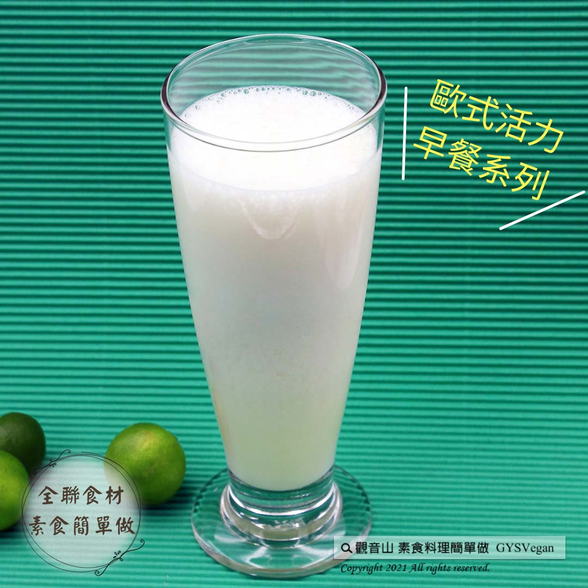

# 香檸雪克

## 📋 基本資訊 / Recipe Overview
- **料理名稱**：香檸雪克
- **原始標題**：香檸雪克｜奶素
- **素食流派 / Diet**：奶素 Lacto-Vegetarian
- **來源平台 / Source**：[觀音山 · 素食料理簡單做](https://vegan.gys.org.tw/lemon20211007/)

## 📖 食譜圖文詳情 (中英雙語對照)

清新檸檬、香醇牛奶與優酪乳的黃金比例，蹦出絕妙的新滋味！喝一口香檸雪克，感受到香醇濃郁中帶有清新檸檬的口感，真讓人想一喝再喝！快跟著觀音山主廚，一起素食料理簡單做吧！​
​
◎食材及佐料〔Ingredients〕：(1人份)​
▪️檸檬汁 ​ 約25cc​
▪️牛奶 ​ 50cc​
▪️優酪乳 ​ 150cc​
▪️冰塊、蜂蜜 ​ 適量​
​
◎烹飪步驟：​
將食材放入果汁機中攪打均勻，即可享用。​
​
【特別說明】​
全素者可用植物奶或豆漿替代牛奶、優酪乳。​
​
本食譜提供：台中觀音山蔬食館 ​
​
✨慈悲的龍德上師 成立「觀音山蔬食館」提倡健康素食、慈悲護生，以”觀音山素食料理簡單做”的理念，提供多款素食食譜，讓您一學就會！
​
​
★10月7日~12月4日 ​ 佛陀天降月：善惡業增長10億倍​
​
✨殊勝功德增長日✨​
觀音山邀請您於10月7日~12月4日，響應素食、廣修供養、戒殺護生、誦經修法、行持諸種善行，獲福無量。​
​
​
【recipe】​
​
The combination of refreshing lemon, mellow milk and yogurt, pops up a wonderful new taste! Take a sip of this lemon shake, you can tastes the fragrance and richness while a burst of refreshing lemon spreads out in your mouth. It really makes you want to drink it again and again! Quickly follow the chef of Guanyinshan, let’s cook simple vegetarian dishes together!​
​
◎Ingredients : （For 1 people）​
▪️Lemon juice ​ 25cc​
▪️Milk ​ 50cc​
▪️Drinking Yogurt ​ 150cc​
▪️Ice cube、Honey ​ , adequate amount​
​
◎Instructions ​
【Cutting/Prep-Ahead】 ​
Put all the ingredients in a blender and process until smooth, and then enjoy.​
​
[Special notes]​
‌As for Vegans, milk and yogurt can be replaced by plant milk or soy milk.​
​
This recipe is provided by # Guanyinshan Green Restaurant, Taichung.​
​
☆ 觀音山 素食料理簡單做 ☆​
Facebook ｜好文按讚
http://www.facebook.com/GYSVegan​
Instagram ｜料理追蹤
http://www.instagram.com/gysvegan/​
Youtube ｜加入訂閱
https://reurl.cc/q8VEqy​
Telegram ｜頻道推薦
https://t.me/GYSVegan​
​
​
—​
歡迎轉載，請註明出處： 觀音山 素食料理簡單做 GYSVegan 素食環保愛地球，健康營養無負擔，慈悲護生一起來~

---
*食譜歸檔時間：2026-08-20 · 來源：觀音山素食料理簡單做 (vegan.gys.org.tw)*