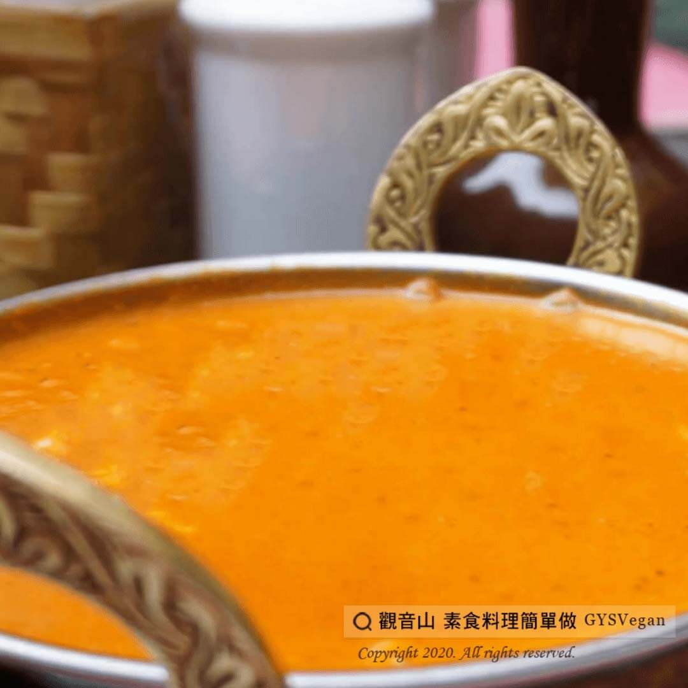

# 香甜濃郁 日式咖哩

## 📋 基本資訊 / Recipe Overview
- **料理名稱**：香甜濃郁 日式咖哩
- **原始標題**：香甜濃郁 日式咖哩｜全素
- **素食流派 / Diet**：全素 Vegan
- **來源平台 / Source**：[觀音山 · 素食料理簡單做](https://vegan.gys.org.tw/%e9%a6%99%e7%94%9c%e6%bf%83%e9%83%81-%e6%97%a5%e5%bc%8f%e5%92%96%e5%93%a9-%e5%85%a8%e7%b4%a0/)

## 📖 食譜圖文詳情 (中英雙語對照)

微甜蘋果香氣和香濃咖哩，吃下去的第一口，馬鈴薯、蘋果輕輕在口中化開來，搭配白飯，不禁令人想說：再來一碗！?​
​
?準備食材：​
蘋果、馬鈴薯、南瓜、紅蘿蔔、咖哩粉、日式素食咖哩塊，適量。​
​
?#素食料理簡單做，開始：​
1. 熱鍋後倒入少許油至鍋中，先下紅蘿蔔炒出紅蘿蔔素，再依序放入蘋果塊、馬鈴薯拌炒。​
2.接著放入適量的咖哩粉拌炒。​
3.倒入水至鍋中，蓋過食材。​
4.水煮沸後，將南瓜放入，煮至馬鈴薯熟透。(用牙籤或筷子插入，可插透即可)​
5. 加入咖哩塊，攪拌至咖哩塊完全溶化，湯汁濃稠即可起鍋，完成囉！！?​
​
⭐️特別說明：​
1.咖哩粉不要放太多不然會苦，有咖哩顏色和香氣出來就好。​
2.馬鈴薯可以先過油炸一下再一起煮，比較不會散掉。​
3.南瓜煮太久會融掉，所以要記得是在鍋中放入水後再放南瓜喔!​
​
?‍?本食譜提供：台中 #觀音山蔬食館 主廚 樂芳​
​
✨慈悲的 龍德上師成立「觀音山蔬食館」提倡健康素食、慈悲護生，以”觀音山素食料理簡單做”的理念，提供多款素食食譜，讓您一學就會！?​
​
​
?觀音山 素食料理簡單做 ​ Follow us?​
Facebook ｜好文按讚
http://www.facebook.com/GYSVegan
​
Instagram ｜料理追蹤
http://www.instagram.com/gysvegan/​
Youtube ​ ​ ​ ｜加入訂閱
https://reurl.cc/q8VEqy​
Telegram ​ ｜頻道推薦
https://t.me/GYSVegan​
​
​
? 歡迎轉載，請註明出處： ​ ​ 觀音山 素食料理簡單做GYSVegan按讚、留言設定搶先看! 素食環保愛地球，健康營養無負擔，慈悲護生一起來~?

---
*食譜歸檔時間：2026-08-20 · 來源：觀音山素食料理簡單做 (vegan.gys.org.tw)*