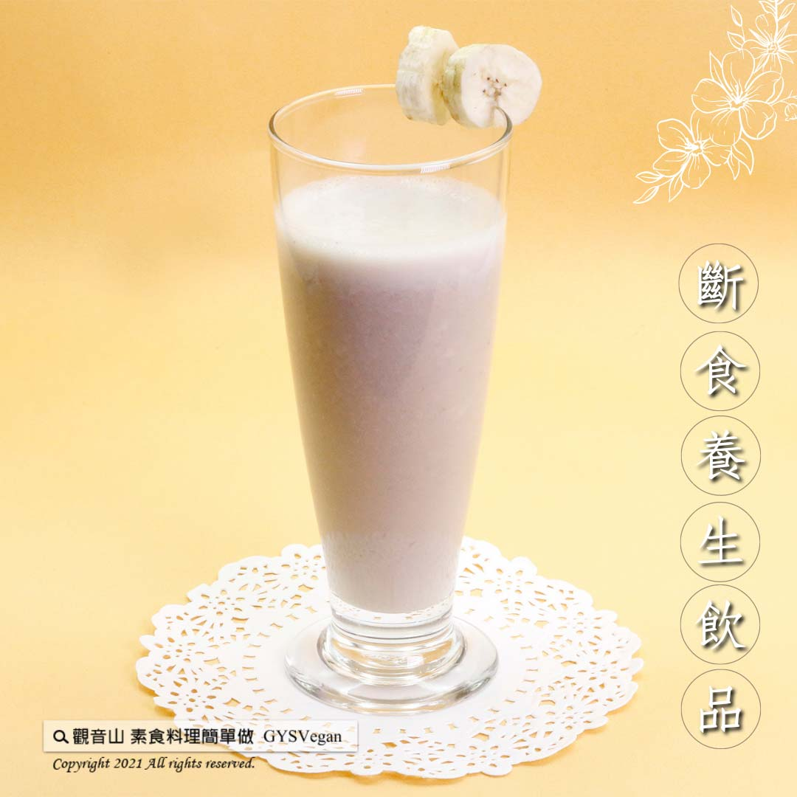

# 香蕉奶昔

## 📋 基本資訊 / Recipe Overview
- **料理名稱**：香蕉奶昔
- **原始標題**：香蕉奶昔｜奶素
- **素食流派 / Diet**：奶素 Lacto-Vegetarian
- **來源平台 / Source**：[觀音山 · 素食料理簡單做](https://vegan.gys.org.tw/banana20210921/)

## 📖 食譜圖文詳情 (中英雙語對照)

香蕉中的寡糖，是腸道益生菌的營養來源，能幫助調整腸道環境，豐富的維生素和膳食纖維，搭配有優質蛋白、益生菌的優酪乳，口感綿密香氣濃郁，斷食 養生一次成功，快跟著觀音山主廚，一起素食料理簡單做吧！​
​
◎食材及佐料〔Ingredients〕：(1人份)​
▪️香蕉 ​ 2條​
▪️水 ​ 150cc​
▪️優酪乳 ​ 350cc​
​
◎烹飪步驟：​
【刀工/前處理】​
1. 香蕉去皮備用。​
​
【調理作法】​
1.將食材放入果汁機中攪打均勻，即可享用！​
​
【特別說明】​
全素者可用植物奶或豆漿替代牛奶。​
​
​
本食譜提供：台中 觀音山蔬食館 主廚 樂敏​
​
​
✨慈悲的龍德上師 成立「觀音山蔬食館」提倡健康素食、慈悲護生，以”觀音山素食料理簡單做”的理念，提供多款素食食譜，讓您一學就會！
​
​
☆ 觀音山 素食料理簡單做 ☆ ​
Facebook ｜好文按讚
http://www.facebook.com/GYSVegan​
Instagram ｜料理追蹤
http://www.instagram.com/gysvegan/​
Youtube ｜加入訂閱
https://reurl.cc/q8VEqy​
Telegram ｜頻道推薦
https://t.me/GYSVegan​
​
​
—​
歡迎轉載，請註明出處： 觀音山 素食料理簡單做 GYSVegan 素食環保愛地球，健康營養無負擔，慈悲護生一起來~

---
*食譜歸檔時間：2026-08-20 · 來源：觀音山素食料理簡單做 (vegan.gys.org.tw)*