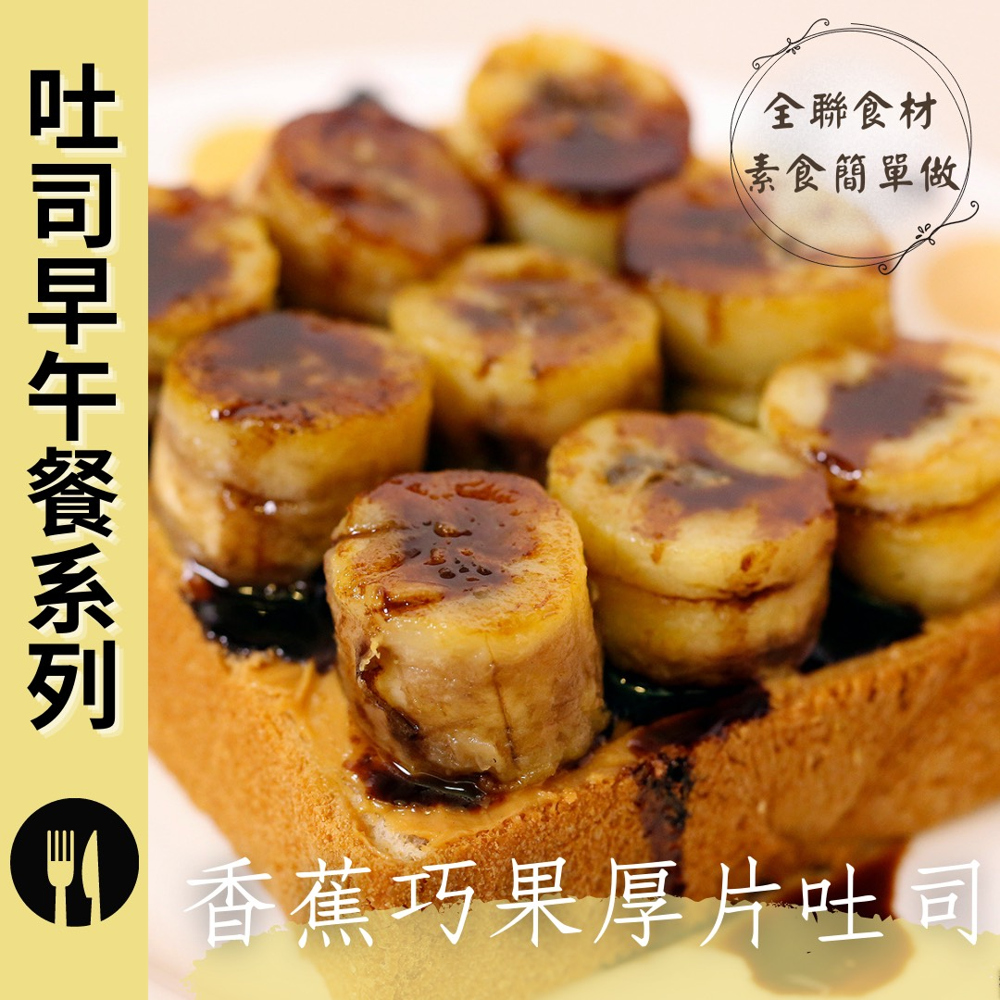

# 香蕉巧果厚片吐司 無奶蛋料理

## 📋 基本資訊 / Recipe Overview
- **料理名稱**：香蕉巧果厚片吐司 無奶蛋料理
- **原始標題**：香蕉巧果厚片吐司｜無奶蛋料理
- **素食流派 / Diet**：全素 Vegan
- **來源平台 / Source**：[觀音山 · 素食料理簡單做](https://vegan.gys.org.tw/banana20210907/)

## 📖 食譜圖文詳情 (中英雙語對照)

微焦的香蕉薄片，搭配抹上花生醬的鬆軟厚片，淋上香濃巧克力醬，創造超出想像的口感，香甜可口，帶給你一整天的活力！用全聯食材 做出創意料理，快跟著觀音山主廚，一起素食料理簡單做吧！​
​
◎食材及佐料〔Ingredients〕：(3人份)​
▪️香蕉 ​ 3條​
▪️純素奶油、花生醬、巧克力醬 ​ 適量​
▪️厚片 ​ 3片​
​
❖以上食材皆可在全聯福利中心 購得​
​
◎烹飪步驟：​
【刀工/前處理】​
1. 香蕉去皮切1公分厚圓片。​
​
【調理作法】​
1.厚片切九宮格紋路。​
2.香蕉用奶油略煎。​
3.厚片抹上花生醬，將煎好的香蕉平均鋪滿吐司。​
4.烤箱180度預熱，放入厚片烤約3-5分鐘。​
5.厚片取出後，淋上巧克力醬可享用。​
​
本食譜提供：台中觀音山蔬食館​ 主廚 淨雅​
​
​
✨慈悲的 龍德上師成立「觀音山蔬食館」提倡健康素食、慈悲護生，以”觀音山素食料理簡單做”的理念，提供多款素食食譜，讓您一學就會！
★9月7日 禪定勝王佛節日：善惡業增長1百倍​
​
✨殊勝功德增長日✨​
觀音山邀請您於今日響應素食、廣修供養、戒殺護生、誦經修法、行持諸種善行，獲福無量。​
​
​
【recipe】​
​
Peanut butter thick toast, paired with burnt banana slices, and drizzled with chocolate syrup, ​ it’s a taste beyond imagination. It’s sweet and delicious, bringing you a whole day of vitality! #PX Mart creative cuisine, follow the chef of Guanyinshan, let’s cook simple vegetarian dish together! ​
​
◎Ingredients : （For 3 people）​
▪️Three bananas​
▪️Vegan butter、Peanut butter、Chocolate syrup ​ , adequate amount​
▪️Three slices of thick sliced toast ​
​
◎Instructions: ​
【Cutting/PREP-Ahead】​
​ 1. Peel a banana and slice into 1 cm thick round. ​ ​
​
【Directions】 ​
1. Cutting a grid into the top of a slice thick toast. (not to cut all the way through to the bottom)​
2. Pan-fry bananas with butter. ​
3. Spread peanut butter on the thick slices, spread the fried bananas evenly over the toast. ​
4. Preheat the oven at 180 degrees, put in thick slices and bake for about 3-5 minutes. ​
5. Top with chocolate syrup after bake the bread. And you’ll be set.​
​
This recipe is provided by Chef Jing Ya,Taichung   Guanyinshan Green Restaurant
​
​
☆ 觀音山 素食料理簡單做 ☆
Facebook ｜好文按讚
http://www.facebook.com/GYSVegan​
Instagram ｜料理追蹤
http://www.instagram.com/gysvegan/​
Youtube ｜加入訂閱
https://reurl.cc/q8VEqy​
Telegram ｜頻道推薦
https://t.me/GYSVegan​
​
​
—​
歡迎轉載，請註明出處： 觀音山 素食料理簡單做 GYSVegan 素食環保愛地球，健康營養無負擔，慈悲護生一起來~

---
*食譜歸檔時間：2026-08-20 · 來源：觀音山素食料理簡單做 (vegan.gys.org.tw)*