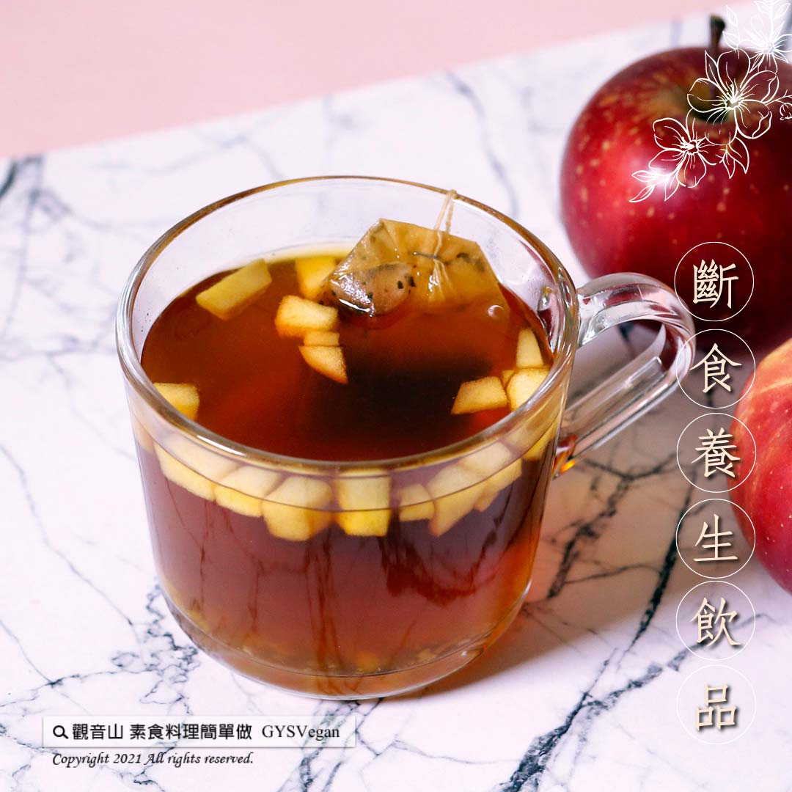

# 香蘋肉桂茶

## 📋 基本資訊 / Recipe Overview
- **料理名稱**：香蘋肉桂茶
- **原始標題**：香蘋肉桂茶｜全素
- **素食流派 / Diet**：全素 Vegan
- **來源平台 / Source**：[觀音山 · 素食料理簡單做](https://vegan.gys.org.tw/cinnamon20210923/)

## 📖 食譜圖文詳情 (中英雙語對照)

以「全方位的健康水果」之稱的蘋果為主軸，使用新鮮蘋果與蘋果醬的組合，搭配回甘、醇厚的紅茶，調製成一杯抗氧化滿分飲品，加上肉桂粉獨特香氣，讓你 斷食養生 快速上手，快跟著觀音山主廚，一起素食料理簡單做吧！​
​
◎食材及佐料〔Ingredients〕：(1人份)​
▪️蘋果 ​ ¼顆​
▪️蘋果醬、肉桂粉 ​ 適量​
▪️紅茶包 ​ 1包​
▪️飲用水 ​ 500C.C ​ ​
​
◎烹飪步驟：​
【刀工/前處理】​
1. 蘋果去皮切小丁。​
​
【調理作法】​
1.蘋果丁加飲用水煮沸後，轉小火煮5分鐘熄火。
2.加入蘋果醬以及紅茶包浸泡出味。
3.盛裝入杯中，撒上肉桂粉即可享用。​
​
本食譜提供：台中觀音山蔬食館 主廚 樂敏​
​
​
✨慈悲的龍德上師 成立「觀音山蔬食館」提倡健康素食、慈悲護生，以”觀音山素食料理簡單做”的理念，提供多款素食食譜，讓您一學就會！
​
★9月24日 觀世音菩薩節日：善惡業增長千萬倍​
​
✨殊勝功德增長日✨​
觀音山邀請您於9月24日響應素食、廣修供養、戒殺護生、誦經修法、行持諸種善行，獲福無量。​
【recipe】​
​
Apples, the main character of this drink, are chock-full of nutrition. The combination of fresh apple and applesauce blended in sweet and mellow black tea makes a perfect antioxidant drink. With an added touch of the fragrant cinnamon powder, this enables you to get a good start with healthy diet & #fasting. ​ Quickly follow the chef of Guanyinshan, let’s make simple vegetarian dish together!​
​
◎Ingredients : （For 1 people）​
▪️A quarter of apple​
▪️Applesauce、Cinnamon powder ​ , adequate amount​
▪️A pack of Black tea bags​
▪️Drinking water ​ 500c.c ​
​
◎Instructions: ​
【Cutting/PRE-Ahead】​
1. Peel and dice apples.​
​
【Directions】​
1. Boil diced apple in drinking water, turn to low heat and simmer for another 5 minutes, then turn off the heat.​
2. Add applesauce and black tea bags to soak to taste.​
3. Pour it into a cup, sprinkle with cinnamon powder and enjoy.​
​
This recipe is provided by Chef Le Min, Taichung # Guanyinshan Green Restaurant.
​
​
☆ 觀音山 素食料理簡單做 ☆​
Facebook ｜好文按讚
http://www.facebook.com/GYSVegan​
Instagram ｜料理追蹤
http://www.instagram.com/gysvegan/​
Youtube ｜加入訂閱
https://reurl.cc/q8VEqy
​
Telegram ｜頻道推薦
https://t.me/GYSVegan​
​
​
—​
歡迎轉載，請註明出處： 觀音山 素食料理簡單做 GYSVegan 素食環保愛地球，健康營養無負擔，慈悲護生一起來~

---
*食譜歸檔時間：2026-08-20 · 來源：觀音山素食料理簡單做 (vegan.gys.org.tw)*