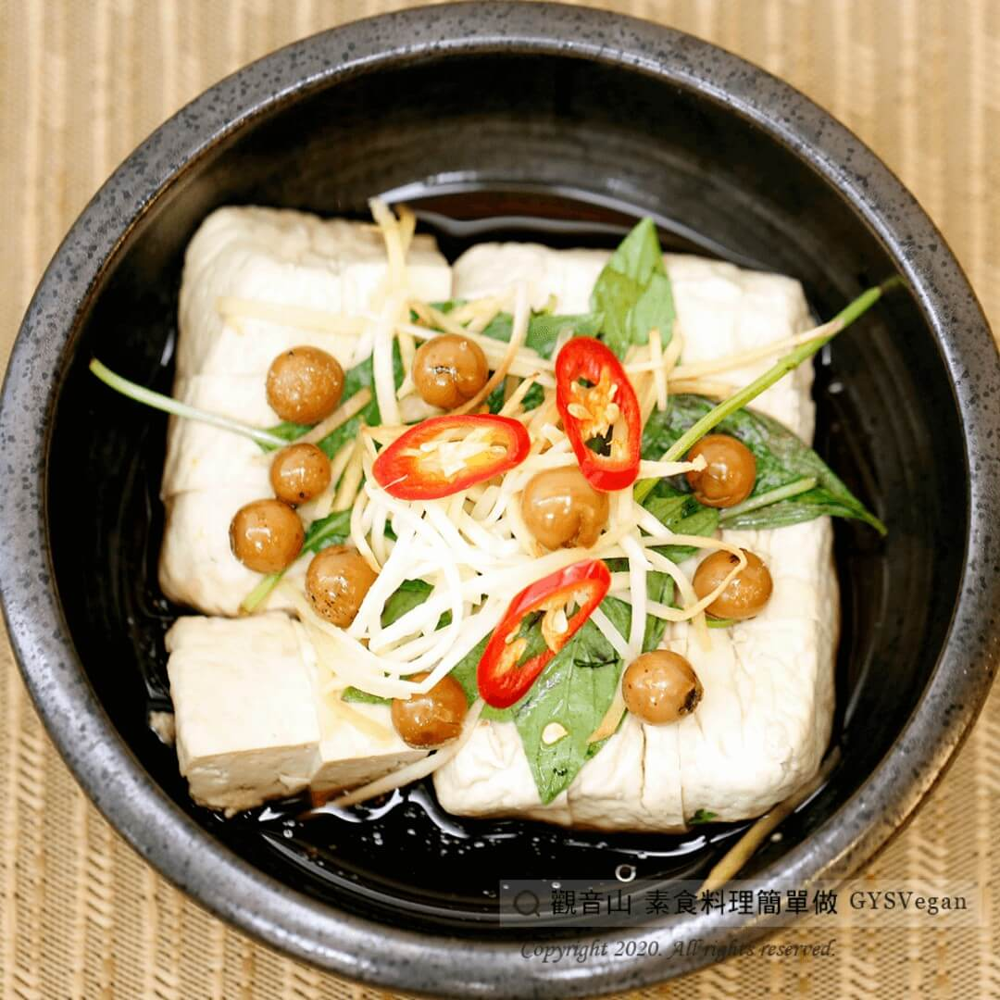

# 鮮味清蒸臭豆腐

## 📋 基本資訊 / Recipe Overview
- **料理名稱**：鮮味清蒸臭豆腐
- **原始標題**：鮮味清蒸臭豆腐｜全素
- **素食流派 / Diet**：全素 Vegan
- **來源平台 / Source**：[觀音山 · 素食料理簡單做](https://vegan.gys.org.tw/steamed20201124/)

## 📖 食譜圖文詳情 (中英雙語對照)

臭豆腐是台灣知名小吃，不只可以油炸，料理方式多元。​
觀音山主廚使用臭豆腐，搭配破布子調味清蒸。​
清蒸過後吸飽湯汁的臭豆腐，吃起來特別順口入味，在這微涼的氣候中，吃著熱熱的清蒸臭豆腐，單吃或搭配白飯都好吃！​
快跟著觀音山主廚，一起素食料理簡單做吧！​
​
?食材及佐料〔Ingredients〕：(5人份)​
▪臭豆腐 4~6塊​
▪薑絲 20克​
▪九層塔 15克​
▪破布子 20克​
▪辣椒 少許​
▪清醬油 適量​
▪糖 適量​
▪香油 適量​
​
?烹飪步驟：​
1.臭豆腐表面切畫井字，不切段。​
2.臭豆腐加入配料、調味料。​
3.大火蒸或使用電鍋蒸15分鐘即可 。​
​
??本食譜提供：台中 #觀音山蔬食館 主廚 樂卿​
​
✨慈悲的 龍德上師成立「觀音山蔬食館」提倡健康素食、慈悲護生，以”觀音山素食料理簡單做”的理念，提供多款素食食譜，讓您一學就會！?​
​
​
【recipe】​
?Stinky tofu is one of Taiwa’s well-known snacks. Not only can it be deep-fried, it can be cooked in various ways. The chef of Guanyinshan uses stinky tofu, seasoned and steamed with clammy cherry, which boosts the mild sweet flavor into the stinky tofu. The stinky tofu soaking the sauce with clammy cheery scent tastes smoothly. In such a slightly cool autumn season, having hot steamed stinky tofu is quite a joy. It can be eanten alone or served as a side dish with rice. Quickly follow us! Let’s cook simple vegetarian dishes together!​
​
?Ingredients : (For 5 people)​
▪Stinkt tofu 4~6​
▪Ginger 20g​
▪Basil 15g​
▪Clammy cherry/ cordia dichotomy 20g​
▪Chili, a little​
▪Japanese soy sauce, adequate amount​
▪Sugar, adequate amount​
▪Sesame oil, ​ adequate amount​
​
?Cooking Steps:​
1. On the surface of the stinking tofu, make 2 parallel equidistant horizontal & 2 parallel equidistant vertical cuts. For the cutting, please do not cut all the way through and keep the tofu as a whole.​
2. Add ingredients and seasonings to stinky tofu.​
3. Bring water in a wok to boil over high heat and set the dish in it, or place it in a rice cooker for 15 mins.​
​
??This recipe is provided by: Taichung Guanyinshan Vegetarian Restaurant, Chef: Le Qing.​
​
​
?觀音山 素食料理簡單做 ​ Follow us?​
Facebook ｜好文按讚
http://www.facebook.com/GYSVegan​
Instagram ｜料理追蹤
http://www.instagram.com/gysvegan/​
Youtube ​ ​ ​ ｜加入訂閱
https://reurl.cc/q8VEqy​
Telegram ​ ｜頻道推薦
https://t.me/GYSVegan​
​
​
? 歡迎轉載，請註明出處： ​ ​ 觀音山 素食料理簡單做 GYSVegan按讚、留言設定搶先看! 素食環保愛地球，健康營養無負擔，慈悲護生一起來~?

---
*食譜歸檔時間：2026-08-20 · 來源：觀音山素食料理簡單做 (vegan.gys.org.tw)*