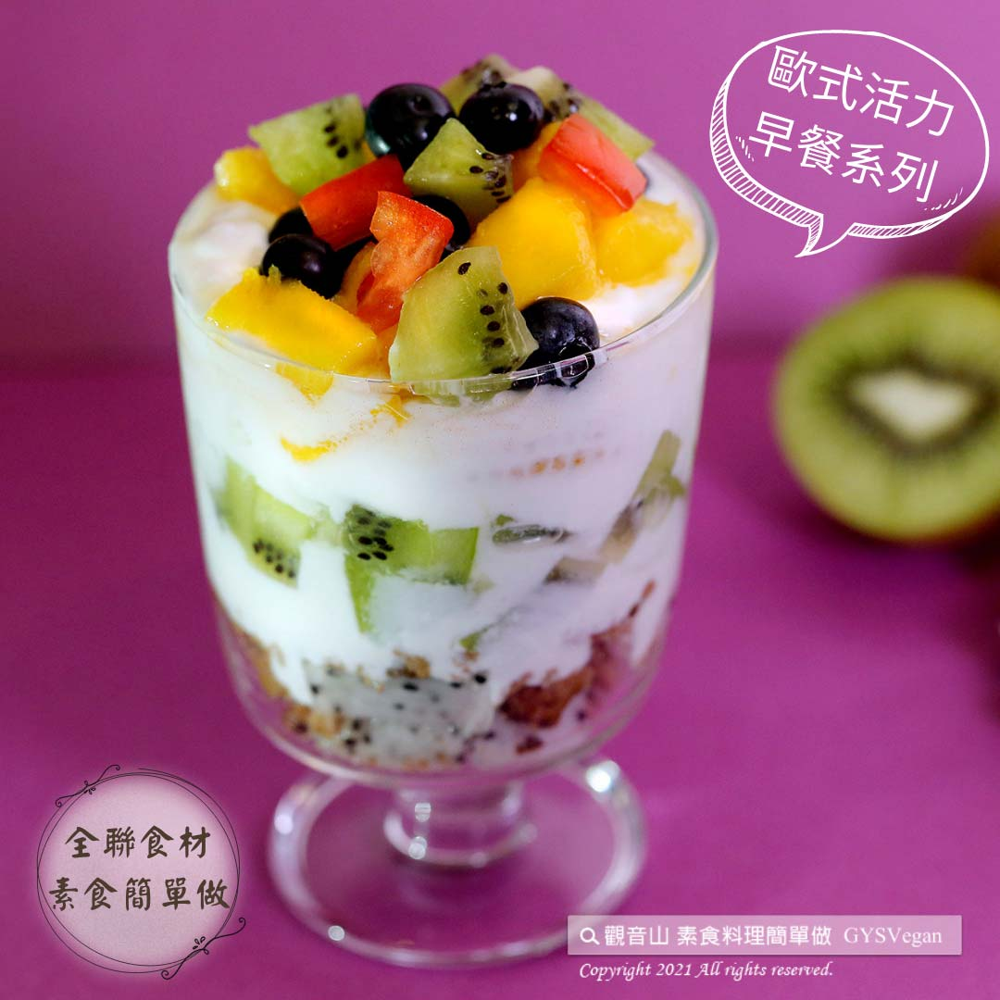

# 鮮果優格杯

## 📋 基本資訊 / Recipe Overview
- **料理名稱**：鮮果優格杯
- **原始標題**：鮮果優格杯｜奶素
- **素食流派 / Diet**：奶素 Lacto-Vegetarian
- **料理分類 / Category**：輕食點心
- **來源平台 / Source**：[觀音山 · 素食料理簡單做](https://vegan.gys.org.tw/yogurt20211005/)

## 📖 食譜圖文詳情 (中英雙語對照)

多種新鮮水果藏在具有豐富營養的優格當中，加上起司、燕麥餅乾的鋪陳，最後放上顏色鮮美的藍莓點綴，每一口都能吃到不一樣的水果鮮甜，入口剎那滿足的口感，讓人難以抵抗，快跟著觀音山主廚，一起素食料理簡單做吧！​
​
◎食材及佐料〔Ingredients〕：(3人份)​
▪️奇異果、橘子 ​ 1顆​
▪️火龍果 ​ 1/2顆​
▪️藍莓 ​ 1盒​
▪️優格 ​ 2罐​
▪️麗滋起司餅乾 ​ 適量​
▪️燕麥餅乾 ​ 適量​
​
◎烹飪步驟：​
【刀工/前處理】​
1.火龍果、奇異果去皮，切1公分丁狀。​
2.橘子去皮，將果肉剝下，切對半備用。​
3.燕麥餅乾稍微壓碎。​
​
【調理作法】​
1.取一玻璃杯或玻璃罐。​
2.依序放入食材:起司餅乾、火龍果、優格→燕麥餅乾、橘子、優格→燕麥餅乾，奇異果、優格。​
3.最後點綴上藍莓、綜合水果、燕麥餅乾，即可享用。​
​
【特別說明】​
1.擺盤及點綴水果種類、組合順序可以依個人喜好做調整。​
2.全素者可用純素優格替代。​
​
本食譜提供：台中觀音山蔬食館 ​
​
✨慈悲的龍德上師 成立「觀音山蔬食館」提倡健康素食、慈悲護生，以”觀音山素食料理簡單做”的理念，提供多款素食食譜，讓您一學就會！
​
​
★10月6日 釋迦牟尼佛節日：善惡業增長9億倍​
​
✨殊勝功德增長日✨​
觀音山邀請您於10月6日響應素食、廣修供養、戒殺護生、誦經修法、行持諸種善行，獲福無量。​
​
​【recipe】
A variety of fresh fruits are layered with yogurt, cheese and oatmeal biscuits and finally decorated with the beautiful blueberries. Each bite is a heaven that tastes various fruit sweetness. Once you first shovel it into your mouth, you’ll find how incredibly satisfying and irresistible it is! Let’s follow the chef of Guanyinshan and make vegetarian dishes together!​
​
◎Ingredients : （For 3 people）​
▪️A kiwi fruit、An orange ​
▪️Half a dragon fruit ​
▪️A box of blueberries ​ ​
▪️Two yogurt ​ ​
▪️Liz cheses cookies ​ , adequate amount​
▪️Oatmeal cookies ​ , adequate amount​
​
◎Instructions ​
【Cutting/Prep-Ahead】 ​
1. Peel the dragon fruit and kiwi fruit and cut into 1 cm cubes.​
2. Peel & segment oranges. Cut in half and set aside.​
3. Slightly crush oatmeal cookies.​
​
【Directions】​
1. Prepare a glass cup or glass jar.​
2. Put the ingredients in layers: cheese biscuit, dragon fruit, yogurt→oatmeal biscuit, orange, yogurt→oatmeal biscuit, kiwi, yogurt until the glass is filled to the top.​
3. Decorate with a bit of blueberries, mixed fruits, and oatmeal biscuits on the top and enjoy.​
​
[Special notes]​
1. The layers and order of the arrangement and decoration of fruits can be adjusted to your preference.​
2. If you are a vegan, choose vegan yogurt as an alternative.​
​
This recipe is provided by Guanyinshan Green Restaurant, Taichung.​
​
​
☆ 觀音山 素食料理簡單做 ☆​
Facebook ｜好文按讚
http://www.facebook.com/GYSVegan
​
Instagram ｜料理追蹤
http://www.instagram.com/gysvegan/​
Youtube ｜加入訂閱
https://reurl.cc/q8VEqy​
Telegram ｜頻道推薦
https://t.me/GYSVegan​
​
​
—​
歡迎轉載，請註明出處： 觀音山 素食料理簡單做 GYSVegan 素食環保愛地球，健康營養無負擔，慈悲護生一起來~

---
*食譜歸檔時間：2026-08-20 · 來源：觀音山素食料理簡單做 (vegan.gys.org.tw)*