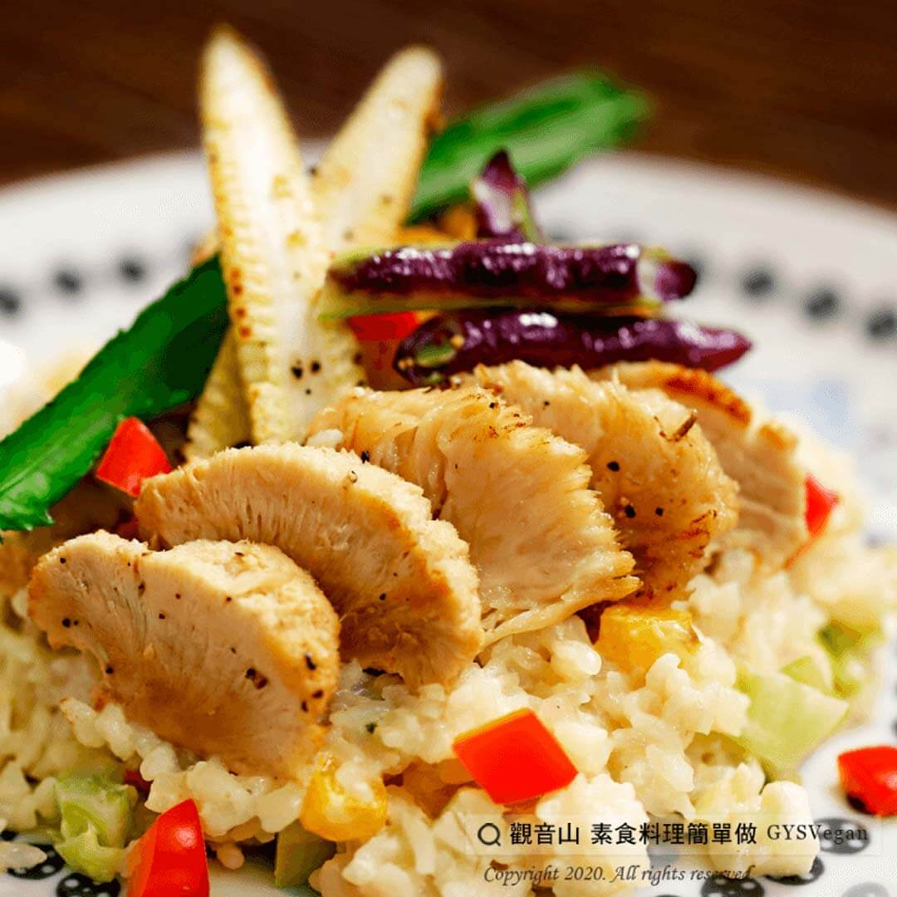

# 麻油猴頭菇燉飯

## 📋 基本資訊 / Recipe Overview
- **料理名稱**：麻油猴頭菇燉飯
- **原始標題**：麻油猴頭菇燉飯｜奶素
- **素食流派 / Diet**：奶素 Lacto-Vegetarian
- **來源平台 / Source**：[觀音山 · 素食料理簡單做](https://vegan.gys.org.tw/%e9%ba%bb%e6%b2%b9%e7%8c%b4%e9%a0%ad%e8%8f%87%e7%87%89%e9%a3%af%ef%bd%9c%e5%a5%b6%e7%b4%a0/)

## 📖 食譜圖文詳情 (中英雙語對照)

燉飯料理，發源於盛產稻米的義大利北部，將生米粒直接下鍋炒至熟透。​
這道『麻油猴頭菇燉飯』，主廚使用煮好的白飯，搭配麻油猴頭菇料理包湯汁、鮮奶油，使飯吸收湯汁的麻油香氣及奶油香味，讓人大快朵頤，簡單、健康、好料理。​
快跟著觀音山主廚，一起素食料理簡單做吧！​
​
?食材及佐料〔Ingredients〕：(3人份)​
▪麻油猴頭菇料理包200克​
▪西洋芹 2支​
▪高麗菜200克​
▪紅椒50克​
▪黃椒50克​
▪白飯300克​
▪鮮奶油100 c.c​
▪鹽適量​
▪糖適量​
▪水適量​
​
?烹飪步驟：​
1.將西洋芹、紅椒、黃椒切丁0.8公分，高麗菜切丁1公分 ，備用。​
2.西洋芹、高麗菜、紅椒、黃椒依序炒香。​
3.加入白飯、料理包湯汁、水，煮至湯汁收乾至粥狀。​
4.加入猴頭菇略炒。​
5.加入鮮奶油拌勻，鹽、糖調味即可。​
​
【特別說明】​
全素者，可以不加鮮奶油。​
​
??本食譜提供：台中 #觀音山蔬食館 主廚 淨雅​
​
✨慈悲的 龍德上師成立「觀音山蔬食館」提倡健康素食、慈悲護生，以”觀音山素食料理簡單做”的理念，提供多款素食食譜，讓您一學就會！?​
​
​
?觀音山 素食料理簡單做 ​ Follow us?​
Facebook ｜好文按讚
http://www.facebook.com/GYSVegan​
Instagram ｜料理追蹤
http://www.instagram.com/gysvegan/​
Youtube ​ ​ ​ ｜加入訂閱
https://reurl.cc/q8VEqy​
Telegram ​ ｜頻道推薦
https://t.me/GYSVegan​
​
​
? 歡迎轉載，請註明出處： ​ ​ 觀音山 素食料理簡單做GYSVegan按讚、留言設定搶先看! 素食環保愛地球，健康營養無負擔，慈悲護生一起來~?

---
*食譜歸檔時間：2026-08-20 · 來源：觀音山素食料理簡單做 (vegan.gys.org.tw)*