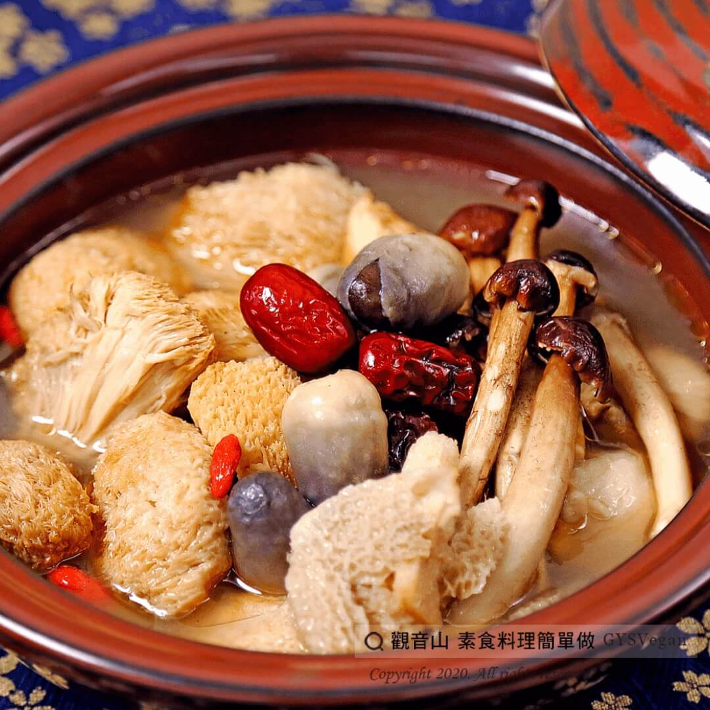

# 麻油竹笙猴菇鍋

## 📋 基本資訊 / Recipe Overview
- **料理名稱**：麻油竹笙猴菇鍋
- **原始標題**：麻油竹笙猴菇鍋｜全素
- **素食流派 / Diet**：全素 Vegan
- **料理分類 / Category**：湯品系列
- **來源平台 / Source**：[觀音山 · 素食料理簡單做](https://vegan.gys.org.tw/bamboo-fungus20201124/)

## 📖 食譜圖文詳情 (中英雙語對照)

明天就是立冬了，曆書記載：「冬者終也，立冬之時，萬物終成，故名『立冬』」。​
進入立冬，表示冬天要來了！在這歲末之時，觀音山主廚準備這道「麻油竹笙猴菇鍋」， 讓大家可以暖迎冬天，快跟著觀音山主廚，一起素食料理簡單做吧！​
​
◎食材及佐料〔Ingredients〕：(3人份)​
▪麻油猴頭菇料理包 1包​
▪竹笙 10條​
▪柳松菇 100克​
▪草菇 150克​
▪鹽 適量​
​
◎烹飪步驟：​
1.竹笙先泡開，洗淨後再用熱水燙過。​
2.放入料理包加入竹笙、柳松菇、草菇及適量的水煮滾。​
3.最後，依個人喜好加入適量鹽巴調味，完成！​
​
【特別說明】​
可加入自己喜愛的菜，如：根莖類、葉菜類或其他菇類。​
​
本食譜提供：台中 觀音山蔬食館 主廚 樂卿​
​
✨慈悲的 龍德上師成立「觀音山蔬食館」提倡健康素食、慈悲護生，以”觀音山素食料理簡單做”的理念，提供多款素食食譜，讓您一學就會！
​
​
觀音山 素食料理簡單做 ​ Follow us​
Facebook ｜好文按讚
http://www.facebook.com/GYSVegan​
Instagram ｜料理追蹤
http://www.instagram.com/gysvegan/​
Youtube ​ ​ ​ ｜加入訂閱
https://reurl.cc/q8VEqy​
Telegram ​ ｜頻道推薦
https://t.me/GYSVegan​
​
​
歡迎轉載，請註明出處： ​ ​ 觀音山 素食料理簡單做GYSVegan按讚、留言設定搶先看! 素食環保愛地球，健康營養無負擔，慈悲護生一起來~

---
*食譜歸檔時間：2026-08-20 · 來源：觀音山素食料理簡單做 (vegan.gys.org.tw)*