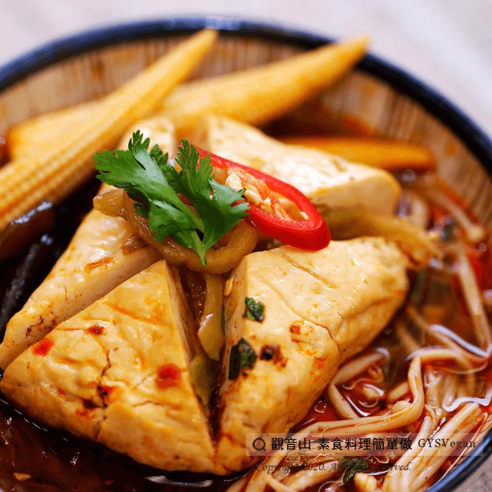

# 麻辣燙臭豆腐

## 📋 基本資訊 / Recipe Overview
- **料理名稱**：麻辣燙臭豆腐
- **原始標題**：麻辣燙臭豆腐｜全素
- **素食流派 / Diet**：全素 Vegan
- **料理分類 / Category**：中式料理
- **來源平台 / Source**：[觀音山 · 素食料理簡單做](https://vegan.gys.org.tw/mala-tang20201220/)

## 📖 食譜圖文詳情 (中英雙語對照)

麻辣燙是一種起源於四川地區，流行於中國各地的小吃，類似於火鍋，湯頭麻辣入味，加入臭豆腐、酸菜、玉米筍、金針菇一起煮，​
吸飽麻辣湯汁的臭豆腐特別下飯，想要更豐盛可加入其他菇類、蔬菜，搭配白飯及麵條更有飽足感！​
快跟著觀音山主廚，一起素食料理簡單做吧！​
​
?食材及佐料〔Ingredients〕：(5人份)​
▪臭豆腐 4塊 ​
▪金針菇 50克​
▪黑木耳 50克​
▪玉米筍 5條 ​
▪酸菜 50克​
▪薑末 20克​
▪香菜 適量​
▪素食麻辣醬(或辣豆瓣醬) 適量​
▪醬油 適量 ​
▪蠔油 適量​
▪砂糖 適量​
​
?烹飪步驟：​
1.臭豆腐對角切，不要切斷。​
2.黑木耳切塊，酸菜切絲，香菜切末，金針菇去蒂頭。​
3.爆香薑末，加入素食麻辣醬、酸菜，加入適量的水，加入調味料調味。​
4.作法3煮滾後，加入豆腐滷約10分鐘​
5.加入其他菇類、蔬菜煮熟。​
6.最後撒上香菜末，擺盤完成!​
​
​
??本食譜提供：台中 #觀音山蔬食館 主廚 樂卿​
​
慈悲的 龍德上師成立「觀音山蔬食館」提倡健康素食、慈悲護生，以”觀音山素食料理簡單做”的理念，提供多款素食食譜，讓您一學就會！?​
​
​
【recipe】​
? Spicy hot pot was Sichuan in origin and then became popular all over China. It is similar to hot pot but soup is spicy and rich in flavor. Various ingredients can be added in it, such as pickled mustard green, baby corns, enoki mushrooms and stinky tofu. Spicy soup soaked stinky tofu is best served with rice. Wanna have a lavish meal just have to add any other mushrooms, vegetables or noodles. Quickly follow the chef of Guanyinshan, let’s cook simple vegetarian dishes together!​
​
?Ingredients : (For 5 people)​
▪Stinky tofu 4​
▪Enoki mushrooms 50g​
▪Agaric 50g​
▪Baby corn 5piece ​
▪Pickled mustard green 50g​
▪Ginger 20g​
▪Coriander , adequate amount​
▪Vegetarian spicy sauce , adequate amount​
▪Soy sauce , adequate amount ​
▪Vegetarian oyster sauce , adequate amount​
▪Sugar , adequate amount​
​
?Cooking Steps: ​
1. Cut stinky tofu diagonally but don’t cut it through. ​
2. Cut black fungus into pieces, shred pickled mustard green, mince coriander, and remove stalks of enoki mushrooms. ​
3. Saute the minced ginger, add vegetarian spicy sauce, pickled mustard green, add appropriate amount of water, add seasonings.​
4. After boiling, add tofu and stew for about 10 minutes ​
5. Add other mushrooms and vegetables to cook. ​
6. Sprinkle chopped coriander at the end, and finish the dish! ​
​
??This recipe is provided by: Taichung #Guanyinshan green restaurant, Chef: Le Qing​
​
​
?觀音山 素食料理簡單做?
Facebook ｜好文按讚
http://www.facebook.com/GYSVegan​
Instagram ｜料理追蹤
http://www.instagram.com/gysvegan/​
Youtube ​ ​ ​ ｜加入訂閱
https://reurl.cc/q8VEqy​
Telegram ​ ｜頻道推薦
https://t.me/GYSVegan​
​
​
–​
? 歡迎轉載，請註明出處： ​ ​ 觀音山 素食料理簡單做 GYSVegan 素食環保愛地球，健康營養無負擔，慈悲護生一起來~?​

---
*食譜歸檔時間：2026-08-20 · 來源：觀音山素食料理簡單做 (vegan.gys.org.tw)*