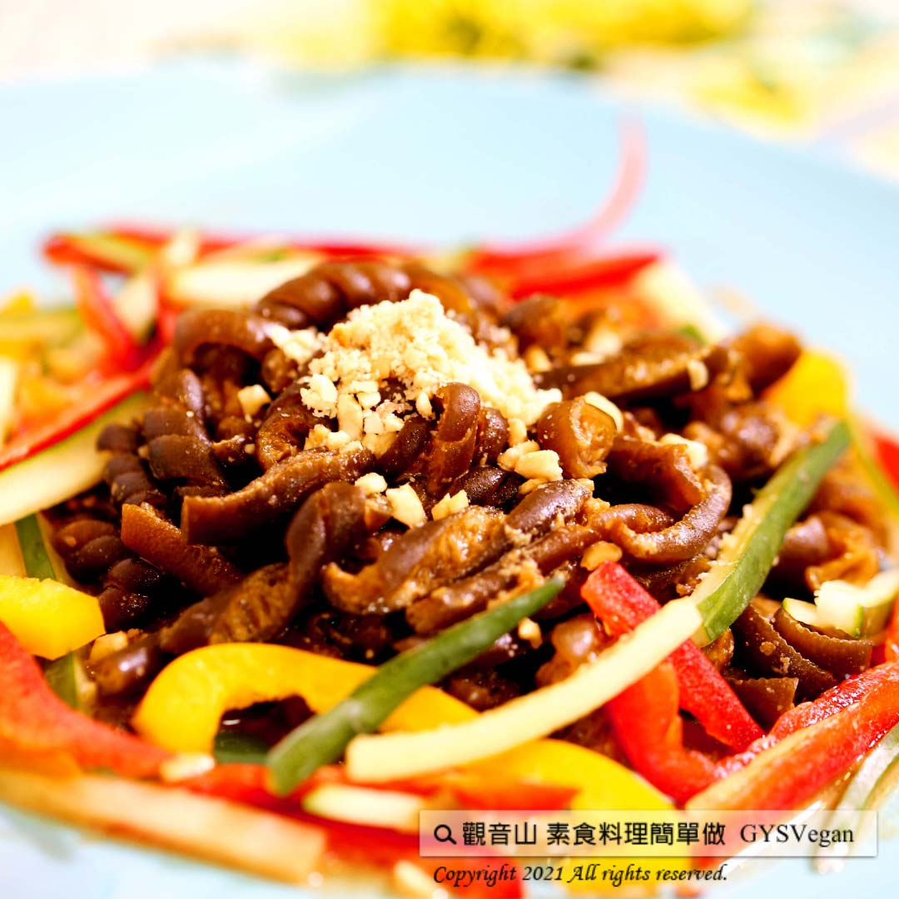

# 麻醬涼拌海茸

## 📋 基本資訊 / Recipe Overview
- **料理名稱**：麻醬涼拌海茸
- **原始標題**：麻醬涼拌海茸｜全素
- **素食流派 / Diet**：全素 Vegan
- **料理分類 / Category**：中式料理
- **來源平台 / Source**：[觀音山 · 素食料理簡單做](https://vegan.gys.org.tw/%e9%ba%bb%e9%86%ac%e6%b6%bc%e6%8b%8c%e6%b5%b7%e8%8c%b8%ef%bd%9c%e5%85%a8%e7%b4%a0/)

## 📖 食譜圖文詳情 (中英雙語對照)

海茸，是一種來自海洋?的天然藻類植物，口感爽脆，營養豐富，含珍貴活性褐藻糖、膠原蛋白質、維生素A和鈣、碘、鐵、鋅等多種營養物質?，經常食用可以滋養皮膚，改善髮質，增強人體免疫力?。​
觀音山蔬食團主廚特別提供『麻醬涼拌海茸』，芝麻的濃郁香氣、素沙茶的鹹香帶勁，讓滑嫩 Q彈的海茸，每一口都有豐富好滋味！?趕快一起動手試做看看這道清爽又低卡的開胃小菜!?​
​
?準備食材與佐料：(2-3人)​
海茸300克、黃彩椒1顆、紅彩椒1顆、碎花生少許、小黃瓜1條、麻醬2匙(20ml)、薑末少許、糖1.5匙(15ml)、香油適量、鹽少許、素沙茶1大匙(20ml)、水少許。​
​
?#素食料理簡單做，開始：​
1. 黃、紅彩椒洗淨切絲；小黃瓜洗淨切絲，備用。​
2. 海茸洗淨、放入滾水鍋中，加入鹽汆燙去腥味，取出放涼，備用。​
3. 將麻醬、水、醬油膏、薑末、糖、香油、素沙茶混和攪拌均勻，製成醬汁。​
4. 將海茸、黃紅彩椒、小黃瓜絲、醬汁混和攪拌均勻。​
5. 最後擺盤撒上碎花生。​
​
這道簡單又美味的料理就完成了~​
​
?本食譜提供：高雄 #觀音山蔬食團 主廚 樂熹​
​
✨慈悲的 龍德上師成立「觀音山蔬食館」提倡健康素食、慈悲護生，以”觀音山素食料理簡單做”的理念，提供多款素食食譜，讓您一學就會！?​
​
​
?觀音山 素食料理簡單做 ​ Follow us?​
Facebook ｜好文按讚
http://www.facebook.com/GYSVegan​
Instagram ｜料理追蹤
http://www.instagram.com/gysvegan/​
Youtube ​ ​ ​ ｜加入訂閱
https://reurl.cc/q8VEqy​
Telegram ​ ｜頻道推薦
https://t.me/GYSVegan​
​
​
? 歡迎轉載，請註明出處： ​ ​ 觀音山 素食料理簡單做GYSVegan按讚、留言設定搶先看! 素食環保愛地球，健康營養無負擔，慈悲護生一起來~?

---
*食譜歸檔時間：2026-08-20 · 來源：觀音山素食料理簡單做 (vegan.gys.org.tw)*