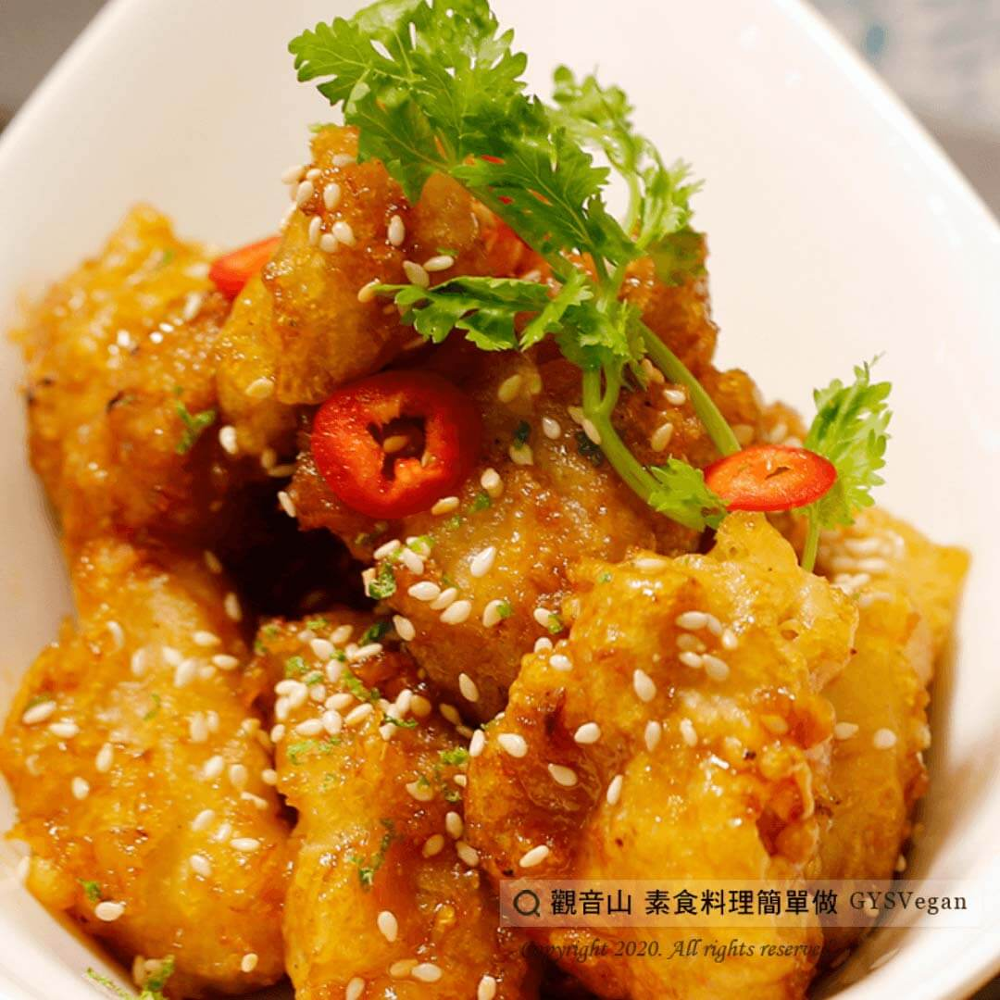

# 黃金素豆乳G

## 📋 基本資訊 / Recipe Overview
- **料理名稱**：黃金素豆乳G
- **原始標題**：黃金素豆乳G ｜全素
- **素食流派 / Diet**：全素 Vegan
- **料理分類 / Category**：家常料理
- **來源平台 / Source**：[觀音山 · 素食料理簡單做](https://vegan.gys.org.tw/%e8%b1%86%e4%b9%b3g-%ef%bd%9c%e5%85%a8%e7%b4%a0/)

## 📖 食譜圖文詳情 (中英雙語對照)

將猴頭菇以濃郁的豆腐乳醃製，酥炸成金黃色，一口咬下鮮嫩多汁，酥脆可口又不油膩，廣受大人小孩喜愛。​
一起跟著「觀音山蔬食館」的主廚，素食料理簡單做吧！​
​
◎食材及佐料〔Ingredients〕：（3人份）​
▪猴頭菇300克​
▪豆腐乳3塊​
▪生白芝麻粒50克​
▪薑末少許​
▪素蠔油3大匙​
▪糖1大匙​
▪中筋麵粉150克​
▪胡椒粉適量​
▪水少許​
​
◎烹飪步驟：​
1.薑洗淨切末，猴頭菇切塊，備用。​
2.猴頭菇加入豆腐乳、薑末、 素蠔油、糖、胡椒粉，調味醃漬15分鐘。​
3.再加入中筋麵粉及水，攪拌混合均勻，撒上生白芝麻。​
4.熱油鍋，將裹粉的猴頭菇以中小火油炸，炸至表皮呈現金黃色，即可起鍋。​
5.以廚房紙巾吸油，擺盤上桌，完成！​
​
⭐️特別說明：​
1. 胡椒粉可使用百草粉、五香粉來替代，亦可三種粉皆加入調味。​
2. 可依個人喜好，添加九層塔或是孜然粉，增添不同風味。​
3. 油炸猴頭菇請使用中小火，油溫過熱，容易使食材燒焦。​
4. 油炸猴頭菇請一塊一塊分次油炸，以避免食材整團黏住。​
5. 此食譜是3人份的參考份量，實際可依個人口味和人數調整。​
6.食材可以前一天先醃製，比較入味。​
​
本食譜提供：台中  觀音山蔬食館 主廚 樂敏​
​
✨慈悲的 龍德上師成立「觀音山蔬食館」提倡健康素食、慈悲護生，以”觀音山素食料理簡單做”的理念，提供多款素食食譜，讓您一學就會！
​
​
觀音山 素食料理簡單做 ​ Follow us
Facebook ｜好文按讚
http://www.facebook.com/GYSVegan​
Instagram ｜料理追蹤
http://www.instagram.com/gysvegan/​
Youtube ​ ​ ​ ｜加入訂閱
https://reurl.cc/q8VEqy​
Telegram ​ ｜頻道推薦
https://t.me/GYSVegan​
​
​
–​
歡迎轉載，請註明出處： ​ ​ 觀音山 素食料理簡單做GYSVegan按讚、留言設定搶先看! 素食環保愛地球，健康營養無負擔，慈悲護生一起來~

---
*食譜歸檔時間：2026-08-20 · 來源：觀音山素食料理簡單做 (vegan.gys.org.tw)*