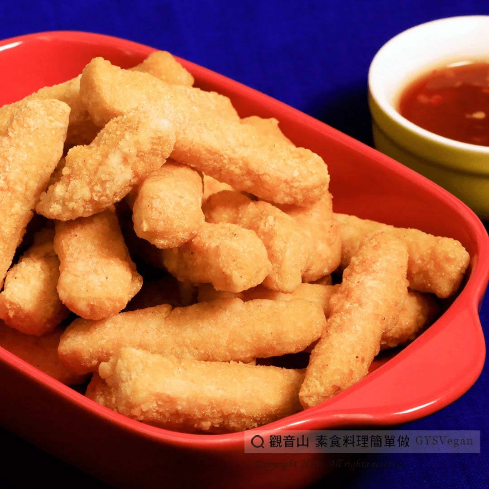

# 黃金臭薯條

## 📋 基本資訊 / Recipe Overview
- **料理名稱**：黃金臭薯條
- **原始標題**：黃金臭薯條｜全素
- **素食流派 / Diet**：全素 Vegan
- **來源平台 / Source**：[觀音山 · 素食料理簡單做](https://vegan.gys.org.tw/fries20201226/)

## 📖 食譜圖文詳情 (中英雙語對照)

原來豆腐也能做成薯條!!
豆腐高蛋白、低卡、營養、富飽足感，用豆腐替代地瓜、馬鈴薯炸成薯條，外酥內軟不油膩，吃起來更加酥脆，多了濃濃的豆香味。
快跟著觀音山主廚，一起素食料理簡單做吧！
?食材及佐料〔Ingredients〕：(5人份)
▪臭豆腐 4~6塊
▪地瓜粉 適量
▪油 適量
?烹飪步驟：
1.臭豆腐切成薯條狀備用
2.將臭豆腐沾地瓜粉。
3.油鍋加熱至180度，放入臭豆腐油炸至金黃色即可。
【特別說明】
可以搭配自己喜好的醬料，例如:蜂蜜芥末醬、糖醋醬、番茄醬等。
??本食譜提供：台中 觀音山蔬食館​ 主廚 樂卿
✨慈悲的 龍德上師成立「觀音山蔬食館」提倡健康素食、慈悲護生，以”觀音山素食料理簡單做”的理念，提供多款素食食譜，讓您一學就會！?
【recipe】
? It turns out that tofu can also be made into French fries!! Tofu is high in protein, low in calories, full of nutrition, and providing satiety. Using tofu instead of sweet potatoes or potatoes makes fries with bean flavor, crispy outside, soft inside and not greasy. Quickly follow the chef of Guanyinshan, let’s cook simple vegetarian dishes together!
?Ingredients : (For 5 people)
▪Stinky tofu 4~6
▪Potato starch , adequate amount
▪Oil , adequate amount
?Cooking steps:
1. Cut stinky tofu into fries for later use.
2. Dusting stinky tofu with sweet potato powder.
3. Heat the oil to 180 degrees for deep frying; add stinky tofu and fry until golden brown.
【Special Note】
You can season them with your favorite sauces, such as honey mustard sauce, sweet and sour sauce, ketchup, etc.
??This recipe is provided by: Taichung #Guanyinshan​ green restaurant, Chef: Le Qing
? 觀音山 素食料理簡單做 ?
Facebook ｜好文按讚
http://www.facebook.com/GYSVegan
​
Instagram ｜料理追蹤
http://www.instagram.com/gysvegan/
​
Youtube ｜加入訂閱
https://reurl.cc/q8VEqy
​
Telegram ｜頻道推薦
https://t.me/GYSVegan
—
? 歡迎轉載，請註明出處： 觀音山 素食料理簡單做 GYSVegan 素食環保愛地球，健康營養無負擔，慈悲護生一起來~?

---
*食譜歸檔時間：2026-08-20 · 來源：觀音山素食料理簡單做 (vegan.gys.org.tw)*