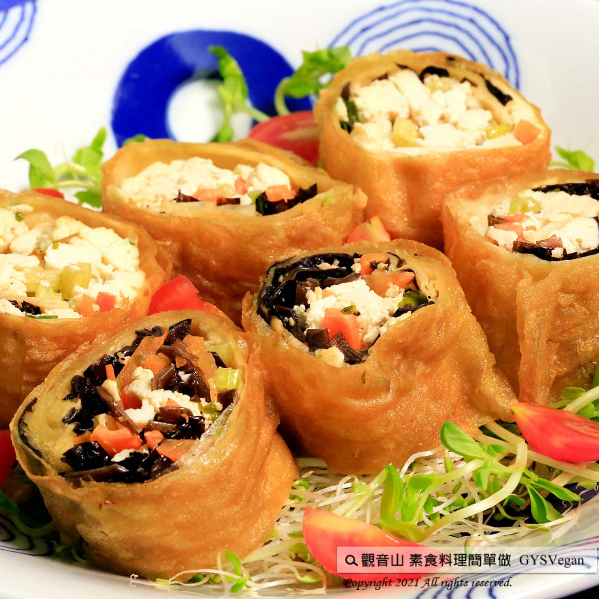

# 黃金臭豆腐捲

## 📋 基本資訊 / Recipe Overview
- **料理名稱**：黃金臭豆腐捲
- **原始標題**：黃金臭豆腐捲｜全素
- **素食流派 / Diet**：全素 Vegan
- **來源平台 / Source**：[觀音山 · 素食料理簡單做](https://vegan.gys.org.tw/stinky-tofu-roll20210702/)

## 📖 食譜圖文詳情 (中英雙語對照)

台灣人氣美食臭豆腐，經由觀音山主廚巧思，將臭豆腐的香氣以及多種內餡融合在一起，做成春捲炸至金黃色，外皮酥脆，中心帶有芹菜的香氣以及豐富的口感。快跟著觀音山主廚，一起素食料理簡單做吧！​
​
?食材及佐料〔Ingredients〕：（5人份）​
▪臭豆腐 ​ 6塊​
▪腐皮(或千張豆皮) ​ 6張​
▪中芹 ​ 1/2把​
▪黑木耳絲(泡發) ​ 70克​
▪酥漿粉 ​ 適量​
▪海苔絲 ​ 適量​
▪鹽、胡椒粉 ​ 適量​
▪素蠔油 ​ 適量​
​
?烹飪步驟：​
【刀工/前處理】​
1.豆腐捏碎備用。​
2.中芹切末。​
3.兩湯匙(30克)的酥漿粉加入50cc的水，攪拌均勻。​
​
【調理作法】​
1.將所有食材、調味料混合拌勻。​
2.取一張豆皮，放上餡料，捲成春捲狀。​
3.沾酥炸粉炸至金黃色。​
4.擺盤，依個人喜好淋上素蠔油。​
​
​
??本食譜提供：台中  觀音山蔬食館 主廚 樂卿​
★7月4日 空行母薈供日：善惡業10萬倍增長
✨殊勝功德增長日✨
觀音山邀請您於7月4日響應素食、廣修供養、戒殺護生、誦經修法、行持諸種善行，獲福無量。
⭐️慈悲的 龍德上師成立「觀音山蔬食館」提倡健康素食、慈悲護生，以”觀音山素食料理簡單做”的理念，提供多款素食食譜，讓您一學就會！?
​​
? 觀音山 素食料理簡單做 Follow us​ ?
◎Facebook ｜好文按讚 ​
https://www.facebook.com/GYSVegan ​
◎Instagram ｜料理追蹤
https://www.instagram.com/gysvegan/​
◎Youtube ​ ​ ​ ｜加入訂閱
https://reurl.cc/q8VEqy​
◎Telegram ​ ｜頻道推薦
https://t.me/GYSVegan​
​
​
【recipe】​
​
?  With a little ingenuity, Taiwan’s popular small eat, stinky tofu, can be made into delicious fried spring rolls. ​ The combination of stinky tofu with flavor-packed filling spring rolls are crispy on the outside, while the filling is rich and tender with mild scent of celery lingering in your mouth. Quickly follow the chef of Guanyinshan. Let’s cook simple vegetarian dishes together! ​
​
?Instructions​
【Cutting/PREP Ahead】 ​
1. Crush stinky tofu for later use. ​
2. Mince celery. ​
3. Add two tablespoons (30g) of crispy powder to 50cc of water and mix well. ​
​
【Cooking steps】 ​
1. Well mix all the ingredients and seasonings.​
2. Take a piece of bean curd, put fillings on it, and roll it into a spring roll. ​
3. Dip in crispy fried powder and fry until golden brown. ​
4. Dish up and top with vegetarian oyster sauce according to personal preference. ​
​
??This recipe is provided by Chef Le Qing, Taichung #Guanyinshan Green Restaurant
—​
? 歡迎轉載，請註明出處：觀音山 素食料理簡單做 GYSVegan 素食環保愛地球，健康營養無負擔，慈悲護生一起來~?

---
*食譜歸檔時間：2026-08-20 · 來源：觀音山素食料理簡單做 (vegan.gys.org.tw)*