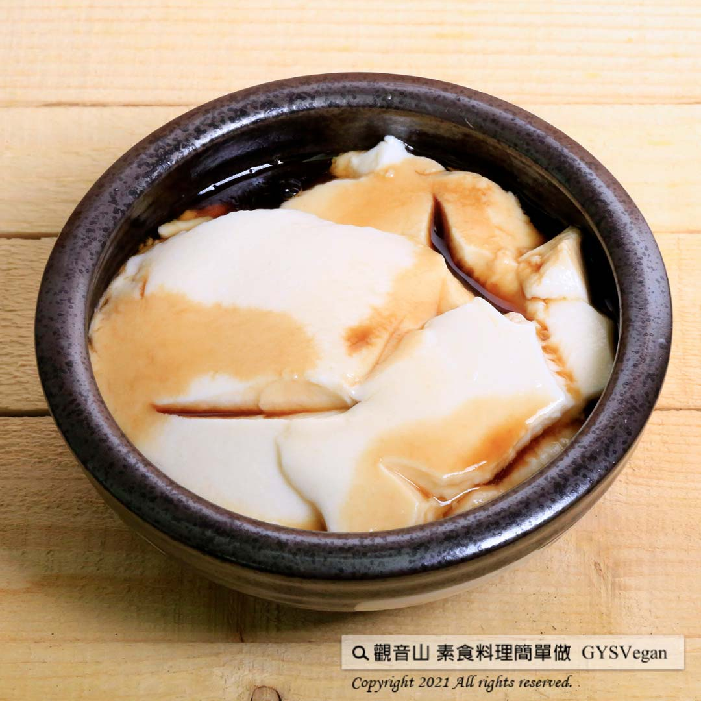

# 黑糖嫩豆花

## 📋 基本資訊 / Recipe Overview
- **料理名稱**：黑糖嫩豆花
- **原始標題**：黑糖嫩豆花｜全素
- **素食流派 / Diet**：全素 Vegan
- **料理分類 / Category**：烘焙甜點
- **來源平台 / Source**：[觀音山 · 素食料理簡單做](https://vegan.gys.org.tw/bean-curd20210409/)

## 📖 食譜圖文詳情 (中英雙語對照)

豆花又稱豆腐腦，含豐富的蛋白質，亦有國民點心之稱。觀音山主廚今天要教大家，如何在家也能做出媲美市售，口感綿密的黑糖嫩豆花！自己在家做料理，天然又健康！​
一起素食料理簡單做吧！​
​
?食材及佐料〔Ingredients〕：(10人份)​
▪豆漿(無糖或微糖) ​ ​ 3000c.c​
▪豆花粉 ​ 1包​
▪冷開水 ​ 375c.c​
▪黑糖 ​ 適量​
​
?烹飪步驟：​
1.豆漿加熱至滾。​
2.取一鍋子豆花粉加入冷開水攪拌均勻。​
3.將熱豆漿迅速沖入作法2.中，不可以攪拌，靜置10-20分鐘即可。​
4.黑糖加入適量的水加熱融化，倒入豆花中，黑糖嫩豆花就完成了！​
​
【特別說明】​
1.豆花粉、水及豆漿的比例，可參考豆花粉的外包裝。​
2.豆花靜置時，可加蓋或保鮮膜，避免表面風乾， 但需保留些許縫隙透氣散熱。​
3.可以搭配薑汁、豆漿、或自己喜好的配料做變化。​
​
??本食譜提供：台中 觀音山蔬食館 主廚 樂卿​
​
✨慈悲的 龍德上師成立「觀音山蔬食館」提倡健康素食、慈悲護生，以”觀音山素食料理簡單做”的理念，提供多款素食食譜，讓您一學就會！?
​
​
【recipe】​
? Douhua (tofu pudding), or Dou Fu Nao (literally “tofu brain”) is a type of extra-soft, uncurdled tofu which is rich in protein. It’s very popular and also taken as a national dessert. Chef of Guanyinshan is going to teach you how to make brown sugar Douhua with a creamy texture that is comparable to that purchased on the market! Cooking at home is natural and healthy! Let’s cook vegetarian dishes together! ​ ​
​
?Ingredients : (For 10 people)​
▪Soy milk(no sugar or light sugar) ​ ​ 3000c.c​
▪A pack of Soybean pudding powder ​
▪Water ​ 375c.c​
▪Brown sugar ​ , adequate amount​
​
?Cooking steps: ​
1. Heat soy milk until simmering.​
2. Dissolve tofu pudding powder in cold water and stir evenly.​
3. Pour hot soy milk quickly over the dissolved mixture(step 2). Don’t stir; just let it sit for 10-20 minutes. ​
4. Add the brown sugar to a small amount of water and simmer it to melt. Pour the syrup over Douhua, and this silky and favorable dessert is complete! ​
​
[Special notes] ​
1. For the ratio of tofu pudding powder to water and soy milk, please refer to instructions on the package of tofu pudding powder.​
2. When the tofu pudding sits, it can be covered by a lid or wrapped with food wrap (with some gaps for heat dissipation) to avoid curd on the surface. ​ ​
3. Ginger juice, soy milk, or any other preferred ingredients could be an alternative to syrup.​
​
??This recipe is provided by Chef Le Qing, Taichung ​ Guanyinshan Green Restaurant​
? 觀音山 素食料理簡單做 ?
◎Facebook ｜好文按讚
https://www.facebook.com/GYSVegan​
◎Instagram ｜料理追蹤
https://www.instagram.com/gysvegan/​
◎Youtube ​ ​ ​ ｜加入訂閱
https://reurl.cc/q8VEqy​
◎Telegram ​ ｜頻道推薦
https://t.me/GYSVegan
​
​
—​
? 歡迎轉載，請註明出處：觀音山 素食料理簡單做 GYSVegan 素食環保愛地球，健康營養無負擔，慈悲護生一起來~?

---
*食譜歸檔時間：2026-08-20 · 來源：觀音山素食料理簡單做 (vegan.gys.org.tw)*