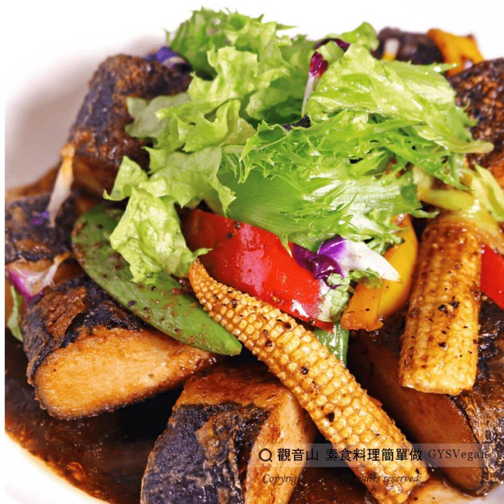

# 黑胡椒素于

## 📋 基本資訊 / Recipe Overview
- **料理名稱**：黑胡椒素于
- **原始標題**：黑胡椒素于｜全素
- **素食流派 / Diet**：全素 Vegan
- **來源平台 / Source**：[觀音山 · 素食料理簡單做](https://vegan.gys.org.tw/%e9%bb%91%e8%83%a1%e6%a4%92%e7%b4%a0%e4%ba%8e-%ef%bd%9c%e9%be%8d%e5%be%b7%e4%b8%8a%e5%b8%ab/)

## 📖 食譜圖文詳情 (中英雙語對照)

用慢火煎出香嫩口感的素魚排，搭配微微嗆辣的黑胡椒，吃得到碧玉筍、紅黃椒的鮮甜，口感極佳的美味享受，是一道輕易上桌零失誤的美味素食料理 。​
快跟著觀音山蔬食館主廚，一起素食料理簡單做吧!​
​
?食材及佐料〔Ingredients〕：(3-5人份)​
▪素魚 6塊​
▪玉米筍 1小盒​
▪紅椒 1/4顆​
▪黃椒 1/4顆​
▪碧玉筍 5支​
▪甜豆 50克​
▪素蠔油 120ml​
▪素沙茶 30克​
▪水 50ml​
▪糖 15克​
▪黑胡椒 10克​
​
?烹飪步驟：​
1.將紅椒、黃椒、碧玉筍斜切約3cm；玉米筍對半切；甜豆去前後蒂頭，備用。​
2.熱鍋，將素魚香煎至微金黃色，起鍋備用。​
3.將紅黃椒、碧玉筍、玉米筍、甜豆放入鍋中翻炒。​
4.加入所有調味料於鍋中調味，醬料滾沸後關火。​
5.將素魚擺盤，放上翻炒好之食材，醬料淋上，完成!​
​
??本食譜提供：台中
#觀音山蔬食館
主廚 樂敏​
​
?慈悲的 龍德上師成立「觀音山蔬食館」提倡健康素食、慈悲護生，以”觀音山素食料理簡單做”的理念，提供多款素食食譜，讓您一學就會！?​
​
​
?觀音山 素食料理簡單做 ​ Follow us?​
Facebook ｜好文按讚
http://www.facebook.com/GYSVegan​
Instagram ｜料理追蹤
http://www.instagram.com/gysvegan/​
Youtube ​ ​ ​ ｜加入訂閱
https://reurl.cc/q8VEqy​
Telegram ​ ｜頻道推薦
https://t.me/GYSVegan​
​
​
? 歡迎轉載，請註明出處： ​ ​ 觀音山 素食料理簡單做GYSVegan按讚、留言設定搶先看! 素食環保愛地球，健康營養無負擔，慈悲護生一起來~?

---
*食譜歸檔時間：2026-08-20 · 來源：觀音山素食料理簡單做 (vegan.gys.org.tw)*