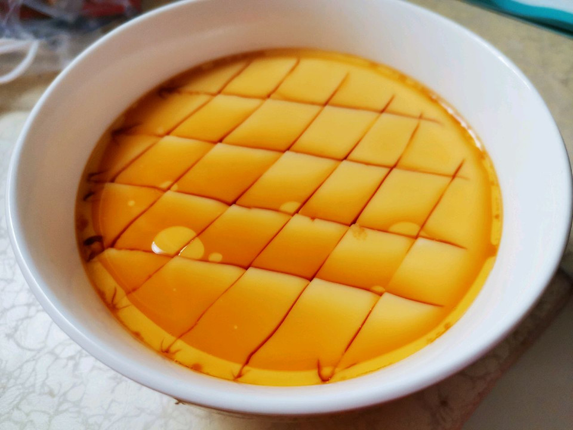

# 0失败无蜂窝软嫩的鸡蛋羹

## 📋 基本資訊 / Recipe Overview
- **料理名稱**：0失败无蜂窝软嫩的鸡蛋羹
- **原始標題**：0失败无蜂窝软嫩的鸡蛋羹
- **素食流派 / Diet**：蛋素 Ovo-Vegetarian
- **料理分類 / Category**：湯品羹湯
- **來源平台 / Source**：[豆果美食 · 素食專區](https://www.douguo.com/cookbook/3048472.html)

## 🌿 食材及佐料清單 / Ingredients
- 鸡蛋 2个
- 热水 适量
- 香油 适量
- 盐 适量
- 生抽 适量

## 🍳 烹飪步驟 / Step-by-Step Cooking Steps
1. 准备65度左右的热水，加入一点点盐，搅拌至盐化开，水的量约是鸡蛋的1.5-2倍
2. 在热水中打入两颗鸡蛋
3. 搅散备用，
4. 盖上耐高温保鲜膜，用牙签扎几个小孔，锅中加水，把碗放入锅中，大火烧开后，转中火约10分钟，关火闷5分钟即可
5. 成品图
6. 用刀随便划下，放入一点点生抽，香油，晃均匀
7. 成品图

## 💡 大廚美味秘訣 / Chef's Tips
- 主要就是65度左右的热水，我是把水烧开后放的温度低一些，这个温度，不会把鸡蛋烫成蛋花
其他的，随便弄，都不会有蜂窝吧，我试了用保鲜膜盖着，也试了用盘子倒扣着，隔水蒸，或是碗直接放水里，都可以，图自己省事吧，
反正蒸出来都很嫩，没有蜂窝

---
*食譜歸檔時間：2026-08-21 · 來源：豆果美食 (www.douguo.com)*