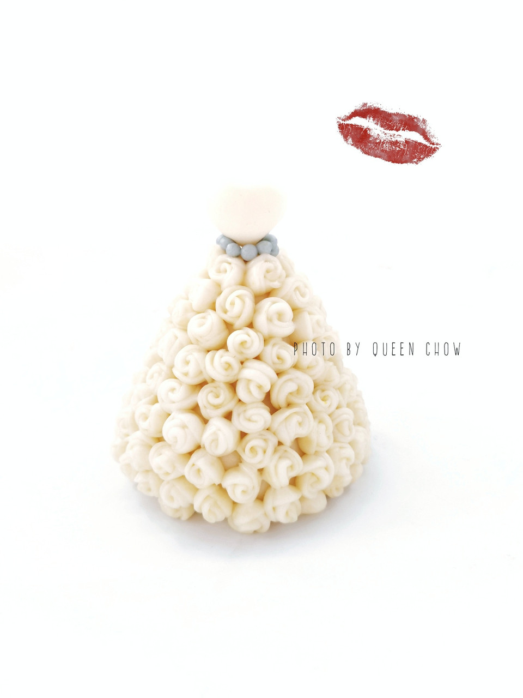

# 2020浪漫情人节 婚纱-原创造型馒头

## 📋 基本資訊 / Recipe Overview
- **料理名稱**：2020浪漫情人节 婚纱-原创造型馒头
- **原始標題**：【2020浪漫情人节】婚纱-原创造型馒头
- **素食流派 / Diet**：全素 Vegan
- **料理分類 / Category**：烘焙麵點 / 點心
- **難易度 / Difficulty**：切墩(初级)
- **烹飪時間 / Cooking Time**：15-30 分鐘
- **來源平台 / Source**：[豆果美食 · 素食專區](https://www.douguo.com/cookbook/2403338.html)

## 🌿 食材及佐料清單 / Ingredients
- 白色面团：适量
- 蓝色面团：适量

## 🍳 烹飪步驟 / Step-by-Step Cooking Steps
1. 60g面团滚圆后整形成圆锥，如图，忘记拍照要做一个爱心的馒头
2. 8mm直径圆形，5个，如图叠加
3. 卷起
4. 对半切开
5. 粘合在圆锥面团上，粘满
6. 蓝色小球做装饰
7. 发酵，蒸制，上面一个白色爱心馒头用牙签固定即可

---
*食譜歸檔時間：2026-08-20 · 來源：豆果美食 (www.douguo.com)*