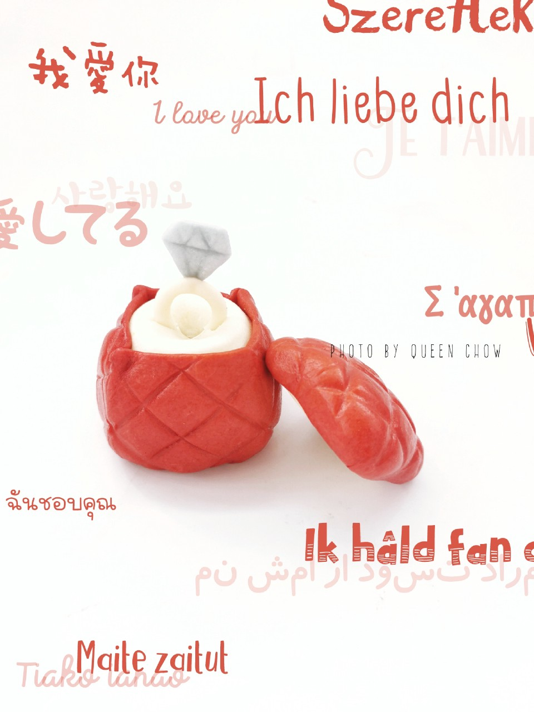

# 戒指，钻戒-原创造型馒头

## 📋 基本資訊 / Recipe Overview
- **料理名稱**：戒指，钻戒-原创造型馒头
- **原始標題**：【2020浪漫情人节】戒指，钻戒-原创造型馒头
- **素食流派 / Diet**：全素 Vegan
- **料理分類 / Category**：烘焙麵點 / 點心
- **來源平台 / Source**：[豆果美食 · 素食專區](https://www.douguo.com/cookbook/2403337.html)

## 🌿 食材及佐料清單 / Ingredients
- 红色面团 适量
- 白色面团 适量
- 蓝色面团 适量

## 🍳 烹飪步驟 / Step-by-Step Cooking Steps
1. 【戒指】白色面团擀薄，4mm左右厚度，如图切出空心圆
2. 蓝色擀薄，用刀或刮板切出钻石形状
3. 组合
4. 白色面团50g左右，滚圆后整形成正方体
5. 红色擀薄切出4个方形，和白色面团的边长一样
6. 四周粘合
7. 刮板压出压痕
8. 【盖子】白色擀薄，切出正方形，和主体边长一样
9. 红色擀薄切出正方形，如图，要根据白色正方形切割
10. 如图，切掉4个边角
11. 粘合
12. 翻面后用刮板压出压痕
13. 发酵，蒸制

---
*食譜歸檔時間：2026-08-21 · 來源：豆果美食 (www.douguo.com)*