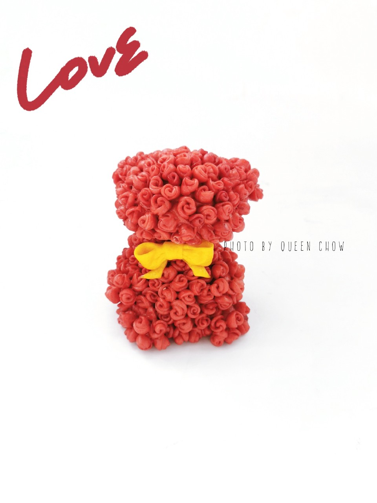

# 玫瑰熊--原创造型馒头

## 📋 基本資訊 / Recipe Overview
- **料理名稱**：玫瑰熊--原创造型馒头
- **原始標題**：【2020浪漫情人节】玫瑰熊--原创造型馒头
- **素食流派 / Diet**：全素 Vegan
- **料理分類 / Category**：烘焙麵點 / 點心
- **來源平台 / Source**：[豆果美食 · 素食專區](https://www.douguo.com/cookbook/2403025.html)

## 🌿 食材及佐料清單 / Ingredients
- 红色面团 适量
- 黄色面团 适量

## 🍳 烹飪步驟 / Step-by-Step Cooking Steps
1. 40g面团上面做一个熊鼻子
2. 40g面团上面做一个熊鼻子
3. 红色擀薄，4个圆形叠加，如图，8mm左右直径圆形
4. 卷起
5. 中间切开
6. 玫瑰花粘合在熊头
7. 粘合满的状态
8. 【熊身体】水滴状 每3g左右面团，4个水滴做熊胳膊和腿
9. 身体是60g面团，推高，粘合腿和胳膊后，粘满玫瑰花
10. 黄色薄片 2个三角形做蝴蝶结
11. 蝴蝶结完成
12. 发酵，蒸制

---
*食譜歸檔時間：2026-08-21 · 來源：豆果美食 (www.douguo.com)*