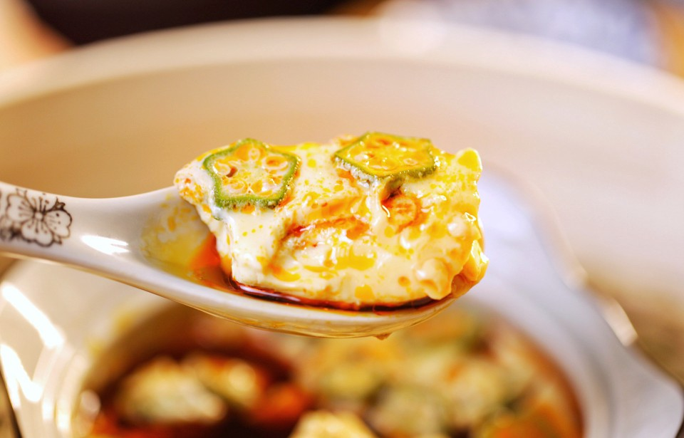

# 「秋葵蒸蛋」快手好吃营养又丰富

## 📋 基本資訊 / Recipe Overview
- **料理名稱**：「秋葵蒸蛋」快手好吃营养又丰富
- **原始標題**：「秋葵蒸蛋」快手好吃营养又丰富
- **素食流派 / Diet**：蛋素 Ovo-Vegetarian
- **料理分類 / Category**：家常蔬食 / 經典熱菜
- **來源平台 / Source**：[豆果美食 · 素食專區](https://www.douguo.com/cookbook/2971297.html)

## 🌿 食材及佐料清單 / Ingredients
- 鸡蛋（蛋液约100克） 2个
- 水 150克
- 盐 2克
- 秋葵 2根
- 生抽 3克
- 红油 5克

## 🍳 烹飪步驟 / Step-by-Step Cooking Steps
1. 准备材料
2. 鸡蛋敲入碗中
3. 加盐打散，盐是一定要加的，凝固的重点
4. 加入水搅匀
5. 过滤一下
6. 撒入秋葵
7. 盖上保鲜膜或者盖子开水上锅
8. 蒸10分钟，容器深的话增加时间。孩子吃到这一步就不用往下看了
9. 生抽红油，不吃辣的红油换成芝麻油
10. 香~~~
11. 成品展示
12. 成品展示

---
*食譜歸檔時間：2026-08-21 · 來源：豆果美食 (www.douguo.com)*