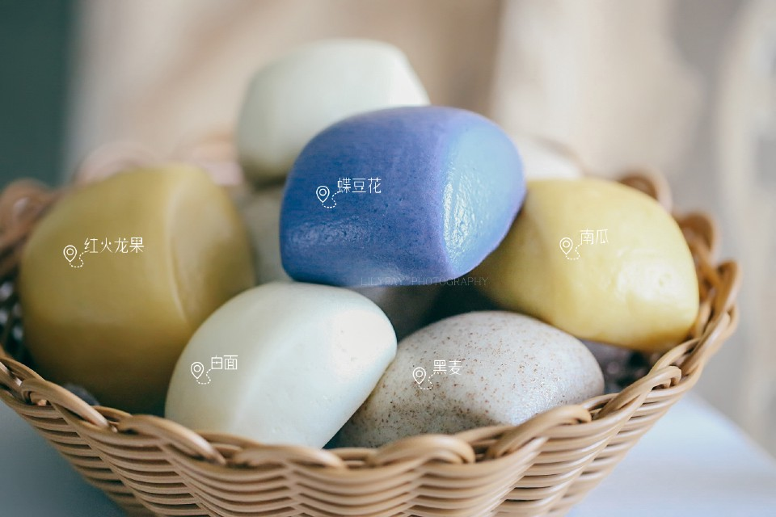

# 一次发酵彩色蔬果水光肌刀切馒头

## 📋 基本資訊 / Recipe Overview
- **料理名稱**：一次发酵彩色蔬果水光肌刀切馒头
- **原始標題**：一次发酵彩色蔬果水光肌刀切馒头
- **素食流派 / Diet**：全素 Vegan
- **料理分類 / Category**：烘焙麵點 / 點心
- **來源平台 / Source**：[豆果美食 · 素食專區](https://www.douguo.com/cookbook/2402206.html)

## 🌿 食材及佐料清單 / Ingredients
- ① 白色
- 中粉 200克
- 水 100克
- 白糖 10克
- 酵母 2克
- ② 燕麦色
- 中粉 160克
- 黑麦粉 40克
- 水 106克
- 白糖 10克
- 酵母 2克
- ③ 橙色
- 中粉 200克
- 红火龙果汁 100克
- 碱 1克
- 白糖 10克
- 酵母 2克
- ④ 黄色
- 中粉 200克
- 熟南瓜泥 50克
- 水 60克
- 酵母 2克
- ⑤ 蓝色
- 中粉 200克
- 蝶豆花 8克
- 开水 120克
- 白糖 10克
- 酵母 2克

## 🍳 烹飪步驟 / Step-by-Step Cooking Steps
1. 先做白色，所有材料加一起，厨师机和成光滑面团；
2. 在台面撒点干粉防粘，放上面团，直接用擀面杖反复擀多次，最后擀成均匀的薄片，由上而下卷起来，稍搓长调整均匀；
3. 我的蒸锅一层放七个，所以平均切成六份，两头长一点短一点没关系，最终糅合成一个圆的；
4. 切面是光滑没大气孔的，表明面揉到位了；
5. 垫上硅油纸；
6. 码进蒸锅，底下放好水，室温发酵40分钟，轻按回弹，大火烧开上汽后，转中小火，蒸15分钟，焖2分钟开盖；
7. 燕麦色如法炮制；
8. 两个颜色蒸好后都很光滑没有塌陷；
9. 橙色如法炮制，特别说明一下，这个配方里加了碱，所以生面团呈紫色，加碱的目的原本是想保留红色不被氧化，但最终还是失败了，人类似乎对红火龙果没什么办法；
10. 黄色如法炮制，南瓜含糖，所以没加糖；
11. 蓝色如法炮制，要注意，8克蝶豆花+120克开水泡成茶后滤掉渣，最终采用103克茶水。
12. ◆◆◆以下为成品展示◆◆◆
13. 成品1
14. 成品2
15. 成品3
16. 成品4

## 💡 大廚美味秘訣 / Chef's Tips
- △ 不同牌子面粉吸水率不同，请根据实际情况调整用量，比如±10~20克；
△ 水光肌的秘密其实就是要把面揉透，以及醒发到位，出品不但表面光滑，组织也松软。

---
*食譜歸檔時間：2026-08-21 · 來源：豆果美食 (www.douguo.com)*