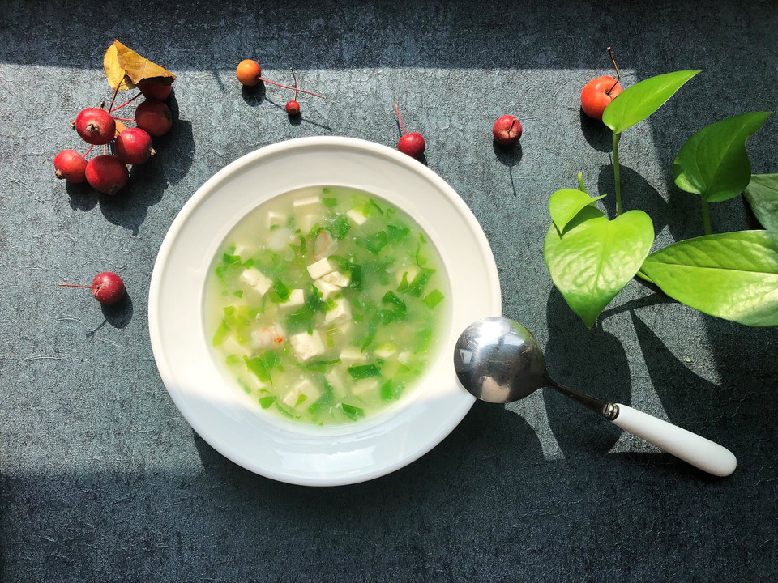

# 一清二白～小白菜豆腐汤

## 📋 基本資訊 / Recipe Overview
- **料理名稱**：一清二白～小白菜豆腐汤
- **原始標題**：一清二白～小白菜豆腐汤
- **素食流派 / Diet**：全素 Vegan
- **料理分類 / Category**：湯品羹湯
- **難易度 / Difficulty**：切墩(初级)
- **烹飪時間 / Cooking Time**：10~30分钟
- **來源平台 / Source**：[豆果美食 · 素食專區](https://www.douguo.com/cookbook/2354496.html)

## 📝 料理故事與簡介 / Story & Introduction
> 秋冬季节多喝些汤汤水水，来应对比较干燥的天气是最好的选择，这道豆腐汤非常简单而且还非常低脂健康。

## 🌿 食材及佐料清單 / Ingredients
- 小白菜：一颗
- 嫩豆腐：100g
- 虾仁：7个
- 葱：一小段
- 盐：半小勺
- 油：半勺
- 淀粉：两勺

## 🍳 烹飪步驟 / Step-by-Step Cooking Steps
1. 白菜洗干净
2. 嫩豆腐切丁、虾仁去虾线切小丁、小白菜和葱切末。
3. 油热六成放葱花炒出香味倒入清水，再放入豆腐丁。这时候准备勾芡用的淀粉～取淀粉放入碗内倒入少许清水和匀备用。
4. 水开后煮五六分钟后放入虾仁和菜末，煮一二分钟倒入和好的淀粉水，边到边搅拌水开放入盐。
5. 如果喜欢胡椒粉可以适当加点白胡椒粉，出锅淋香油根据个人喜好来定。
6. 出锅

## 💡 大廚美味秘訣 / Chef's Tips
- 豆腐如果没有嫩豆腐可用其他豆腐代替，小白菜也可以用菠菜代替。
想做的再简单一点可以不炝锅清水煮步骤忽略炝葱花这步就可以，出锅淋几滴香油即可。

---
*食譜歸檔時間：2026-08-20 · 來源：豆果美食 (www.douguo.com)*