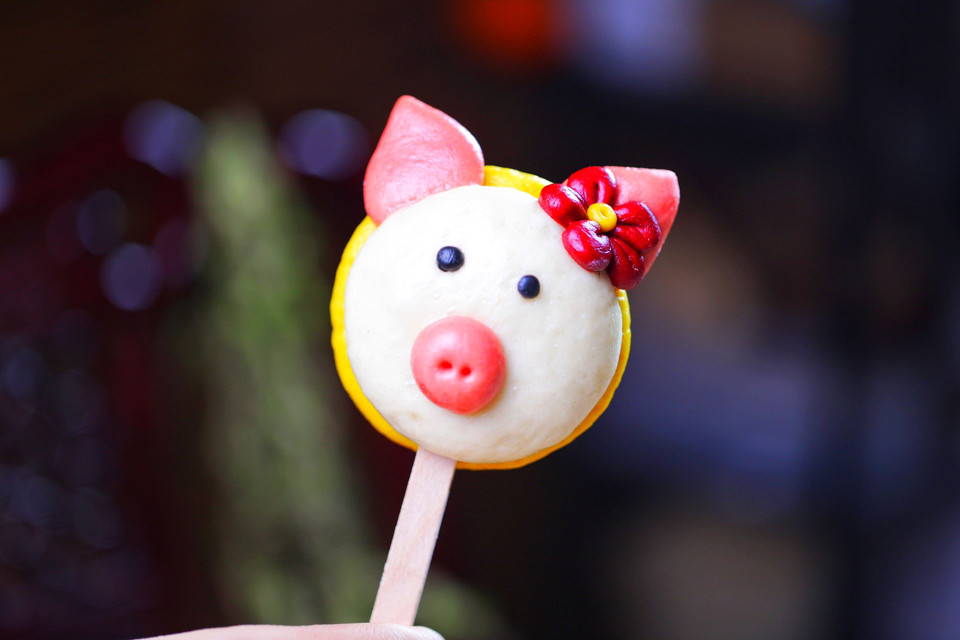

# 一看就会无色素「卡通小猪馒头」

## 📋 基本資訊 / Recipe Overview
- **料理名稱**：一看就会无色素「卡通小猪馒头」
- **原始標題**：一看就会无色素「卡通小猪馒头」
- **素食流派 / Diet**：全素 Vegan
- **料理分類 / Category**：烘焙麵點 / 點心
- **來源平台 / Source**：[豆果美食 · 素食專區](https://www.douguo.com/cookbook/2971635.html)

## 🌿 食材及佐料清單 / Ingredients
- 中筋面粉 250克
- 水 125克
- 糖 20克
- 酵母粉 2.5克
- 南瓜粉 自己需要的量
- 红曲米粉或者甜菜根粉 自己需要的量
- 竹炭粉 自己需要的量

## 🍳 烹飪步驟 / Step-by-Step Cooking Steps
1. 材料备好
2. 糖酵母面粉加水和面团
3. 揉匀备用
4. 分成自己需要的大小
5. 色粉调色
6. 做一只小猪需要黄色面团30克，白色面团30克，粉色面团6克，大红色面团4克，黑色面团1克。备用，黑色是竹炭粉
7. 粉色用白面团和红色面团过度出来
8. 黄色面团擀薄做基底
9. 粉色面团分成三份 两份做耳朵
10. 白色面团比黄色面团略小一圈盖上去做脸
11. 最后一块粉色面团做鼻子 竹签扎上孔
12. 放到白色面团上面
13. 黑色搓圆做眼睛
14. 红色面团分成五份，搓圆按扁再捏出来一个尖尖呈水滴状
15. 在尖的部分压出来一道痕迹
16. 五个拼起来，一点点黄色做花心，一朵小花就完成了
17. 沾点水放到小猪耳朵上
18. 夏天季节一边做的过程中就一边发酵了，鼓起来之后就是发酵了，水开后蒸十五分钟，焖3分钟再开盖子
19. 成品展示
20. 成品展示
21. 成品展示

## 💡 大廚美味秘訣 / Chef's Tips
- 1.面团处理好之后就直接用，不需要等发酵，造型馒头只需要一发，能更好的保持形状
2.色粉的量根据自己喜欢的程度去增减
3.水开后上锅，蒸15分钟后一定要再焖三分钟才能开盖

---
*食譜歸檔時間：2026-08-21 · 來源：豆果美食 (www.douguo.com)*