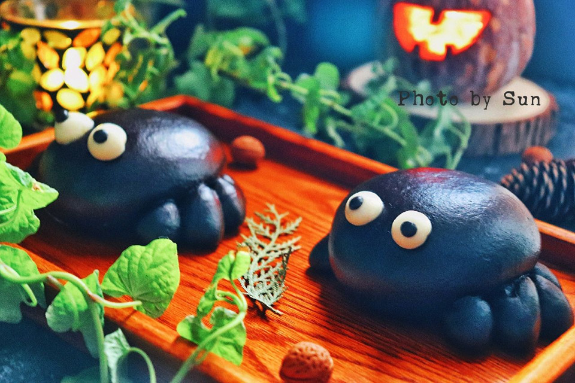

# 万圣节 小蜘蛛馒头

## 📋 基本資訊 / Recipe Overview
- **料理名稱**：万圣节 小蜘蛛馒头
- **原始標題**：万圣节 小蜘蛛馒头
- **素食流派 / Diet**：全素 Vegan
- **料理分類 / Category**：烘焙麵點 / 點心
- **來源平台 / Source**：[豆果美食 · 素食專區](https://www.douguo.com/cookbook/2357304.html)

## 🌿 食材及佐料清單 / Ingredients
- 普通高筋面粉 246克
- 细砂糖 20克
- 酵母 0.5克
- 竹炭粉 15克
- 常温水 160ml

## 🍳 烹飪步驟 / Step-by-Step Cooking Steps
1. 先称好等下要用到面粉
2. 称好0.5克的酵母
3. 依旧称好准备使用的细砂糖
4. 面粉过筛入筛入盆子里
5. 砂糖撒入面粉中
6. 用筷子把砂糖和面粉混合均匀
7. 酵母里倒入少量清水 用筷子搅均化开酵母
8. 把酵母水倒入面粉中 用筷子拌开
9. 接着少量多次的倒入清水 用筷子搅拌面粉
10. 面粉成为如图样面穗儿就可以了
11. 11下手揉成一个粗糙的面团 盖上一个小盆子 静至10分钟
12. 12静至好的面团放在揉面板上揉均匀 有粗糙小气泡就可
13. 揪出一块小面团 备用
14. 称取15克竹炭粉
15. 15克竹炭粉分三次 揉进大面团里（如果揉竹炭粉的时候面团略干可以稍微淋一些水在面团上揉匀）
16. 大面团揉成如图样光滑的面团
17. 分成5个剂子 其中一块略大一点（这个是用来做腿的 需要多一点的面团）
18. 取出一块面团 揉匀（剩下的面团用盆子盖住防止干皮）
19. 揉好的面团整形成如图样的略扁椭圆的面团
20. 揪出一块面团分别 撮四个如图样一头略尖的揪揪 两个略小剩下两个略大
21. 如图样分别略朝前弯曲 安在面团的底部一边
22. 另外一边也如上一步一样安在面团底部
23. 取小块白色面团 搓圆 然后安装在面团上然后轻轻压扁 做眼睛
24. 再取两小点黑面团 搓圆 安装在白色眼球上轻轻压扁做眼仁儿 一只小蜘蛛就做好了
25. 做好的小蜘蛛放入笼屉里 然后盖上盖子发酵半小时
26. 大火烧开水转中火 发酵好的小蜘蛛面胚子 上蒸笼 蒸制10分钟 蒸制每满5分钟的时候揭一次盖子散一回热气 然后下火再盖盖子焖5分钟 这样蒸出来的馒头不会瘪
27. 一个成品图图 好可爱好可爱的小蜘蛛馒头就做好了 快和家人分享吧 ～

## 💡 大廚美味秘訣 / Chef's Tips
- 在黏合小蜘蛛腿和身子的时候可以在身子底部两边刷一层水方便黏合

---
*食譜歸檔時間：2026-08-21 · 來源：豆果美食 (www.douguo.com)*