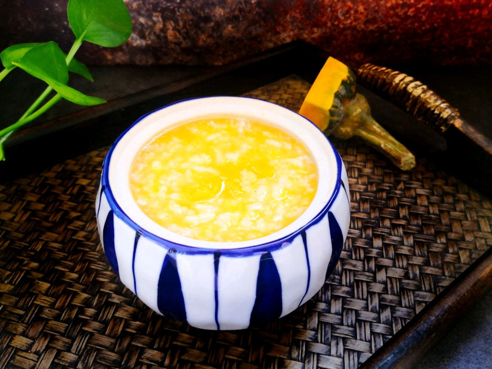

# 不一样的美味南瓜粥

## 📋 基本資訊 / Recipe Overview
- **料理名稱**：不一样的美味南瓜粥
- **原始標題**：不一样的美味南瓜粥
- **素食流派 / Diet**：全素 Vegan
- **料理分類 / Category**：米食料理
- **難易度 / Difficulty**：配菜(中级)
- **烹飪時間 / Cooking Time**：30~60分钟
- **來源平台 / Source**：[豆果美食 · 素食專區](https://www.douguo.com/cookbook/2361334.html)

## 📝 料理故事與簡介 / Story & Introduction
> 看到这个食谱名称是不是有点好奇呢？今天的南瓜粥其实材料跟往常的南瓜粥是一样的，只不过换了个做法，熬出来的粥香甜到每一粒米，连粥汤也清甜哦，一起来看看吧！

## 🌿 食材及佐料清單 / Ingredients
- 南瓜（带皮）：400克
- 珍珠米：120克
- 清水：1000ml
- 冰糖/盐：适量

## 🍳 烹飪步驟 / Step-by-Step Cooking Steps
1. 珍珠米提前30分钟浸泡。把浸泡好的大米清洗干净倒入电饭锅，加入适量清水，按煲粥煲粥。米和水的比例为1：8，喜欢喝稀点的可以稍微再加点水，另外熬粥我一般都用珍珠米，粘而不腻口感好，也可以其他米代替哈。
2. 熬粥期间把南瓜去皮切成薄片。南瓜可以选用贝贝南瓜或者其他南瓜，我用的还是自己种的普通南瓜。
3. 放入蒸箱或者蒸锅蒸熟。
4. 趁热压成泥，想要更加细腻的可以倒入料理机稍微搅打。
5. 熬粥结束后倒入南瓜泥，一边倒一边搅拌，防止粘锅，继续煮3-4分钟。这步可以根据自己口味选择放糖还是放盐，其实南瓜本身带有甜味，糖和盐都不用已经很好喝了。
6. 南瓜先蒸熟再倒入粥里，这样熬出来的南瓜粥香甜到每一粒米，连粥汤都清甜哦。
7. 冷冷的早晨来碗香甜又暖身的南瓜粥吧。

---
*食譜歸檔時間：2026-08-20 · 來源：豆果美食 (www.douguo.com)*