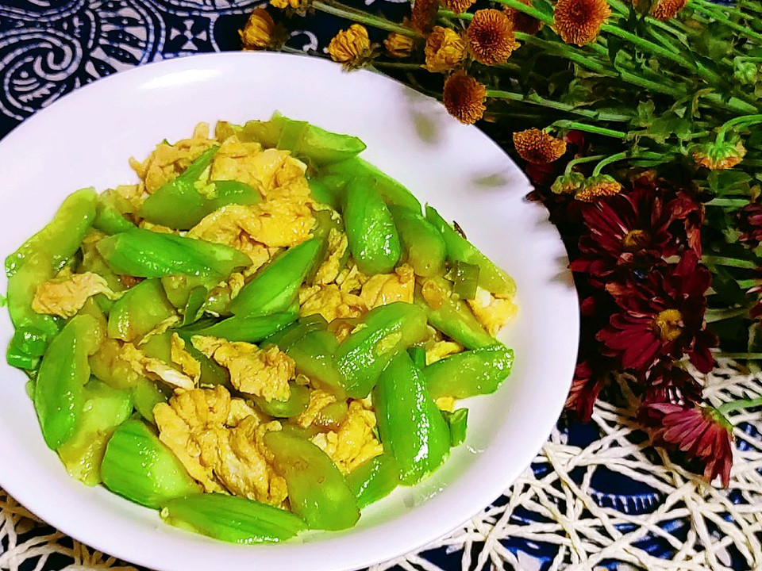

# 丝瓜炒蛋

## 📋 基本資訊 / Recipe Overview
- **料理名稱**：丝瓜炒蛋
- **原始標題**：丝瓜炒蛋
- **素食流派 / Diet**：蛋素 Ovo-Vegetarian
- **料理分類 / Category**：家常蔬食 / 經典熱菜
- **來源平台 / Source**：[豆果美食 · 素食專區](https://www.douguo.com/cookbook/2307182.html)

## 🌿 食材及佐料清單 / Ingredients
- 鸡蛋 2个
- 丝瓜 1根
- 葱花 适量
- 盐 1小勺
- 糖 1匙尖
- 香油 1匙尖
- 味精 少许

## 🍳 烹飪步驟 / Step-by-Step Cooking Steps
1. 丝瓜去皮。
2. 切滚刀块。
3. 鸡蛋打散。
4. 油烧热，倒入蛋液。
5. 鸡蛋划散成熟后盛出。
6. 锅中再倒入少许油烧热，放入葱花炒出香味。
7. 放入丝瓜翻炒。
8. 丝瓜略炒软放一匙尖糖提鲜。
9. 倒入炒好的鸡蛋翻炒均匀，放盐，味精，淋香油出锅。
10. 成品图。

## 💡 大廚美味秘訣 / Chef's Tips
- 丝瓜不要炒太久了，炒软就行。

---
*食譜歸檔時間：2026-08-21 · 來源：豆果美食 (www.douguo.com)*