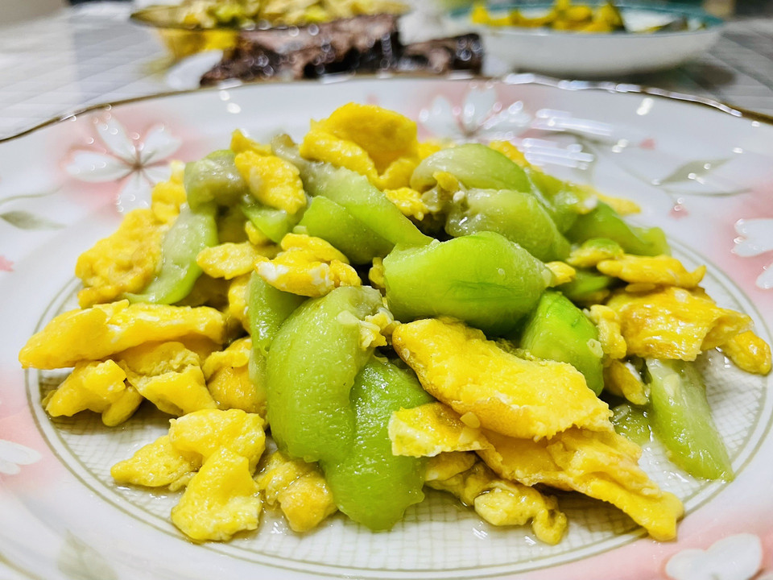

# 丝瓜炒蛋

## 📋 基本資訊 / Recipe Overview
- **料理名稱**：丝瓜炒蛋
- **原始標題**：丝瓜炒蛋
- **素食流派 / Diet**：蛋素 Ovo-Vegetarian
- **料理分類 / Category**：家常蔬食 / 經典熱菜
- **難易度 / Difficulty**：切墩(初级)
- **烹飪時間 / Cooking Time**：10分钟左右
- **來源平台 / Source**：[豆果美食 · 素食專區](https://www.douguo.com/cookbook/3118247.html)

## 📝 料理故事與簡介 / Story & Introduction
> 丝瓜是夏季餐桌上最常见的蔬菜，营养较为丰富，清热解暑

## 🌿 食材及佐料清單 / Ingredients
- 丝瓜：1根
- 鸡蛋：2个
- 油：适量
- 盐：适量

## 🍳 烹飪步驟 / Step-by-Step Cooking Steps
1. 自己家的矮丝瓜，自己家老母鸡下的鸡
2. 最近家里的菜都是老爸绿色农场提供的，丝瓜切片，鸡蛋放盐打散
3. 锅内放油加入蛋液
4. 稍微煎一下
5. 用锅铲划散
6. 多炒一会鸡蛋会老一点，但会更香，盛出备用
7. 炒蛋过的锅不用洗的，直接下丝瓜翻炒
8. 加入一丢丢的水
9. 不用加盖，加入少许盐
10. 加入炒好的鸡蛋
11. 装盘
12. 开吃

## 💡 大廚美味秘訣 / Chef's Tips
- 鸡蛋根据个人口味炒的嫩点还是老点，用鸭蛋、鹅蛋也很好，可以加水放汤也可以

---
*食譜歸檔時間：2026-08-20 · 來源：豆果美食 (www.douguo.com)*