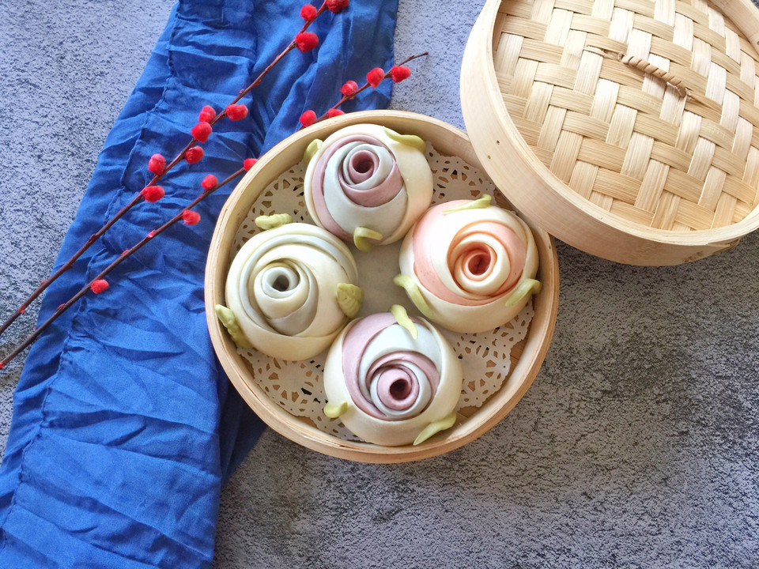

# 五彩玫瑰花馒头

## 📋 基本資訊 / Recipe Overview
- **料理名稱**：五彩玫瑰花馒头
- **原始標題**：五彩玫瑰花馒头
- **素食流派 / Diet**：全素 Vegan
- **料理分類 / Category**：烘焙麵點 / 點心
- **來源平台 / Source**：[豆果美食 · 素食專區](https://www.douguo.com/cookbook/2313703.html)

## 🌿 食材及佐料清單 / Ingredients
- 中筋面粉 150克
- 凉水 75克
- 酵母 1.5克
- 白糖 10克
- 中筋面粉 100克
- 酵母 1克
- 白糖 5克
- 红曲粉 少许
- 清水 50克
- 中筋粉 100克
- 酵母 1克
- 白糖 5克
- 紫薯粉 少许
- 清水 50克
- 中筋面粉 100克
- 酵母 1克
- 白糖 5克
- 蝶豆花 10朵
- 清水 50克
- 中筋粉 50克
- 酵母 0.5克
- 白糖 少许
- 菠菜粉 少许
- 清水 25克

## 🍳 烹飪步驟 / Step-by-Step Cooking Steps
1. 各种面团分别揉成光滑的面团
2. 分别搓成长条切成10克左右的剂子
3. 分别擀成圆形的薄片
4. 各色面片随意搭配，六个按顺序排列如果闲大可摆放5片，摆好后用筷子在中间位置压一下如图
5. 从下往上卷起
6. 从中间切开，然后用手轻轻整理一下
7. 依次做好后
8. 绿色面团用擀面杖擀成长方形薄片
9. 用刀切成窄窄的上细下宽的长条，或用手揪一点绿面团搓成水滴状压扁用牙签压出叶子形状
10. 把叶子粘在做好的馒头上
11. 锅中倒入适量的清水，把馒头放在篦子上醒发30分钟左右，看状态
12. 大火烧开转中火20分钟即可，焖3-5分钟揭锅盖

---
*食譜歸檔時間：2026-08-21 · 來源：豆果美食 (www.douguo.com)*