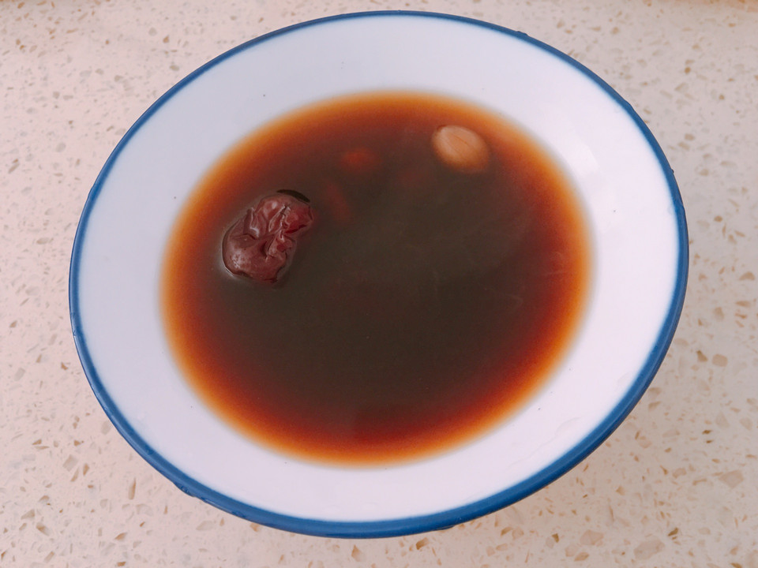

# 五红汤

## 📋 基本資訊 / Recipe Overview
- **料理名稱**：五红汤
- **原始標題**：五红汤
- **素食流派 / Diet**：全素 Vegan
- **料理分類 / Category**：湯品羹湯
- **難易度 / Difficulty**：切墩(初级)
- **烹飪時間 / Cooking Time**：1小时以上
- **來源平台 / Source**：[豆果美食 · 素食專區](https://www.douguo.com/cookbook/2397977.html)

## 📝 料理故事與簡介 / Story & Introduction
> 补气血，健脾养胃，既有营养又简单

## 🌿 食材及佐料清單 / Ingredients
- 红豆：50克
- 花生：50克
- 红枣：50克
- 枸杞：10克
- 红糖：40克
- 清水：1500毫升

## 🍳 烹飪步驟 / Step-by-Step Cooking Steps
1. 红豆提前浸泡6小时
2. 把所有材料放入锅中
3. 大火烧开转小火慢熬1小时
4. 出锅

---
*食譜歸檔時間：2026-08-20 · 來源：豆果美食 (www.douguo.com)*