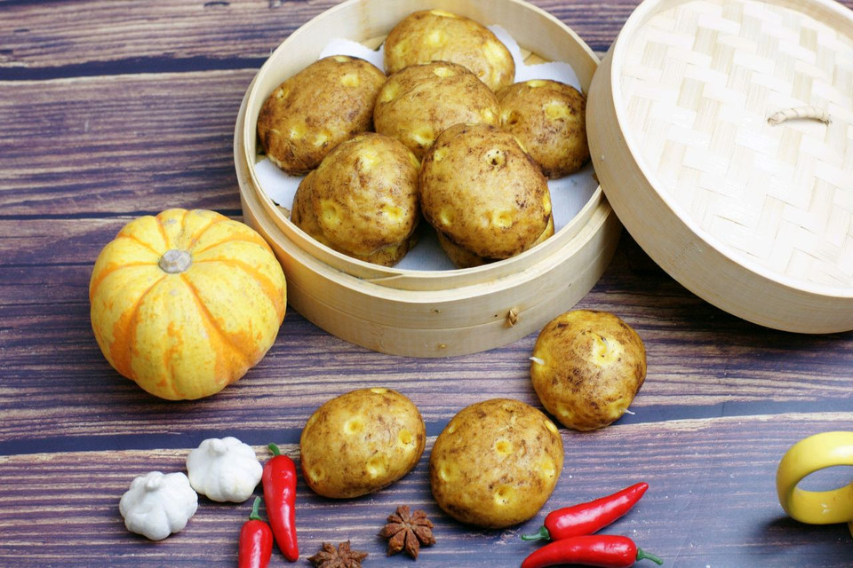

# 仿真土豆馒头

## 📋 基本資訊 / Recipe Overview
- **料理名稱**：仿真土豆馒头
- **原始標題**：仿真土豆馒头
- **素食流派 / Diet**：全素 Vegan
- **料理分類 / Category**：家常蔬食 / 經典熱菜
- **來源平台 / Source**：[豆果美食 · 素食專區](https://www.douguo.com/cookbook/2341108.html)

## 🌿 食材及佐料清單 / Ingredients
- 普通面粉 200克
- 干酵母 3克
- 糖 40克
- 可可粉 4克
- 南瓜泥 120克

## 🍳 烹飪步驟 / Step-by-Step Cooking Steps
1. 南瓜去皮切块，蒸锅上蒸透，用勺子捣成南瓜泥
2. 筛入中粉，糖，干酵母，揉搓均匀
3. 得到光滑不粘手的面团
4. 均分成8份
5. 搓成8个小的椭圆形
6. 用筷子戳一些小眼
7. 手粘一些可可粉，涂抹在面团表面，注意可可粉不要掉进小眼里
8. 蒸锅内准备沸水，发酵30分钟，等面团胀大到原来的1.5倍，大火蒸10分钟，焖3分钟就好了

---
*食譜歸檔時間：2026-08-20 · 來源：豆果美食 (www.douguo.com)*