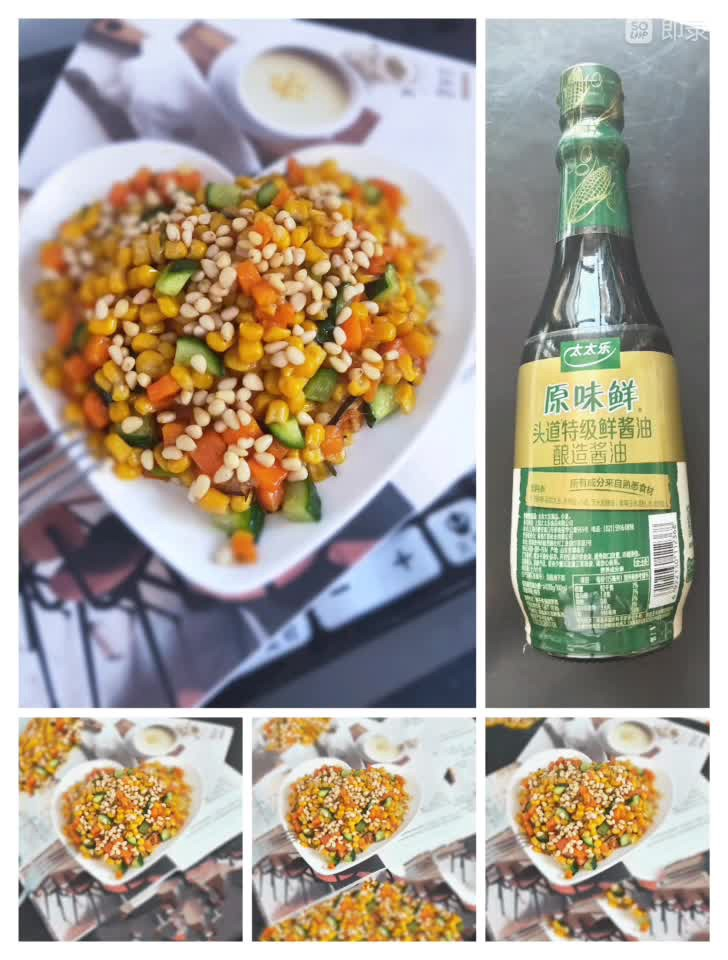

# 低卡低脂好吃不贵的松仁玉米

## 📋 基本資訊 / Recipe Overview
- **料理名稱**：低卡低脂好吃不贵的松仁玉米
- **原始標題**：低卡低脂好吃不贵的松仁玉米
- **素食流派 / Diet**：全素 Vegan
- **料理分類 / Category**：米食料理
- **來源平台 / Source**：[豆果美食 · 素食專區](https://www.douguo.com/cookbook/3101730.html)

## 🌿 食材及佐料清單 / Ingredients
- 熟玉米粒 200克
- 熟松仁 20克
- 胡萝卜 半根
- 乳瓜 半根
- 油 10克
- 葱花 5克
- 糖 10克
- 盐 1克
- 淀粉 1勺
- 清水 适量

## 🍳 烹飪步驟 / Step-by-Step Cooking Steps
1. 所有配料洗净切好备用
2. 热锅放油放入葱花爆香
3. 放入胡萝卜丁翻炒变色
4. 放入乳瓜继续翻炒均匀
5. 放入熟玉米粒继续翻炒均匀
6. 放入白糖，盐，翻炒均匀后，水和淀粉搅拌均匀后撒入锅中少许翻炒均匀即可。
7. 成品图
8. 成品图

## 💡 大廚美味秘訣 / Chef's Tips
- 所有调料根据自己的喜好加减

---
*食譜歸檔時間：2026-08-21 · 來源：豆果美食 (www.douguo.com)*