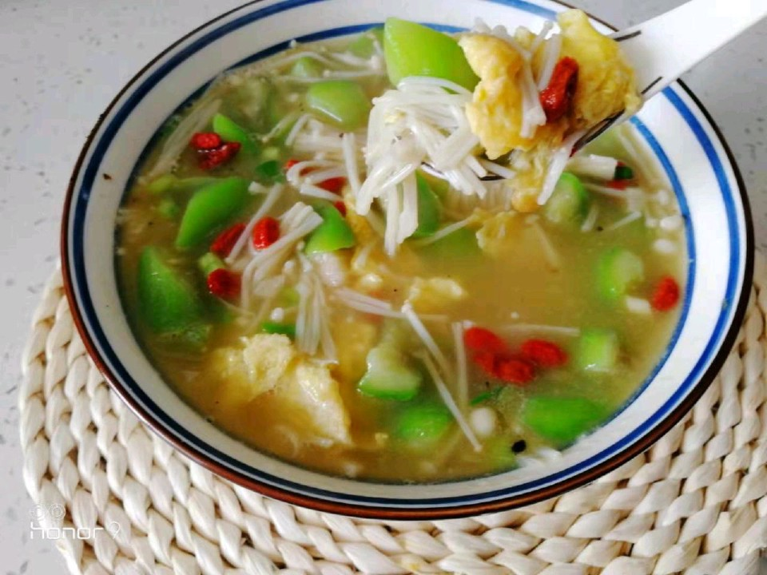

# 低卡营养的丝瓜汤

## 📋 基本資訊 / Recipe Overview
- **料理名稱**：低卡营养的丝瓜汤
- **原始標題**：低卡营养的丝瓜汤
- **素食流派 / Diet**：蛋素 Ovo-Vegetarian
- **料理分類 / Category**：湯品羹湯
- **難易度 / Difficulty**：切墩(初级)
- **烹飪時間 / Cooking Time**：15-30 分鐘
- **來源平台 / Source**：[豆果美食 · 素食專區](https://www.douguo.com/cookbook/3101743.html)

## 📝 料理故事與簡介 / Story & Introduction
> 夏天常喝丝瓜汤，既低卡又有营养，食材做法超简单。

## 🌿 食材及佐料清單 / Ingredients
- 丝瓜：1根
- 鸡蛋：2个
- 金针菇：1包
- 蒜：3瓣
- 姜：2片
- 枸杞：10几粒
- 盐：适量
- 鸡精：1小勺
- 香油：1勺

## 🍳 烹飪步驟 / Step-by-Step Cooking Steps
1. 准备丝瓜一根，鸡蛋2个，金针菇或者白玉菇一包。
2. 金针菇切去根部，用水清洗干净。
3. 丝瓜削去皮，斜着切成滚刀块，不要太薄。
4. 蒜、姜切好，枸杞清水洗干净。
5. 锅中放油，将鸡蛋打散放入锅中炒好盛出备用。
6. 锅中底油，爆香蒜沫和姜沫。
7. 放入丝瓜多炒一会儿，这是不变色的关键。
8. 放入适量的开水。
9. 放入金针菇，小火煮3分钟。
10. 放入炒好的鸡蛋，适量的盐、香油和1小勺鸡精，搅拌均匀出锅。
11. 放点枸杞点缀一下，香喷喷的丝瓜汤，低卡有营养。

---
*食譜歸檔時間：2026-08-20 · 來源：豆果美食 (www.douguo.com)*