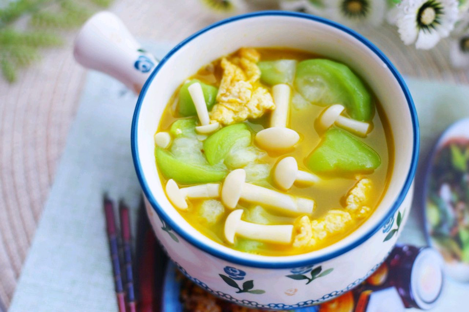

# 低脂美味的丝瓜菌菇鸡蛋汤

## 📋 基本資訊 / Recipe Overview
- **料理名稱**：低脂美味的丝瓜菌菇鸡蛋汤
- **原始標題**：低脂美味的丝瓜菌菇鸡蛋汤
- **素食流派 / Diet**：蛋素 Ovo-Vegetarian
- **料理分類 / Category**：湯品羹湯
- **來源平台 / Source**：[豆果美食 · 素食專區](https://www.douguo.com/cookbook/2331950.html)

## 🌿 食材及佐料清單 / Ingredients
- 丝瓜 1根
- 鸡蛋 2个
- 白玉菇 1把
- 葱 1根
- 姜 适量

## 🍳 烹飪步驟 / Step-by-Step Cooking Steps
1. 食材：丝瓜、鸡蛋、白玉菇、葱、姜。
2. 丝瓜去皮洗净，切成滚刀块备用。
3. 白玉菇洗净切断，葱切末，姜切丝。
4. 鸡蛋磕入碗中，加少许盐和料酒打散。
5. 热锅热油，倒入鸡蛋煎成蛋皮铲碎盛出备用。
6. 利用余油加姜丝爆香，加入白玉菇煸炒一下。
7. 加入丝瓜翻炒至变软。
8. 倒入适量开水。
9. 水开后放入鸡蛋。
10. 加适量盐。
11. 滴几滴香油，出锅盛入碗中，撒上葱花即可。鲜美无比的丝瓜鸡蛋菌菇汤就做好啦。
12. 超好吃。
13. 连喝三碗都不够。
14. 做起来。

---
*食譜歸檔時間：2026-08-21 · 來源：豆果美食 (www.douguo.com)*