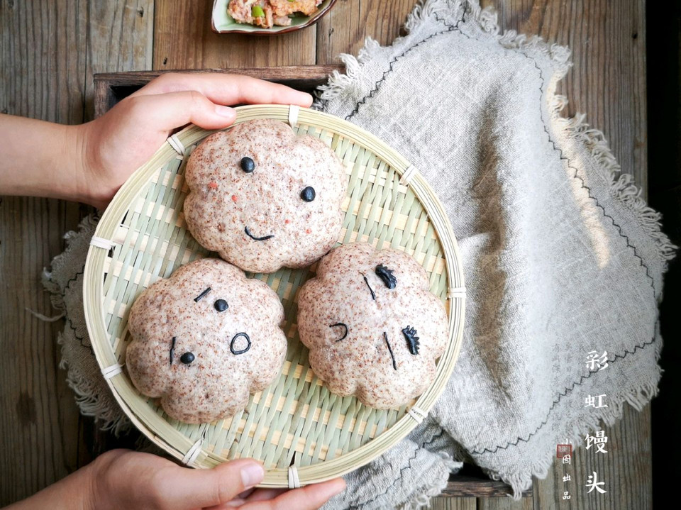

# 做一个有内涵的馒头——彩虹馒头

## 📋 基本資訊 / Recipe Overview
- **料理名稱**：做一个有内涵的馒头——彩虹馒头
- **原始標題**：做一个有内涵的馒头——彩虹馒头
- **素食流派 / Diet**：全素 Vegan
- **料理分類 / Category**：烘焙麵點 / 點心
- **來源平台 / Source**：[豆果美食 · 素食專區](https://www.douguo.com/cookbook/2318106.html)

## 🌿 食材及佐料清單 / Ingredients
- 面粉 400克
- 黑全麦粉 60克
- 酵母粉 4克
- 红曲粉 适量
- 番茄粉 适量
- 南瓜粉 适量
- 菠菜粉 适量
- 蝶豆花粉 适量
- 紫薯粉 适量
- 可可粉 适量
- 清水 230克
- 竹炭粉 适量

## 🍳 烹飪步驟 / Step-by-Step Cooking Steps
1. 准备食材。
2. 酵母粉用温水冲开，少量多次加入面粉中用筷子搅拌成雪花状。
3. 揉成光滑面团后盖保鲜膜醒发。
4. 将黑全麦粉和面粉按1：3比例混合，酵母粉用温水冲开，少量多次加入面粉中。
5. 用筷子搅拌成雪花状。
6. 揉成光滑面团后盖保鲜膜醒发。
7. 醒发好的白色面团取出再次揉光排气分成大小均匀的7个面团（如果要给馒头做卡通表情需要留出一点白色面团以备后面调色）。
8. 在面团中分成加入适量的红曲，番茄，南瓜，菠菜，蝶豆花，紫薯，可可粉揉匀。
9. 再将每个彩色面团等分成6份（分成几份根据自己要做几个馒头而定），揉成小球。
10. 全麦面团醒发好后取出再次揉光排气分成大小均匀的6个面剂。
11. 将面剂按扁，擀成边沿薄中间略厚的面皮。
12. 将彩色面团小球按扁叠起。
13. 按图示包入全麦面皮里。
14. 收口朝下放置一旁再次醒发15-20分钟。
15. 用留出的白色面团加竹炭粉和红曲粉调色，做表情。
16. 按同样的方法做完所有馒头，二次醒发好后造型并可添加自己喜欢的表情。
17. 上锅隔水大火蒸20分钟，关火后焖3分钟。
18. 出锅。
19. 带表情的乌云馒头。
20. 拨开乌云见彩虹哦(´-ω-`)！

---
*食譜歸檔時間：2026-08-21 · 來源：豆果美食 (www.douguo.com)*