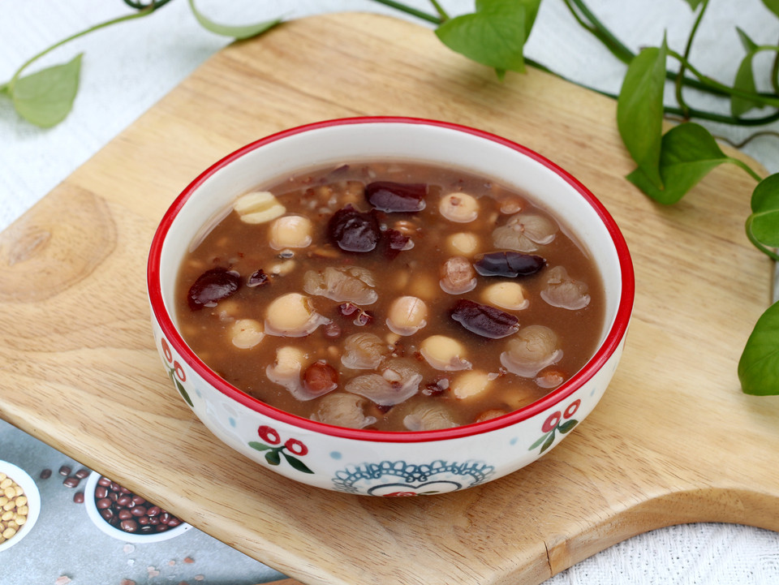

# 八宝粥

## 📋 基本資訊 / Recipe Overview
- **料理名稱**：八宝粥
- **原始標題**：八宝粥
- **素食流派 / Diet**：全素 Vegan
- **料理分類 / Category**：米食料理
- **來源平台 / Source**：[豆果美食 · 素食專區](https://www.douguo.com/cookbook/3022934.html)

## 🌿 食材及佐料清單 / Ingredients
- 花生 20克
- 红豆 30克
- 红枣 25克
- 莲子 30克
- 薏米 20克
- 芡实 20克
- 红米 30克
- 白砂糖 适量
- 水 1000克

## 🍳 烹飪步驟 / Step-by-Step Cooking Steps
1. 准备好食材和分量
2. 除红枣、桂圆干和白砂糖，所有食材加水泡一晚上
3. 红枣干和桂圆干用水简单清洗一次
4. 泡好的食材和红枣、桂圆干一起放入米博多功能料理机的主锅里，加入1000克水
5. 选择米博多功能锅里的八宝粥程序，自动开始烹饪
6. 按照提示加入适量的白砂糖
7. 这是米博多功能锅煮好的八宝粥，放凉后会粘稠一些
8. 冬天喝一碗八宝粥，暖心又暖胃，真舒服

## 💡 大廚美味秘訣 / Chef's Tips
- 均衡的膳食对宝宝健康成长很关键哦，但要提醒饮食均衡还远远不够，日常饮食也有营养“缺口”，如维生素AD就不易从食物中获取充足。维生素AD能提高宝宝免疫力，促进骨骼发育、身高增长，预防近视和贫血。功夫在日常，每天还要记得补充一粒伊可新维生素AD滴剂哦~

---
*食譜歸檔時間：2026-08-21 · 來源：豆果美食 (www.douguo.com)*