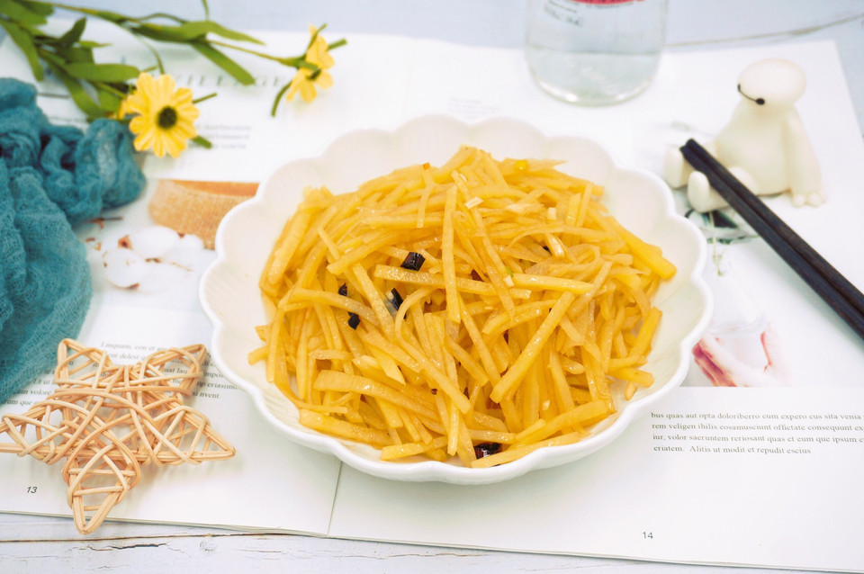

# 凉拌土豆丝 (2)

## 📋 基本資訊 / Recipe Overview
- **料理名稱**：凉拌土豆丝 (2)
- **原始標題**：凉拌土豆丝
- **素食流派 / Diet**：全素 Vegan
- **料理分類 / Category**：涼拌前菜 / 輕食
- **難易度 / Difficulty**：切墩(初级)
- **烹飪時間 / Cooking Time**：10~30分钟
- **來源平台 / Source**：[豆果美食 · 素食專區](https://www.douguo.com/cookbook/2303708.html)

## 📝 料理故事與簡介 / Story & Introduction
> 分享一道小时候特别喜欢的家常菜，凉拌土豆丝，普通的食材，简单的做法，却是难忘的美味，上学的时候特别喜欢吃，尤其是那个花椒和辣椒的焦香味，混着土豆丝的香味，特别诱人，吃起来酸辣清脆，而且超级下饭哦

## 🌿 食材及佐料清單 / Ingredients
- 土豆：400g
- 小葱：两棵
- 干辣椒：两个
- 蒜：两瓣
- 花椒：若干粒
- 生抽：一勺
- 香醋：两勺
- 糖：半勺
- 盐：一勺
- 白醋：两勺（焯水时用）
- 香油：半勺

## 🍳 烹飪步驟 / Step-by-Step Cooking Steps
1. 土豆削皮洗净
2. 切细丝，也可以用刨丝器，个人觉得手切土豆丝味道更棒
3. 葱蒜辣椒切碎备用
4. 土豆丝清水洗两遍，去一下淀粉
5. 烧水，加两勺白醋，水开后放入土豆丝，焯一到两分钟，然后捞出过冷水备用
6. 起锅热油
7. 油热后，放入花椒和辣椒，出香味后关火
8. 将油浇在葱蒜碎上
9. 一勺盐，半勺糖（小调味勺）
10. 一勺生抽，两勺香醋，半勺香油（普通小汤勺）
11. 将调味汁浇在土豆丝上（土豆丝过完冷水后沥一下水）
12. 搅拌均匀
13. 盛盘
14. 成品图

## 💡 大廚美味秘訣 / Chef's Tips
- ♡土豆丝焯水的时候一定要加点醋哦，这样土豆丝口感比较清脆
♡拌好的土豆丝冷藏一下会更好吃，特适合炎热的夏天，爽口开胃

---
*食譜歸檔時間：2026-08-20 · 來源：豆果美食 (www.douguo.com)*