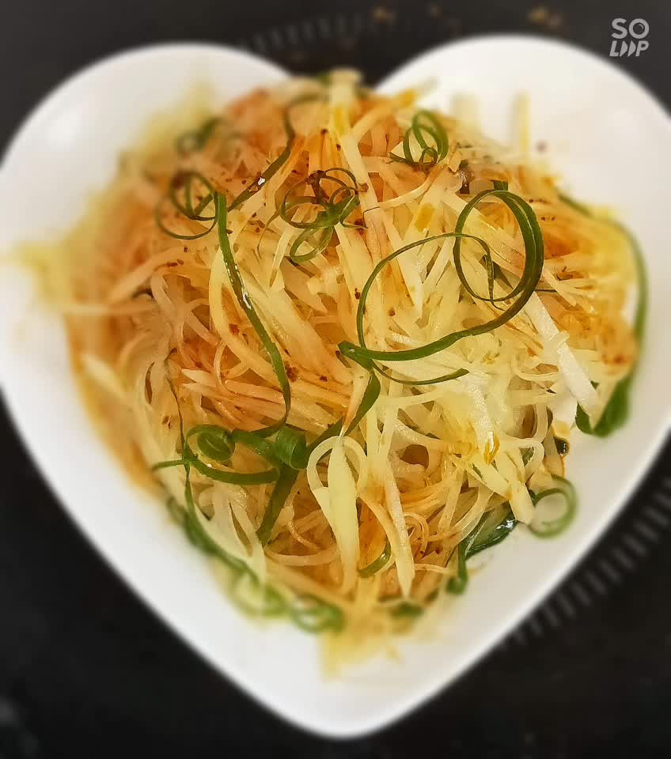

# 凉拌土豆丝

## 📋 基本資訊 / Recipe Overview
- **料理名稱**：凉拌土豆丝
- **原始標題**：凉拌土豆丝
- **素食流派 / Diet**：全素 Vegan
- **料理分類 / Category**：涼拌前菜 / 輕食
- **難易度 / Difficulty**：切墩(初级)
- **烹飪時間 / Cooking Time**：15-30 分鐘
- **來源平台 / Source**：[豆果美食 · 素食專區](https://www.douguo.com/cookbook/2514432.html)

## 📝 料理故事與簡介 / Story & Introduction
> 夏季的凉拌菜让很多人非常的喜爱吃，主要它清爽可口，而且制作简单，让我们每个家庭，都可以在短短的几分钟中，做上一道这样的佳肴，凉拌土豆丝是首选，这样的凉拌菜，不仅在各个饭店上都有出售，而且也是必点之菜，土豆之所以成为很多人的最爱，也是因为它的本身营养价值高，值得选择。

凉拌土豆丝不仅保存了土豆的营养，也利于人体的消化，对一些便秘和消化道不好的人，是一种很好的选择，对减肥的人来讲，不仅轻松达到瘦身，而且也不会让身体缺失营养。
土豆性平，有和胃、调中、健脾、益气之功效；能改善肠胃功能，对胃溃疡、十二脂肠溃疡、慢性胆囊炎、痔疮引起的便秘均有一定的疗效。土豆中还含有丰富的钾元素，可以有效地预防高血压。当人体过多地摄入盐分后，体内钠元素就会偏高，钾便呈现出不足而引起高血压，故常吃土豆能及时地给体内补充所需求的钾元素；土豆中的维生素C除对大脑细胞具有保健作用。

## 🌿 食材及佐料清單 / Ingredients
- 土豆：1个
- 盐：2克
- 米醋：5克
- 鲁花味极鲜：3克
- 葱花油：3克
- 辣椒油：5克

## 🍳 烹飪步驟 / Step-by-Step Cooking Steps
1. 土豆洗净切细丝状
2. 泡入水中洗去淀粉
3. 放开水中焯至土豆丝变色
4. 捞出控干水份加所有调料搅拌均匀就可以了。
5. 装盘后撒入辣椒油，撒葱丝装饰。
6. 成品图片
7. 成品图
8. 成品图片

## 💡 大廚美味秘訣 / Chef's Tips
- 1.土豆切的越细口感越好
2.土豆丝不要焯水时间太长
3.所有调料根据土豆的大小多少加减。

---
*食譜歸檔時間：2026-08-20 · 來源：豆果美食 (www.douguo.com)*