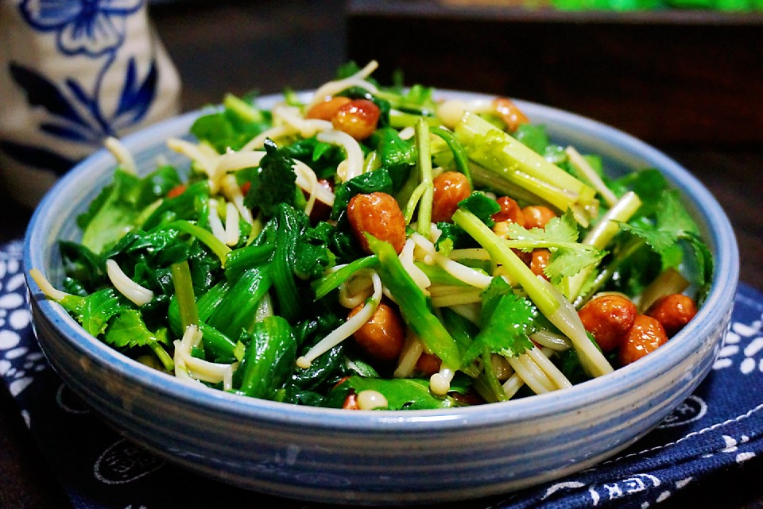

# 凉拌菠菜

## 📋 基本資訊 / Recipe Overview
- **料理名稱**：凉拌菠菜
- **原始標題**：凉拌菠菜
- **素食流派 / Diet**：全素 Vegan
- **料理分類 / Category**：涼拌前菜 / 輕食
- **來源平台 / Source**：[豆果美食 · 素食專區](https://www.douguo.com/cookbook/3060729.html)

## 🌿 食材及佐料清單 / Ingredients
- 菠菜 300克
- 金针菇 100克
- 花椒 1小把
- 盐 2克
- 生抽 2勺
- 米醋 2勺
- 白糖 1勺
- 花生米 1把

## 🍳 烹飪步驟 / Step-by-Step Cooking Steps
1. 菠菜择去黄叶，去除根部，清洗干净。香菜也择洗干净。
2. 锅中放适量的水，烧开后先放入金针菇焯熟，捞出过凉。冬天天气冷，所以要用温开水过凉，不要用自来水或者是凉水。
3. 焯金针菇的水不用倒，把菠菜放进去焯2分钟左右，焯熟。而且有助于去除菠菜中的草酸。
4. 焯好的菠菜也要过凉一下。
5. 锅中放适量的油，凉锅凉油放入花生米，炸至花生米变色就可以盛出备用了。
6. 锅中放油，油热放入花椒煸香。将花椒滤出，只留花椒油。将菠菜，香菜，金针菇都切成段，放入盆中，加入生抽，醋，白糖，花椒油拌匀。
7. 最后倒入炸好的花生米拌匀就可以了。
8. 成品图。

---
*食譜歸檔時間：2026-08-21 · 來源：豆果美食 (www.douguo.com)*