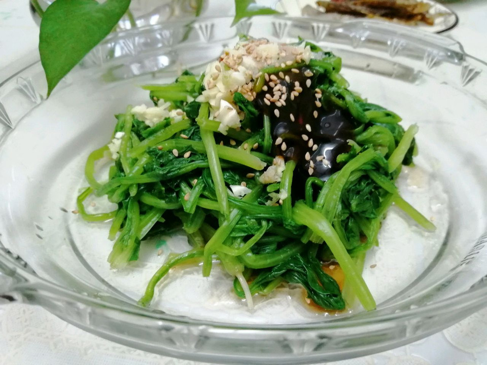

# 凉拌菠菜

## 📋 基本資訊 / Recipe Overview
- **料理名稱**：凉拌菠菜
- **原始標題**：凉拌菠菜
- **素食流派 / Diet**：全素 Vegan
- **料理分類 / Category**：涼拌前菜 / 輕食
- **來源平台 / Source**：[豆果美食 · 素食專區](https://www.douguo.com/cookbook/2997044.html)

## 🌿 食材及佐料清單 / Ingredients
- 菠菜 1把
- 蒜 适量
- 芝麻 适量
- 米醋 适量
- 蚝油 适量
- 盐 适量

## 🍳 烹飪步驟 / Step-by-Step Cooking Steps
1. 新鲜的菠菜，摘洗干净
2. 用水煮三分钟
3. 焯好的菠菜，过一下凉水，挤干水分放入盘中
4. 撒上所有的调料
5. 拌匀即可食用
6. 营养搭配的一餐

## 💡 大廚美味秘訣 / Chef's Tips
- 煮菠菜时加少许的盐，不要盖盖子，保持菠菜的的碧绿颜色

---
*食譜歸檔時間：2026-08-21 · 來源：豆果美食 (www.douguo.com)*